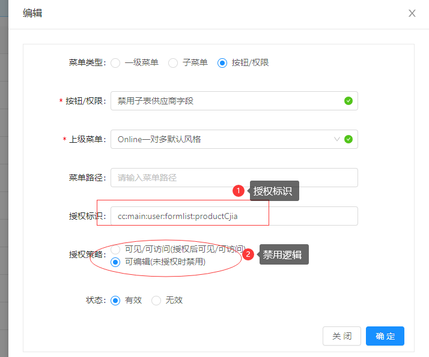
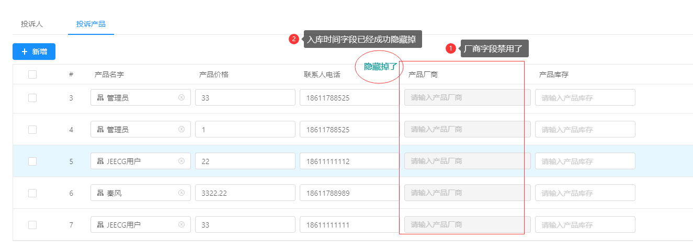

子表行字段的禁用和隐藏控制
===
>[info] 此用法，可以同时实现行编辑字段的隐藏控制和禁用控制。
>  `友情提示：配置不生效的话，退出重新登录再测试。`

支持行组件：j-editable-table、j-vxe-table

#### 一、用法

（1）页面引入工具js
```
import { colAuthFilterJEditableTable } from "@/utils/authFilter"
```


（2）通过权限处理行编辑的字段集合 columns 

```
created() {
  this.ccTouSuProductTable.columns = colAuthFilterJEditableTable(this.ccTouSuProductTable.columns,'cc:main:user:formlist:');
},
```


#### 二、权限配置
#####  1.禁用字段配置


#####  2.隐藏字段配置


#### 三、查看效果

用户授权后，退出**重新登录**，即可查看和编辑对应字段


