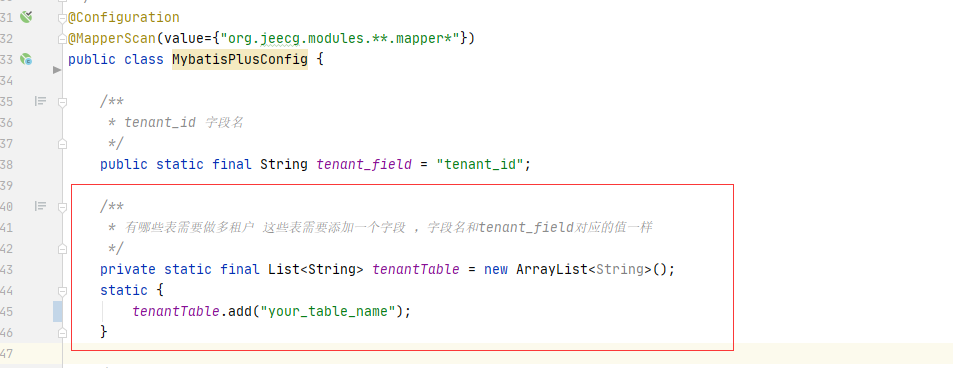
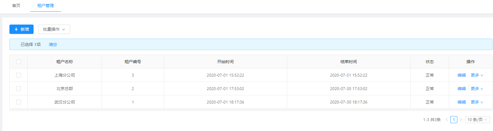
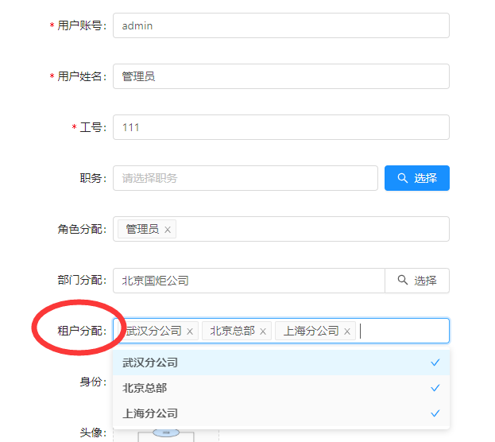

# 如何实现SAAS多租户模式
>[warning] 此文档已经老了，只适合jeecgboot 3.5.0之前的版本，3.5.0之后的版本 [参考这个文档](http://help.jeecg.com/javaback/saas.html) 

> 针对某个表实现SAAS模式，具体实现以下二点功能：
> 1. 添加数据自动注入登录人租户ID。
> 2. 查询自动根据登录人租户ID进行数据筛选。

## 具体步骤
### 1. 代码配置
修改`org.jeecg.config.mybatis.MybatisPlusConfig`的`tenantTable`属性，将需要做多租户的表名添加到该集合中。     

注意： 2.4.6+版本此类更名为 org.jeecg.config.mybatis.MybatisPlusSaasConfig

### 2. 数据库表修改
上述多租户的表需要添加一个`int`类型字段 `tenant_id`，同时java对应实体也加上字段`tenantId`。
~~~
ALTER TABLE {表名} ADD COLUMN tenant_id int(10) NULL DEFAULT 0;
~~~

### 3. 租户配置
#### 3. 1 新增多租户
进入菜单 系统管理 >【租户管理】，配置租户。


#### 3.2 给用户分配租户
进入【用户管理】设置用户的租户，支持一个用户选择多个租户


### 4. 选择租户登录（测试）
当用户有多个租户的时候，需要在登录的时候选择一个当前登录系统的租户，以便用户处理对应租户的数据
```
这个时候访问对应模块，会发现数据通过租户ID实现了隔离，新增数据会自动带上租户ID。
```


*****
### 其他规则


####  1. 微服务下多租户ID怎么在不同服务间传递
- 登录之后租户ID会在前端存储
- 每次请求会携带header `tenant-id`值为租户ID
- 每个服务都可以从request中获取租户ID
~~~
String tenantId = req.getHeader("tenant-id");
~~~

####  2. 用户未分配租户情况下
  登录 `tenant-id` 会以默认租户ID `0` 

####  3.Jeecg-boot 多租户完整改造方案（涉及菜单部门角色等基础模块）
  https://jeecg.blog.csdn.net/article/details/119780074
