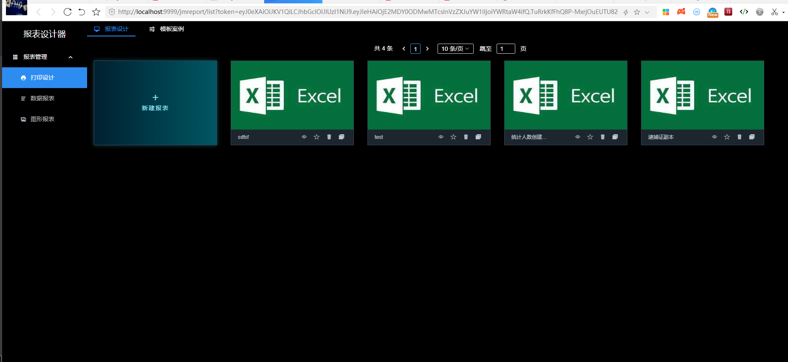

# 简单三步集成积木报表

详细文档见 http://report.jeecg.com/2078875
## 1. jeecg-boot-module-system模块中引入积木报表jar包
~~~
<!-- 积木报表-->
<dependency>
    <groupId>org.jeecgframework.jimureport</groupId>
    <artifactId>jimureport-spring-boot-starter</artifactId>
    <version>1.4.0</version>
</dependency>
~~~
## 2. 实现JmReportTokenServiceI实现token获取和权限验证
~~~
@Component
class JimureportServiceImpl implements JmReportTokenServiceI {

    //根据tokne获取用户名,需要自行实现
    @Override
    public String getUsername(String token) {
        return "admin";
    }

   //校验权限，需要自行实现
    @Override
    public Boolean verifyToken(String token) {
        return  true;
    }
}
~~~
## 3.执行升级SQL
```
看升级日志
```
### 4. 角色授权


## 首页效果

