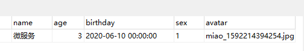
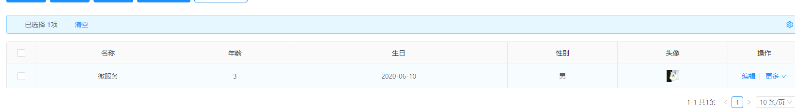

普通字段
~~~
@Excel(name="姓名",width=25)
private java.lang.String name;
~~~
---

日期字段
~~~
@Excel(name = "生日", width = 25, format = "yyyy-MM-dd")
private Date birthday;
~~~
----

图片字段：
~~~
@Excel(name="头像",width=25,type=2)
private java.lang.String avatar;
~~~
- excel 单元格存放图片:

- 数据库存放图片相对路径：

- 列表页面显示小图

---
需要字段翻译的
数据库存储的是字典的值，导入导出时显示字典的文本
~~~
@Excel(name = "性别", width = 25,dicCode="sex")
private Integer sex;
~~~
~~~
@Excel(name="负责部门",width = 25,dictTable ="sys_depart",dicText = "depart_name",dicCode = "id")
private String departIds;
~~~