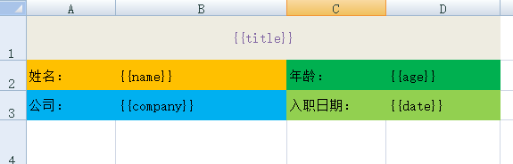
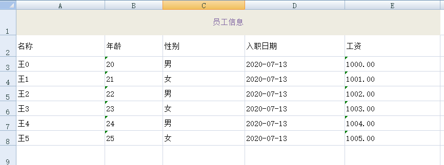

### 功能描述：  

预先设置导出模板，通过**表达式**取值，实现一些特殊样式/风格的导出，避免编写大量复杂的代码，降低开发难度，提高维护效率

### 简单的演示:
1.创建一个excel文件作为模板，设置一些特殊的样式

2.编写java测试类运行，代码如下：
```
~~~
import org.apache.poi.ss.usermodel.Workbook;
import org.jeecgframework.poi.excel.ExcelExportUtil;
import org.jeecgframework.poi.excel.entity.TemplateExportParams;

import java.io.File;
import java.io.FileNotFoundException;
import java.io.FileOutputStream;
import java.io.IOException;
import java.util.HashMap;
import java.util.Map;

/**
 * 模板导出
 */
public class Mobandaochu {

    public static TemplateExportParams getTemplateParams(String name){
        return new TemplateExportParams("D:\\JAVA\\poi\\"+name+".xlsx");
    }

    public static Workbook putong() {
        TemplateExportParams params = getTemplateParams("putong");
        Map<String, Object> map = new HashMap<String, Object>();
        map.put("title", "员工个人信息");
        map.put("name", "大熊");
        map.put("age", 22);
        map.put("company", "北京机器猫科技有限公司");
        map.put("date", "2020-07-13");
        Workbook workbook = ExcelExportUtil.exportExcel(params, map);
        return workbook;
    }

    public static void main(String[] args) throws IOException {
        Workbook workbook = putong();
        File savefile = new File("D:\\JAVA\\poi");
        if (!savefile.exists()) {
            savefile.mkdirs();
        }
        FileOutputStream fos = new FileOutputStream("D:\\JAVA\\poi\\result.xlsx");
        workbook.write(fos);
        fos.close();
    }

}

~~~
```
3.查看结果文件：


---------------


*由上述演示可以看出，根据模板导出就是先做好一个excel文件作为导出的模板，并且填入相应的表达式，在导出文件时，传入具体的数据就可以导出所需文件了。*
#### 以下列举所有表达式：
|  表达式   |  描述/示例   |
| --- | --- |
|   三目运算  |    {{test ? obj:obj2}}test如果某一个字段，则该字段一定是布尔类型,如果一个表达式，如arg == 1则一定要带有空格 |
|   n:  |    这个cell是数值类型 {{n:}} |
|   le:  |    代表长度{{le:()}} 在if/else 运用{{le:() > 8 ? obj1 : obj2}} |
|   fd:  |   格式化时间 {{fd:(obj;yyyy-MM-dd)}} |
|   fn:   |   格式化数字 {{fn:(obj;###.00)}} |
|   fe:   |   遍历数据,创建row |
|   !fe   |   遍历数据不创建row |
|  $fe:   |   下移插入,把当前行,下面的行全部下移.size()行,然后插入 |
|  #fe:   |    横向遍历|
|  v\_fe:   |  横向遍历值|
|  !if:  | 删除当前列 {{!if:(test)}}|
|  单引号   |  表示常量值 '' 比如'1' 那么输出的就是 1|
| &NULL&  |  空格|
|   \]\]  |  换行符 多行遍历导出|

------
#### 带有循环，带特殊表达式的示例：
1.创建exel模板

2.编写代码
```
~~~
import org.apache.poi.ss.usermodel.Workbook;
import org.jeecgframework.poi.excel.ExcelExportUtil;
import org.jeecgframework.poi.excel.entity.TemplateExportParams;

import java.io.File;
import java.io.FileNotFoundException;
import java.io.FileOutputStream;
import java.io.IOException;
import java.util.*;

/**
 * 模板导出
 */
public class Mobandaochu {

    public static TemplateExportParams getTemplateParams(String name){
        return new TemplateExportParams("D:\\JAVA\\poi\\"+name+".xlsx");
    }

    public static Workbook fuza() {
        TemplateExportParams params = getTemplateParams("fuza");
        Map<String, Object> map = new HashMap<String, Object>();
        map.put("title", "员工信息");
        List<Map<String, Object>> listMap = new ArrayList<Map<String, Object>>();
        for (int i = 0; i < 6; i++) {
            Map<String, Object> lm = new HashMap<String, Object>();
            lm.put("name", "王"+i);
            lm.put("age", "2"+i);
            lm.put("sex", i%2==0?"1":"2");
            lm.put("date",new Date());
            lm.put("salary", 1000+i);
            listMap.add(lm);
        }
        map.put("maplist", listMap);
        Workbook workbook = ExcelExportUtil.exportExcel(params, map);
        return workbook;
    }

    public static void main(String[] args) throws IOException {
        Workbook workbook = fuza();
        File savefile = new File("D:\\JAVA\\poi");
        if (!savefile.exists()) {
            savefile.mkdirs();
        }
        FileOutputStream fos = new FileOutputStream("D:\\JAVA\\poi\\result.xlsx");
        workbook.write(fos);
        fos.close();
    }

}
~~~
```
3.运行结果：

