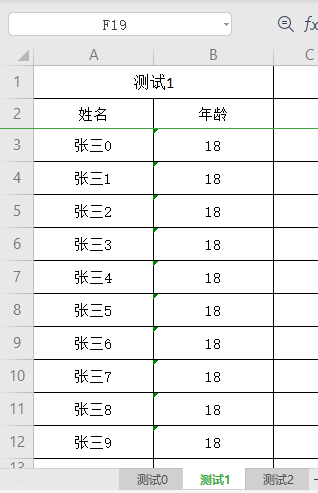

现在要导出格式如下：

实体如下：
~~~
public class TestEntity{

    @Excel(name = "姓名", width = 15)
    private String username;
    
    @Excel(name = "年龄", width = 15)
    private int age;

.....省略后续getset
~~~
---------
数据格式如下：
~~~
//多个map，对应了多个sheet
List<Map<String, Object>> listMap = new ArrayList<Map<String, Object>>();

for(int i=0;i<3;i++){
    Map<String, Object> map = new HashMap<String, Object>();
    map.put("title",getExportParams("测试"+i));//表格title
    map.put("entity",TestEntity.class);//表格对应实体

    //数据封装方式一：map数据，手动封装ExcelExportEntity集合
    List<Map> ls=new ArrayList<Map> ();
    for(int j=0;j<10;j++){
        Map map = new HashMap();
        map1.put("name","李四"+j);
        map1.put("age",18+j);
        ls.add(map);
    }

   //数据封装方式二：实体类
    List<TestEntity> ls=new ArrayList<TestEntity> ();
    for(int j=0;j<10;j++){
        TestEntity testEntity = new TestEntity();
        testEntity.setName("张三"+j);
        testEntity.setAge(18+j);
        ls.add(testEntity);
    }
    map.put("data", ls);
    listMap.add(map);
}

//导出参数
public static ExportParams getExportParams(String name) {
     //表格名称,sheet名称,导出版本 
    return  new ExportParams(name,name,ExcelType.XSSF);
}
~~~

调用ExcelExportUtil.exportExcel方法生成workbook
~~~
Workbook wb = ExcelExportUtil.exportExcel(listMap,ExcelType.XSSF);
~~~
