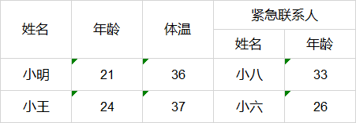

**模式一：map数据，手动封装ExcelExportEntity集合**

现在要导出格式如下：

---------

数据格式如下：
~~~
List<Map<String,Object>> dataList = new ArrayList<Map<String,Object>>();
Map<String,Object> map1 = new HashMap<>();
map1.put("name","小明");
map1.put("age","21");
map1.put("degree","36");
map1.put("link_name","小八");
map1.put("link_age","33");
dataList.add(map1);

Map<String,Object> map2 = new HashMap<>();
map2.put("name","小王");
map2.put("age","24");
map2.put("degree","37");
map2.put("link_name","小六");
map2.put("link_age","26");
dataList.add(map2);
~~~

配置ExcelExportEntity集合如下：
~~~
List<ExcelExportEntity> entityList = new ArrayList<>();
//一般表头使用这种两个参数的构造器
ExcelExportEntity e1 = new ExcelExportEntity("姓名","name");
ExcelExportEntity e2 = new ExcelExportEntity("年龄","age");
ExcelExportEntity e3 = new ExcelExportEntity("体温","degree");
entityList.add(e1);
entityList.add(e2);
entityList.add(e3);
//需要被设置成子表头的使用这种三个参数的构造器,设置colspan为true
ExcelExportEntity e5 = new ExcelExportEntity("姓名","link_name",true);
ExcelExportEntity e6 = new ExcelExportEntity("年龄","link_age", true);
entityList.add(e5);
entityList.add(e6);
//合并表头也需要设置colspan为true
ExcelExportEntity e4 = new ExcelExportEntity("紧急联系人","linkman",true);
List<String> sub = new ArrayList<>();
sub.add("link_name");
sub.add("link_age");
//还需要设置一个子表头key的集合
e4.setSubColumnList(sub);
entityList.add(e4);

~~~

调用ExcelExportUtil.exportExcel方法生成workbook
~~~
Workbook wb = ExcelExportUtil.exportExcel(new ExportParams(null, "sheetName"),entityList,dataList);
~~~

==================================---===============================
**模式二：实体类，基于注解，添加excel注解groupName属性**
现在要导出格式如下：

~~~
public class SysUser {

    @Excel(name = "登录账号", width = 15, groupName = "基本信息")
    private String username;
    
    @Excel(name = "真实姓名", width = 15, groupName = "基本信息")
    private String realname;
    
    @Excel(name = "头像", width = 15)
    private String avatar;
    
    @Excel(name = "性别", width = 15)
    private String sex;

.....省略后续getset
~~~
数据如下：
~~~
List<SysUser> ls = new ArrayList<SysUser>();
SysUser s1 = new SysUser();
s1.setUsername("zhangsan");
s1.setRealname("张三");
s1.setAvatar("大头贴");
s1.setSex("男");
ls.add(s1);

SysUser s2 = new SysUser();
s2.setUsername("lisi");
s2.setRealname("李四");
s2.setAvatar("短寸头");
s2.setSex("男");
ls.add(s2);

SysUser s3 = new SysUser();
s3.setUsername("wangwu");
s3.setRealname("王舞");
s3.setAvatar("洗剪吹");
s3.setSex("女");
ls.add(s3);
~~~

导出Workbook 方法：
~~~
Workbook wb = ExcelExportUtil.exportExcel(new ExportParams(null, "sheetName"),SysUser.class,ls);
~~~