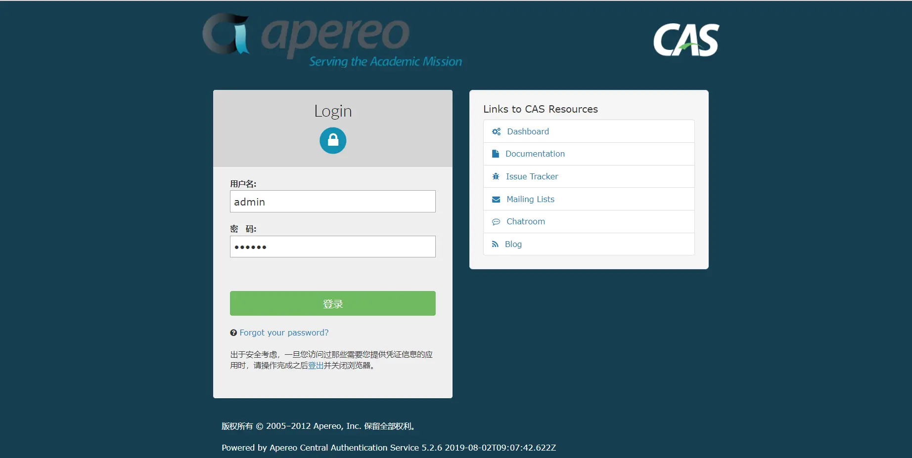
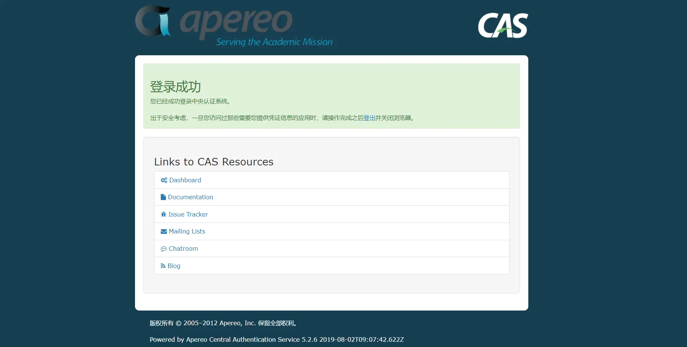

1、CAS单点登录服务端准备
===

> 搭建CAS服务端，如果已经部署服务端，此步骤可以省略！！

### CAS单点登录对接前期准备
#### （1）单点登录的介绍
单点登录（Single Sign On ,简称SSO）是目前比较流行的服务于企业业务整合的解决方案之一，SSO 使得在多个应用系统中，用户只需要登录一次就可以访问所有相互信任的应用系统。 
CAS（Central Authentication Service）是 Yale大学发起的一个企业级的、开源的项目，旨在为 Web 应用系统提供一种可靠的单点登录解决方法

####  (2)CAS服务端搭建
> 此处不做详细搭建部署介绍，可以网络查询资料部署, 官网地址https://github.com/apereo/cas-overlay-template
当前我对接的CAS版本是5.2X，也可以使用 5.3X


##  注意！注意！注意！ 重要的事情说三遍！

**CAS服务端必须要开启rest支持**

添加如下依赖即可：

```
<!--开启cas server的rest支持-->
				<dependency>
				    <groupId>org.apereo.cas</groupId>
				    <artifactId>cas-server-support-rest</artifactId>
				    <version>${cas.version}</version>
				</dependency>
```

服务端部署完成后能正常使用系统用户进行登录登出即可






