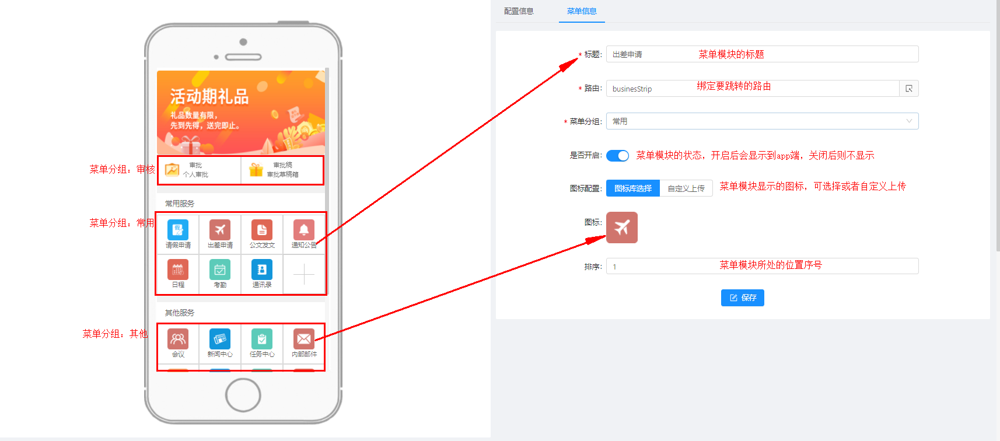
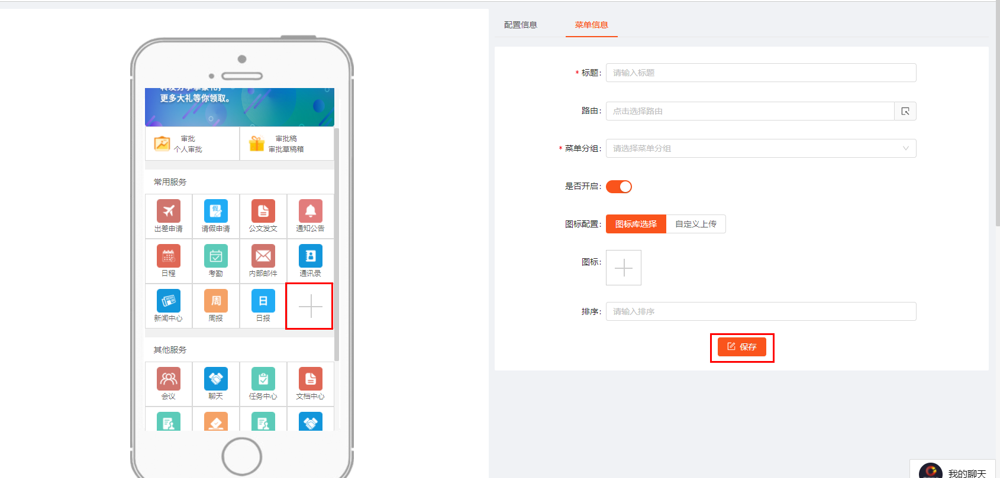
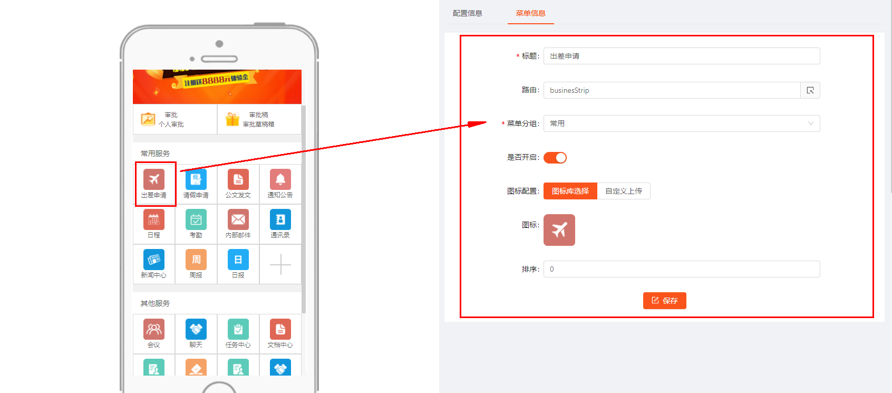
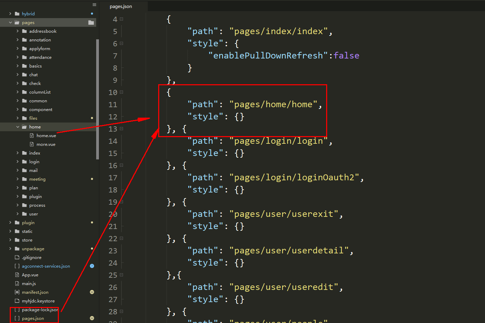
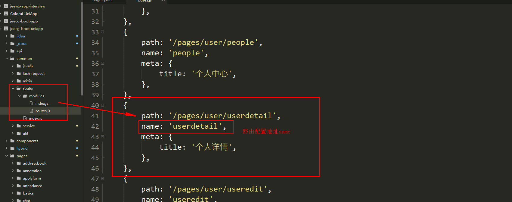
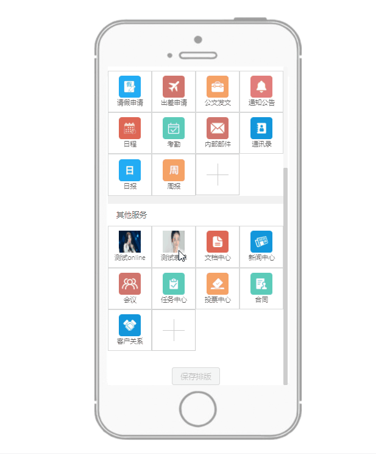
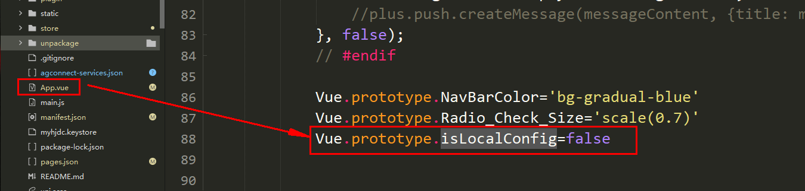

# APP首页排版设计
>[info] version`2.5+`  20210801
 自定义配置支持首页菜单、登录页面、封面图、online表单、设计器表单以及APP相关的基础信息（***注意：修改后配置想要立即生效需要APP端退出重新登录才能实现。默认配置信息缓存十分钟***。哪如何让所有重点终端都生效呢？ 临时方案，可以所有的token都失效，清空redis中的token）
[TOC]
## 1.APP基础配置
> 登录页面、logo图、轮播图

登录后台，点击`表单设计 > APP智能设计`，可以看到如下图页面

在配置信息的tab下面，可以设置app的标题、logo和首页的轮播图信息。配置完成后的app页面，如下

**配置方式：**
填写完成标题等信息后，点击下方保存按钮即可；
## 2.首页菜单配置
> 首页菜单图标、路由、online表单、设计器表单

### 2.1字段介绍
见下图：

###  2.2新增
   点击图中的+号，右侧会切换到菜单配置tab，输入基本信息后，点击保存即可新增。

>[info]具体路由配置参见下方【2.5路由配置】

###  2.3编辑
 单击具体的服务模块，信息会回显到右侧的form表单中，修改信息后，点击保存即可完成编辑。

### 2.4删除
双击任意服务模块，进入删除模式，所有服务模块右上角会显示删除标记，点击具体的模块的右上角删除标记，即可删除服务模块。再次双击任意服务模块后，回到正常模式。

### 2.5路由配置
 **方式一：手动输入路由名称。具体路由名称的获取方式如下：**
   APP端配置路由：
  1：在page.json文件中配置好页面路径
   
   2: 在router下的routes文件下配置路由地址和名称
   
   3: 将路由name配置到下图位置即可
  
 **方式二：点击输入栏内后侧的操作按钮，弹出选择框，选择你要的表单即可**

Tab1对应的是你创建的online表单
Tab2对应的是你创建的设计器表单
>[info]注意点:
 online对接的路由配置格式：**/app/online/表名**
 表单设计器对接的路由配置格式：**/app/desform/表单编码**
 普通的路由配置的格式： ***APP端设置的路由名称***

### 2.6是否开启
新增模块的状态默认是开启的，若果关闭后，左侧的菜单模块会置灰，在app端的页面上则不会显示该模块

### 2.7拖拽排版
拖动具体的服务模块，可以将它放到任意位置，来修改排版和布局，拖动完成后，点击下方**保存排版**按钮即可
**切记：拖拽排序完后一定要点击保存排版按钮**

 
## 3.首页布局如何切换
通过设置根目录下App.vue 页面配置的参数 isLocalConfig
默认为true，表示通过前端配置的数据来构建首页。  
改为false，通过后台智能设计的数据来加载首页。  

