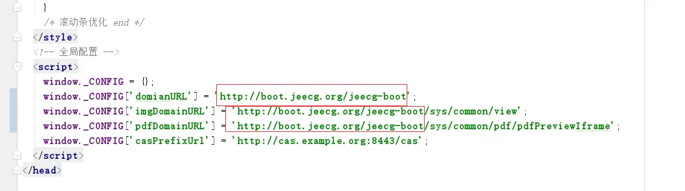
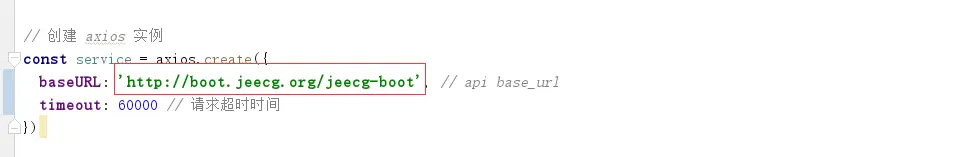

1、Build JEECG BOOT项目
===

> 打包APP之前首先Build项目，并对响应的配置做更改

### 一、修改配置信息
#### （1）修改后端服务域名地址

- 修改文件public/index.html

- 修改文件src/utils/request.js

#### （2）修改路由模式

- 修改文件src/router/index.js

mode 值改为 hash

#### （3）build之前配置publicPath

- 修改文件vue.config.js
增加配置 publicPath:'./',

以上配置完成后即可执行 npm run build 命令进行编译，编译之后文件会在dist目录下

