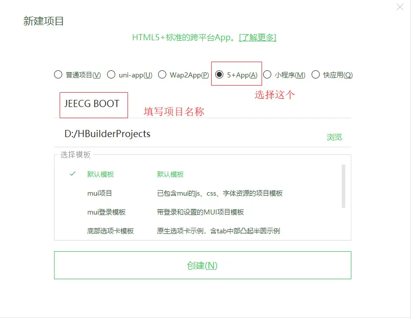
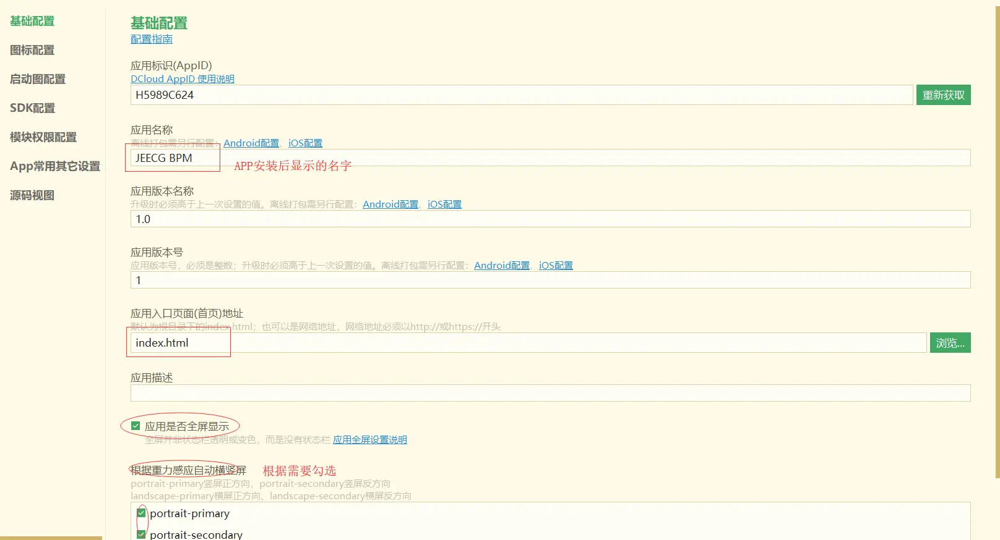
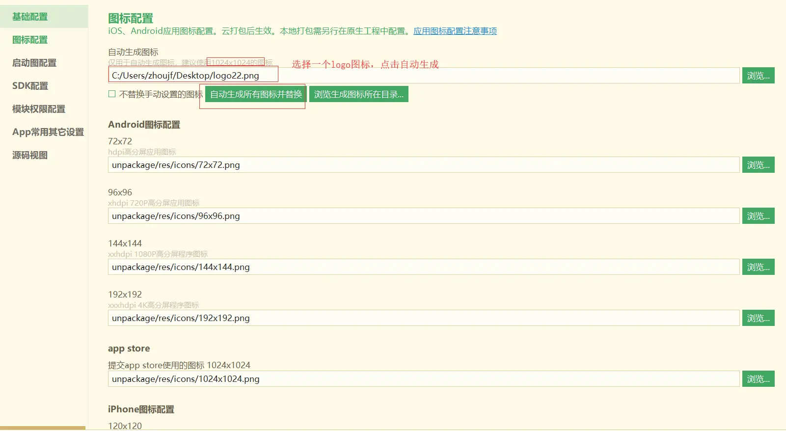
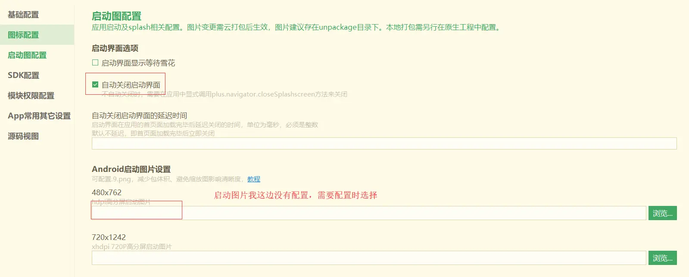
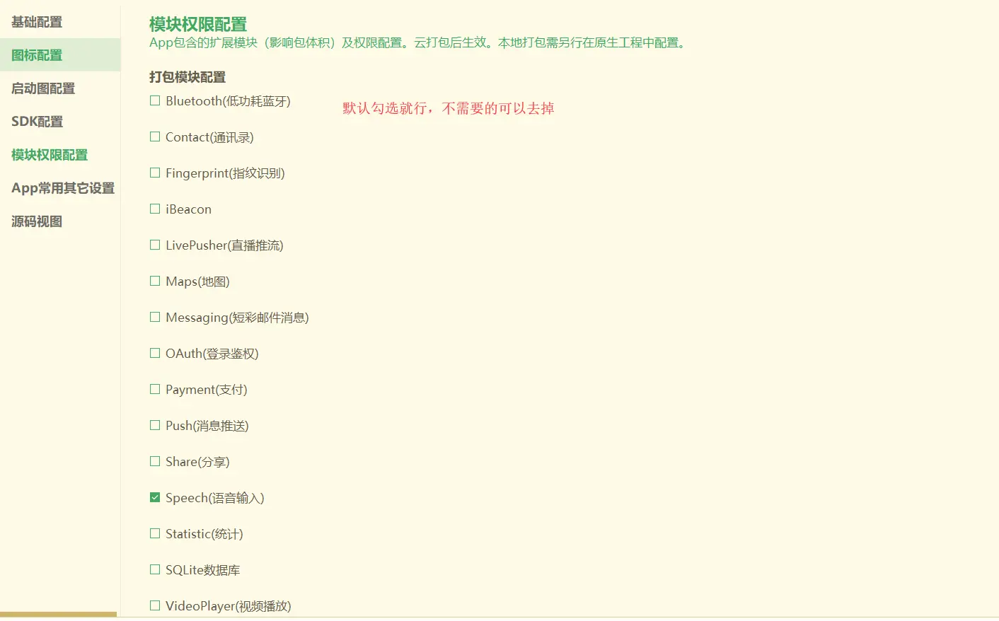
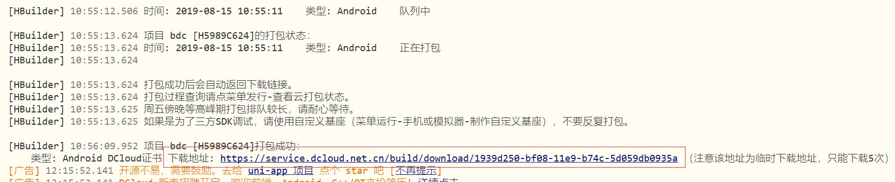

2、HBuilderX 打包APP
===

> 第一步build的文件（dist目录下的文件）使用HBuilderX 打包成APP

> 使用 HBuiderX 打包。（工具下载地址：http://www.dcloud.io/）

### 一、创建项目
【文件-新建-项目】 选择项目类型和填写项目名称



创建后会生成如下目录


### 二、dist目录下的文件拷贝到该工程

（1）包里工程路面下unpackge目录和mainifest.json文件  其他文件目录全部删除
（2）拷贝dist目录下的文件到该工程目录

拷贝后目录结构大概如下：


### 三、打包前项目配置

双击文件mainifest.json 进入文件配置界面

（1）基础配置

根据具体情况填写



（2）图标配置

配置logo



（3）启动图配置



（3） SDK配置 （暂时不用选择）

（4）模块权限配置



#### 打包后app点击返回键直接退出处理

在index.html中增加如下代码
```
<script type="text/javascript">
    //如下代码主要是解决打包后的app点击返回键直接退出
    document.addEventListener('plusready', function(a) { //等待plus ready后再调用5+ API：
                //// 在这里调用5+ API
                var first = null;
                plus.key.addEventListener('backbutton', function() { //监听返回键
                        //首次按键，提示‘再按一次退出应用’
                        if (!first) {
                            first = new Date().getTime(); //获取第一次点击的时间戳
                            // console.log('再按一次退出应用');//用自定义toast提示最好
                            // toast('双击返回键退出应用'); //调用自己写的吐丝提示 函数
                            plus.nativeUI.toast("双击退出", {duration:'short'}); //通过H5+ API 调用Android 上的toast 提示框
                            setTimeout(function() {
                                first = null;
                            }, 1000);
                        } else {
                            if (new Date().getTime() - first < 1000) { //获取第二次点击的时间戳, 两次之差 小于 1000ms 说明1s点击了两次,
                                plus.runtime.quit(); //退出应用
                            }
                        }
                    }, false);
            });
</script>
```

### 四、打包APP

【发行-原生APP-云打包】


打包后控制台如下打印



根据下载地址下载APP,手机安装即可！！


