#  unipush推送功能

[TOC]

### 一、配置推送
打开项目的manifest.json文件
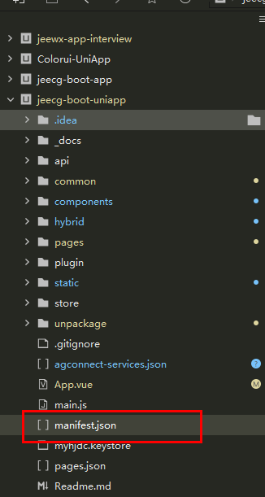
在App SDK配置模块勾选unipush推送

在APP模块权限配置中勾选push推送
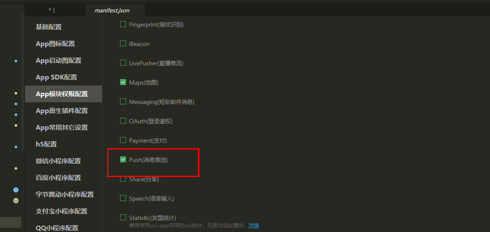
进入配置页面
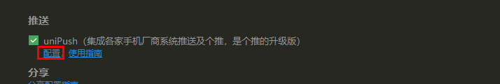

在配置时请先确认实名认证
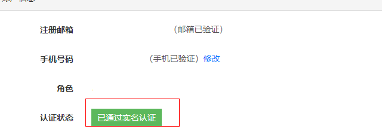
### 二、配置信息
#### 1、获取android签名
（1）https://ask.dcloud.net.cn/article/35777
（2）win10签名需要写入文件，需要管理员权限
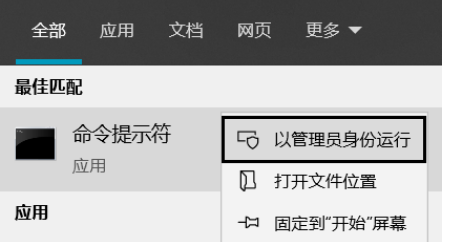

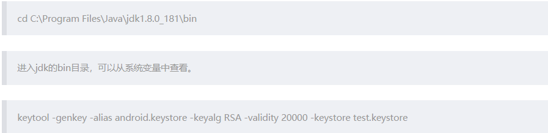

生成一个名字为test的签名

出现这种情况直接复制系统给的命令执行即可  
注意这里需要管理员权限
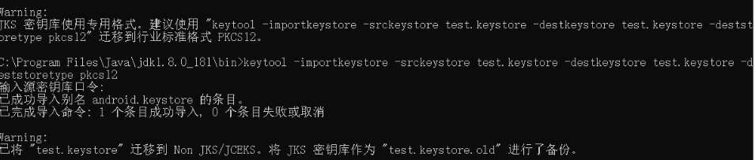
完成后会生成两个个keystore文件，其中old后缀是一个备份文件
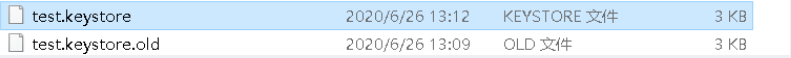
可以使用以下命令查看：
keytool -list -v -keystore test.keystore  
Enter keystore password: //输入密码，回车
会输出以下格式信息：

其中**SHA1**和**SHA256**是所需要的
#### 2、配置推送信息
1.其中包名需要记住,找到需要配置的应用，将之前生成的SHA1配置到应用签名上

### 三、打包执行
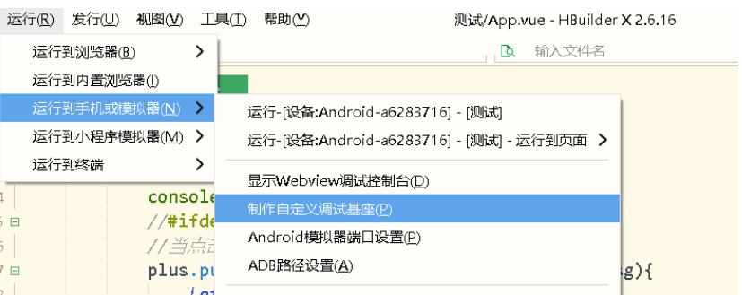

包名和别名在前面需要一致
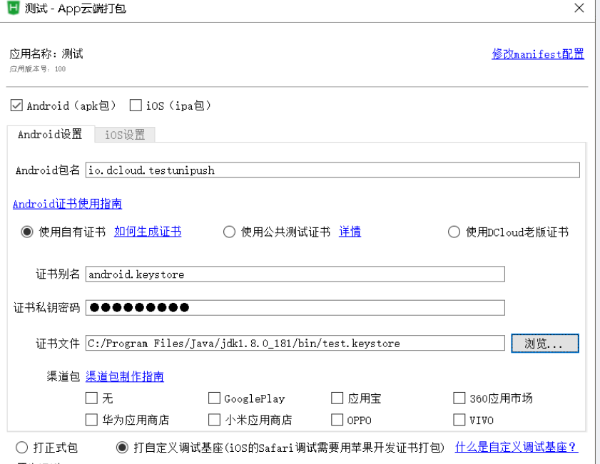

等待打包完成

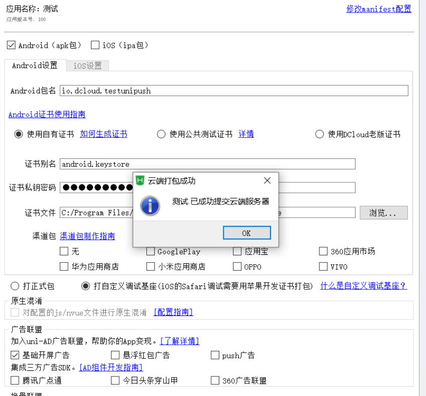
完成后更改打包基座

运行到设备
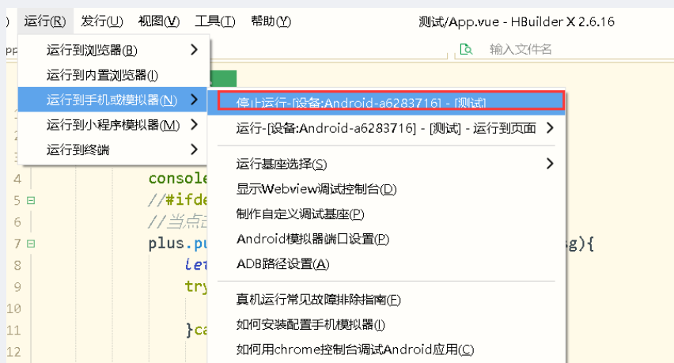

### 三、测试推送
在官网中发送一个推送
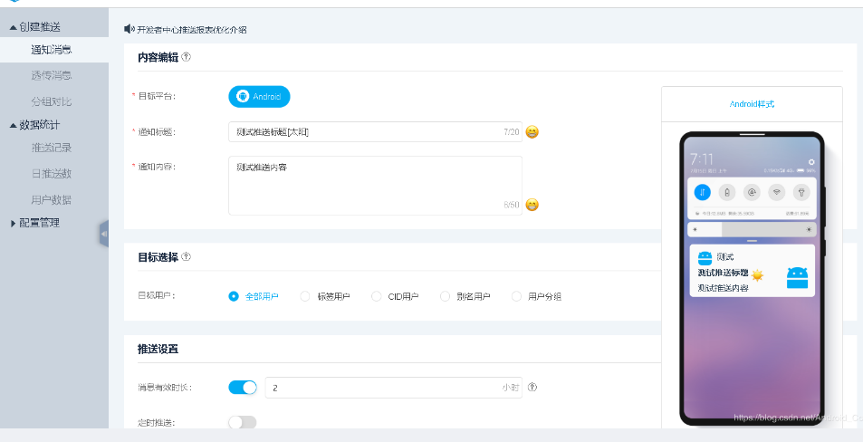
注意需要打开通知权限
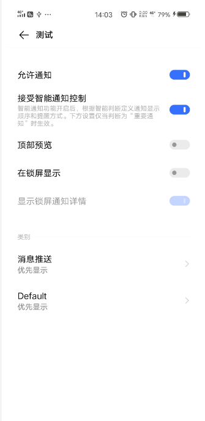

### 四、配置离线厂商推送
#### 1、注册手机厂商账号（华为）
华为开发者平台账号注册：(建议直接使用华为账号，否则可能无法使用推送)
1.直接到[https://developer.huawei.com/](https://developer.huawei.com/)华为开发者联盟去注册账号，跟着提示一步步走即可

2.账号注册完后到管理中心----》我的应用 ----》新建    去新建项目。
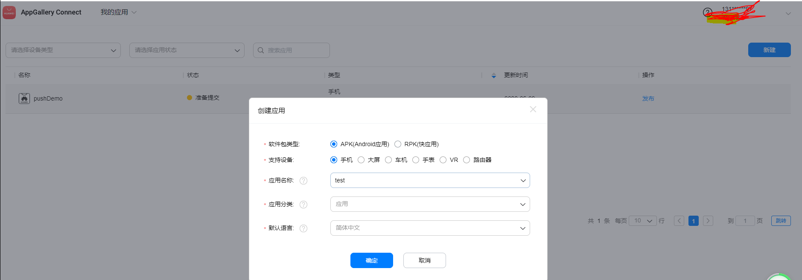

3.新建完成后，点击开发进入如下页面
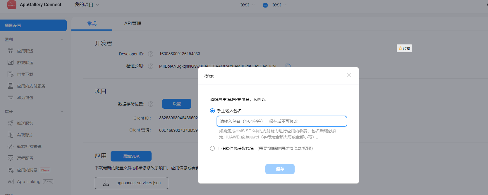
 4.填写包名，**这个包名很重要，需要和unipush的包名保持一致**。

5.项目创建完成后需要生成指纹证书文件，将之前生成的SHA256填入如图标记部分
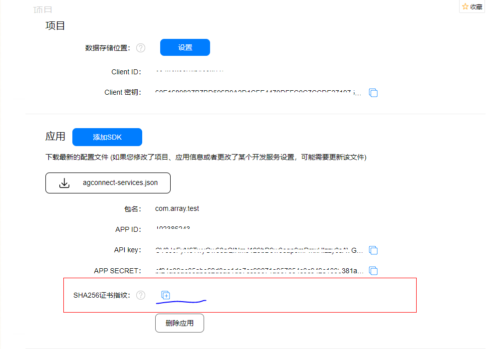

自此华为所需信息都已经获取完成。
6.项目信息完成后，开通推送服务

点击“立即开通”
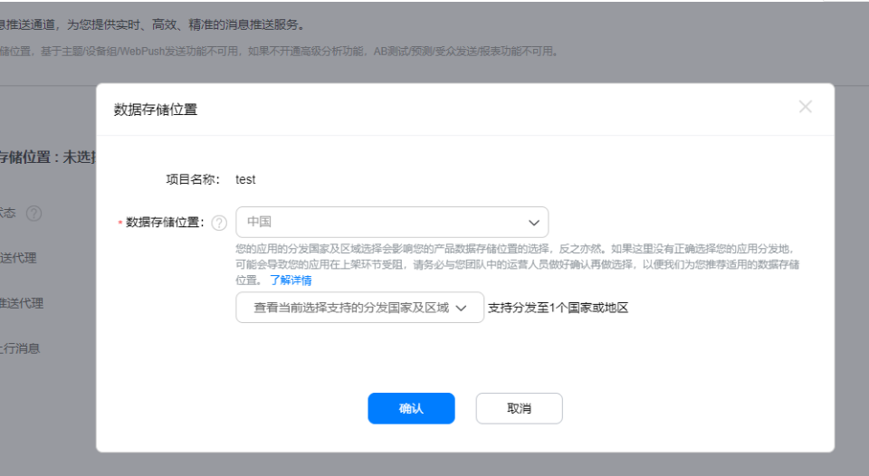
web推送代理打开
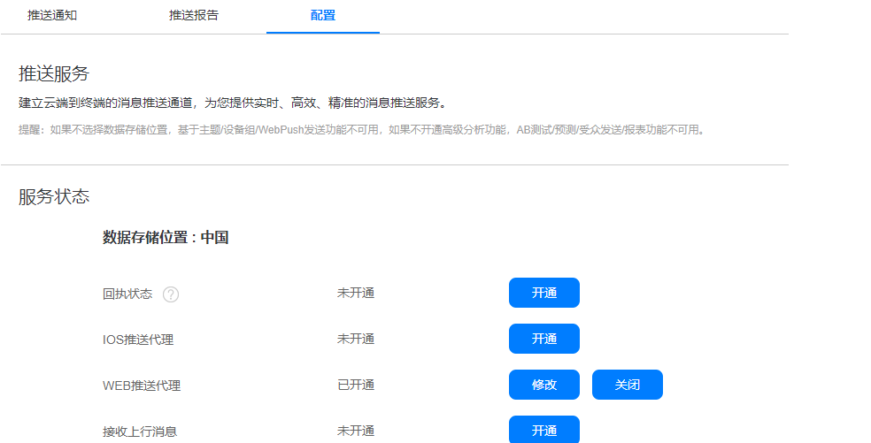
#### 2、注册手机厂商账号（小米）
1.到小米开发这平台注册账号：需要小米账号,非小米账号就会没有权限
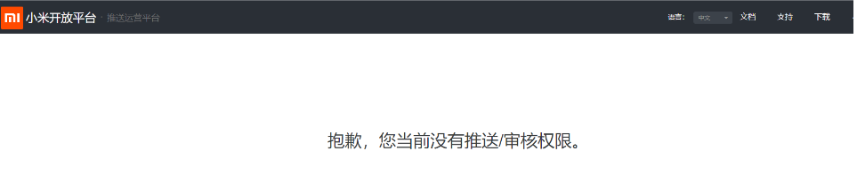
2.账号注册完成，就可去到推送运营平台。点击创建应用，创建自己的推送项目，注意报名要与unipush保持一致。

3.点击应用信息就可以拿到，推送需要的应用信息

#### 3、 unipush接入厂商：
1.找到之前配置的unipush

2.配置厂商通道：点击厂商推送设置将各个厂商的应用信息填入对应项中，保存。

