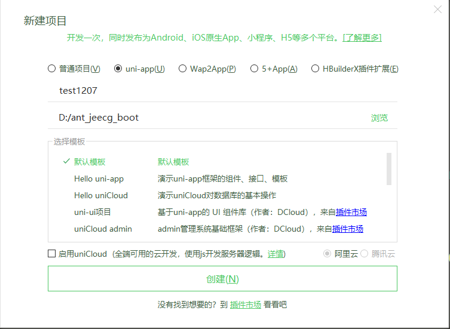
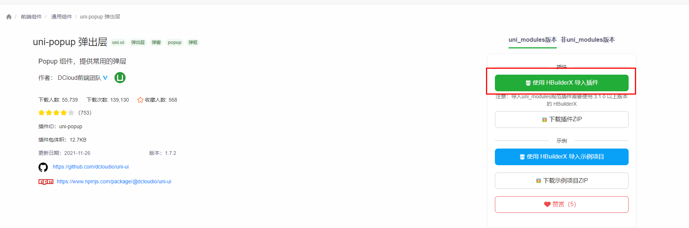
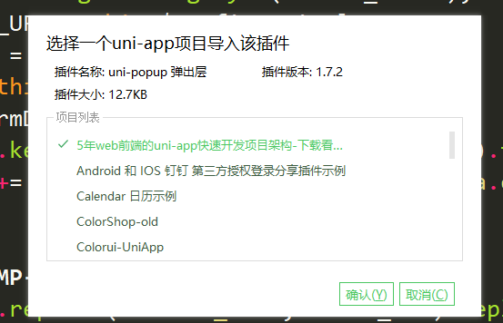

# 如何在 uniapp 项目中，使用“插件市场” 的原生插件

插件市场 :[http://ext.dcloud.net.cn/?cat1=5&cat2=51](http://ext.dcloud.net.cn/?cat1=5&cat2=51)
#### 1. 第一步： 首先在HBuilder x 中新建一个uniapp 项目，如果已建好 uniapp 项目则跳过该步骤。

#### 2.第二步： 在 ”插件市场中 “ 选择你需要的原生插件 -》 选择使用HbuildX导入插件-》 弹出一个 uniapp 应用选择框，勾选你要在哪一个uniapp项目中使用该插件。

#### 3.第三步： 选择完项目后，点击确认，会自动下载到指定文件夹

#### 4.第四步： 在需要使用的页面中引用即可

# uni-app - 使用 npm 安装第三方包
官方文档：https://uniapp.dcloud.io/frame?id=npm%E6%94%AF%E6%8C%81

如果您是 HBuilder 创建的项目，那么你需要以下几步才能装包（cli 创建的项目可直接 npm 装包）。

#### 初始化项目
若项目之前未使用 npm 管理依赖（项目根目录下无 package.json 文件），先在项目根目录执行命令初始化 npm 工程，键入以下命令：
~~~
npm init -y
~~~
根目录会多出一个 package.json 文件。
#### 完成
~~~
安装完成后，根目录会多出一个 node_modules 文件夹。
~~~
这时，你就可以正常 npm 来装包了。