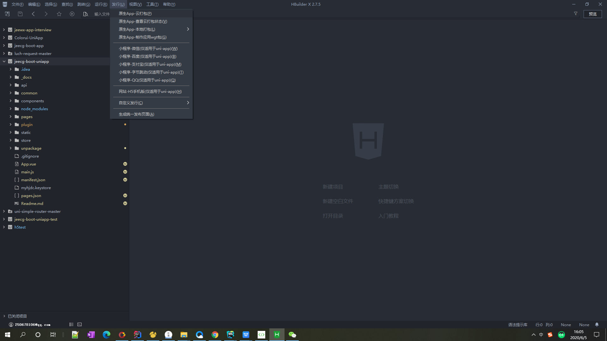
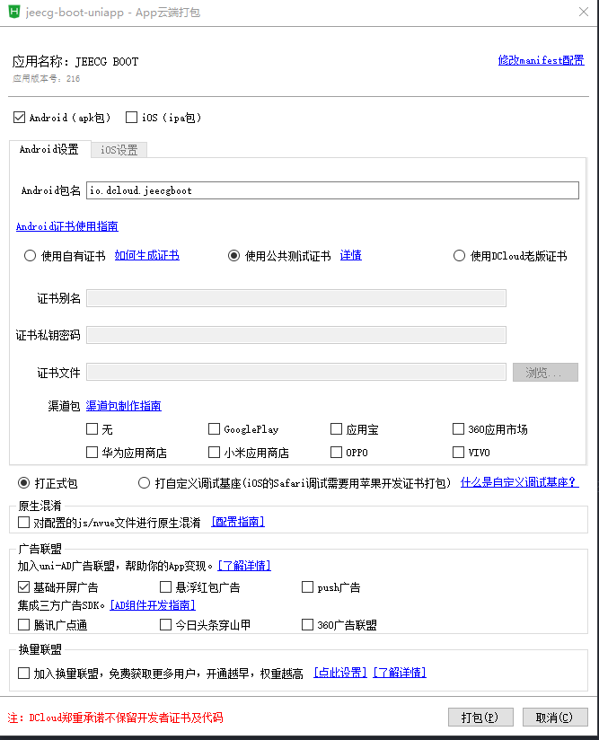
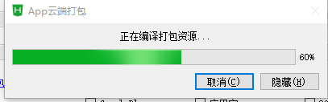
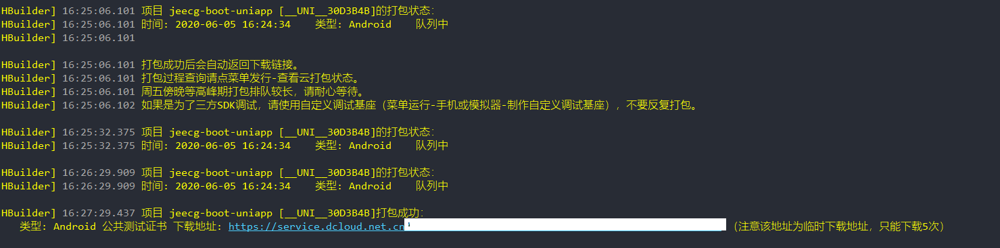
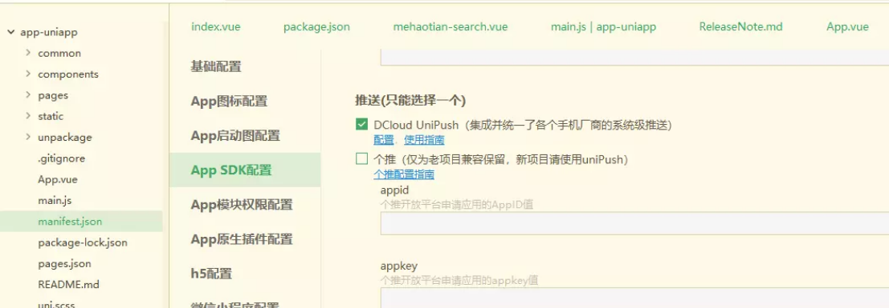
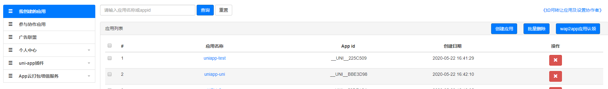
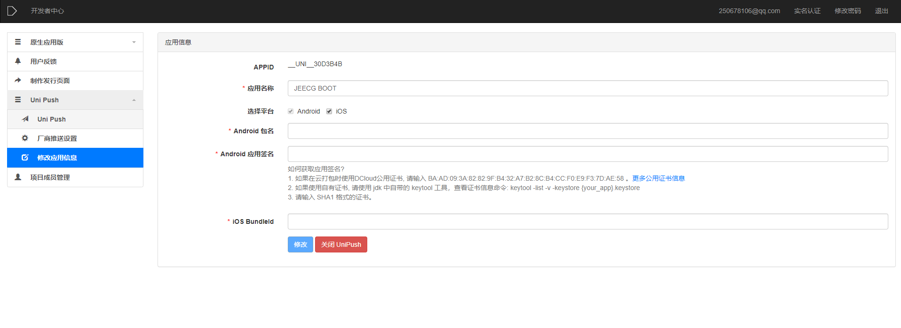

#### 打包为原生App（云端）
在HBuilderX工具栏，点击发行，选择原生app-云端打包，如下图：

出现如下界面，点击打包即可。

打包中：

提示下图，则打包成功，等待返回下载链接

返回下载链接

####  可能遇到的问题：

**解决方法：**
1.开通UniPush推送服务
UniPush仅支持uni-app类型项目，其它类型项目暂不支持 点此查看如何开通UniPush推送服务
在Hbuilder中修改mainfest.json文件配置.

勾选`DCloud UniPush`，然后点击配置按钮会进入uniPush的后端配置，需要先认证，认证通过后，可以在我创建的应用列表中查看自己当前的应用。如果有多个项目，此处可以根据列表中的App_id和本地的appid关联查看[https://dev.dcloud.net.cn/app/index?type=0](https://dev.dcloud.net.cn/app/index?type=0)

点击当前项目，进入对应项目的管理页面，展开Unipush菜单，选择修改应用信息，填写自己想要指定的包名及根据本地证书生成的签名信息（如果要使用官方的证书，那就按提示填写官方签名信息）

配置完可进入Unipush的“推送通知”测试页面。

