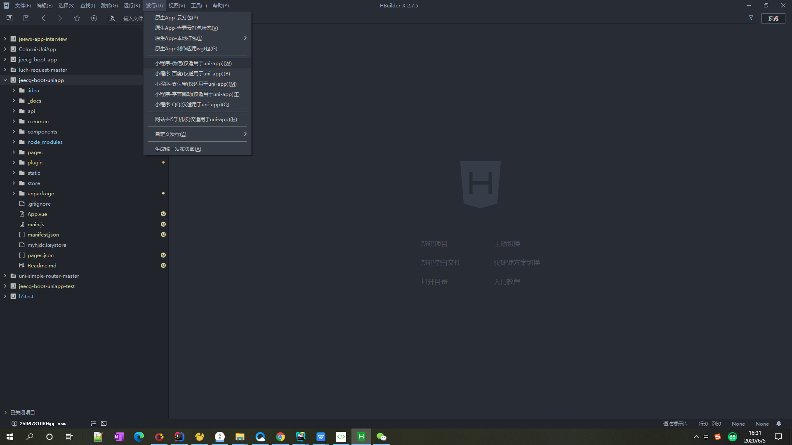
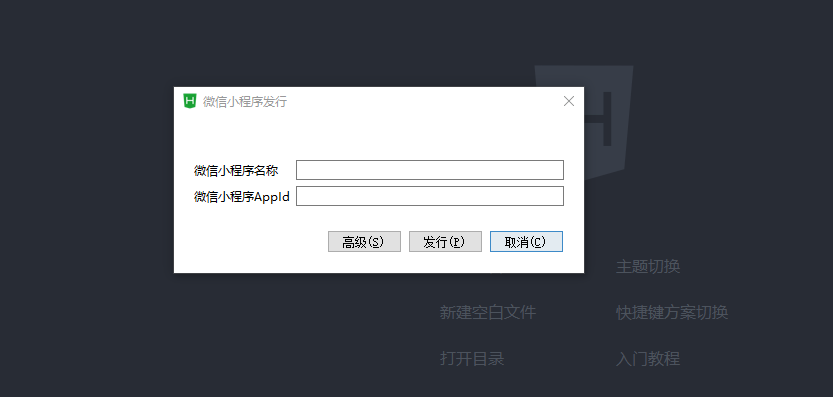
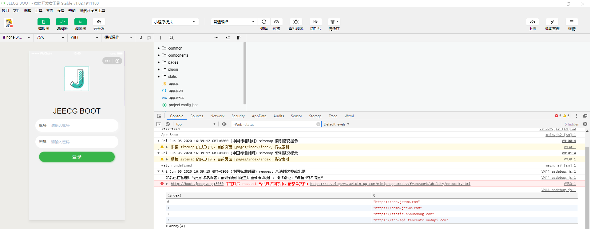
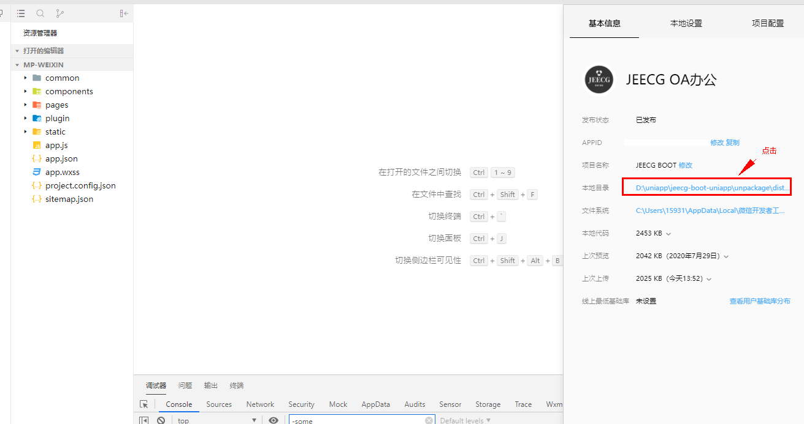
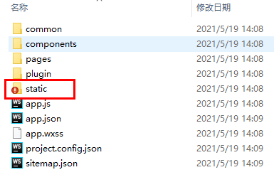
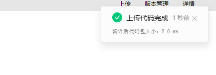

#### 打包为微信小程序
1.  申请微信小程序AppID，参考：微信教程【https://developers.weixin.qq.com/miniprogram/dev/framework/quickstart/getstart.html#%E7%94%B3%E8%AF%B7%E5%B8%90%E5%8F%B7】。
2.  在HBuilderX中顶部菜单上依次单击“发行” =>“小程序-微信”，输入小程序名称和appid单击发行即可在unpackage/dist/build/mp-weixin生成微信小程序项目代码。
 
输入小程序的appid和名称

发行后在微信开发者工具中打开，
**要注意小程序的合法域名的配置。以及微信小程序域名必须https开头**

小程序配置域名白名单：https://blog.csdn.net/weixin_44606457/article/details/105227254

注意：
   因为小程序打包上传大小不能超过2048kb，所以在上传是需要对部分静态文件进行删除

  1.打开打包文件夹
  
  2.打开static文件
  
  3.删除下图圈中说明的文件夹
  
 4.然后我们在上传才符合小程序要求的大小
 

另外一种方式：目录条件编译：
https://uniapp.dcloud.io/platform?id=static-%e7%9b%ae%e5%bd%95%e7%9a%84%e6%9d%a1%e4%bb%b6%e7%bc%96%e8%af%91