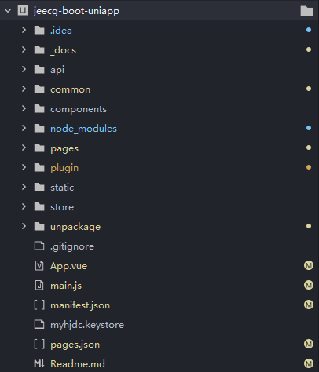

# jeecg-boot-uniapp 框架简介

uni-app 使用vue的语法+小程序的标签和API。

## 效果预览

## 开发规范

为了实现多端兼容，综合考虑编译速度，运行性能等因素，uni-app约定了如下开发规范：

*   页面文件向导[Vue单文件组件（SFC）规范](https://vue-loader.vuejs.org/zh/spec.html)
*   组件标签靠近小程序规范，详见uni-app组件规范
*   互连能力（JS API）靠近微信小程序规范，但需要将替换替换wx为uni，详见uni-app接口规范
*   数据绑定及事件处理同Vue.js规范，同时补充了App和页面的生命周期
*   为兼容多端运行，建议使用flex布局进行开发
## 目录结构

**1.一个uni-app工程，默认包含如下目录及文件：**
┌─components   uni-app组件目录
│ └─comp-a.vue 可复用的a组件
├─hybrid 存放本地网页的目录，[详见](https://uniapp.dcloud.io/component/web-view) 
├─platforms 存放各平台专用页面的目录，[详见](https://uniapp.dcloud.io/platform?id=%E6%95%B4%E4%BD%93%E7%9B%AE%E5%BD%95%E6%9D%A1%E4%BB%B6%E7%BC%96%E8%AF%91) 
├─pages 业务页面文件存放的目录 
│├─index
││     └─index.vue  index页面
│├─list
││     └─list.vue  list页面
├─static 存放应用引用静态资源（如图片、视频等）的目录，**注意：**静态资源只能存放于此
├─wxcomponents 存放小程序组件的目录，[详见](https://uniapp.dcloud.io/frame?id=%E5%B0%8F%E7%A8%8B%E5%BA%8F%E7%BB%84%E4%BB%B6%E6%94%AF%E6%8C%81)
├─main.js  Vue初始化入口文件 
├─App.vue 应用配置，用来配置App全局样式以及监听 [应用生命周期](https://uniapp.dcloud.io/frame?id=%E5%BA%94%E7%94%A8%E7%94%9F%E5%91%BD%E5%91%A8%E6%9C%9F)
├─manifest.json 配置应用名称、appid、logo、版本等打包信息，[详见](https://uniapp.dcloud.io/collocation/manifest) 

└─pages.json 配置页面路由、导航条、选项卡等页面类信息，[详见](https://uniapp.dcloud.io/collocation/pages)

**2.jeecg-boot-uniapp项目，包含的非uni-app工程默认的其他目录**
┌─_docs 项目的一些文档日志存放目录
├─api    请求服务端的接口文件存放目录
├─common   通用的文件
│├─luch-request 存放的是大神封装的request请求插件目录
│├─router  存放路由配置的目录
│├─service  存放请求拦截和开发环境配置
│├─util 存放的一些工具类
├─plugin  存放项目插件的目录
└─store 状态管理目录

