> 本章介绍ai开头的online表单测试数据主要测试的功能点

[TOC]

## 表单控件

表单控件分为单表`ai_control_single`，主表`ai_control_main`，一对多`ai_control_sub`,一对一`ai_control_sub_one`

### 1、单表

> 选择`表单控件@单表`，点击生成数据， 如果表名重复，需要修改

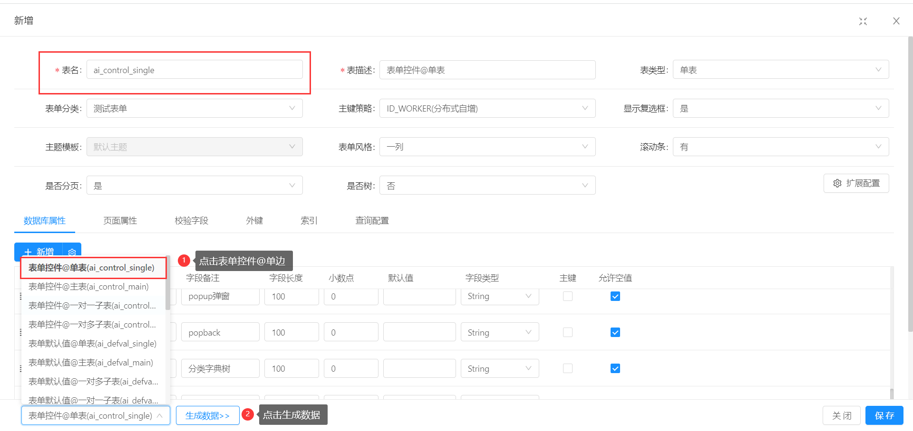

> 生成对应的自定义按钮、js增强、sql增强

自定义按钮，点击生成测试数据

js增强from，点击生成测试数据

js增强list，点击生成测试数据
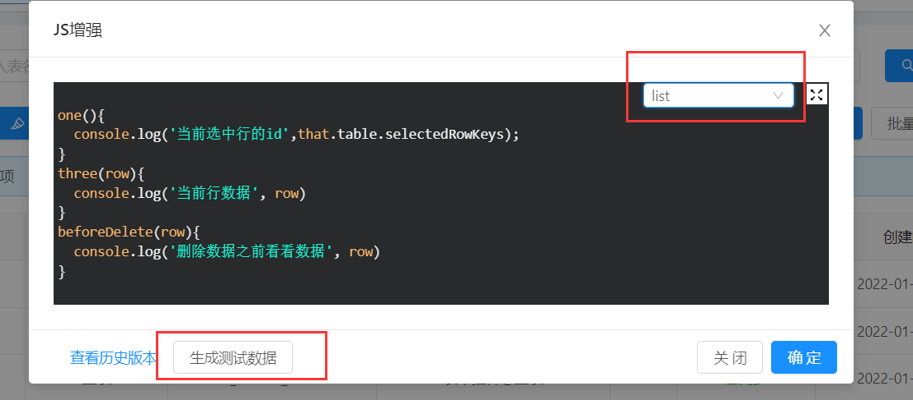
SQL增强，点击生成测试数据

> 主要测试内容

* 重点-> 控件是否全部生成，并且可以点击、新增和保存，字典、字典表和字典表带条件的下拉、单选、多选、下拉多选、下拉搜索是否可以生成
    
* 输入`单价和文本`，`多行文本`里面的内容是否发生改变
    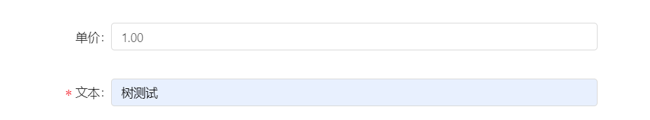
    
* 点击form增强，并点击确定，列表是否跟新
    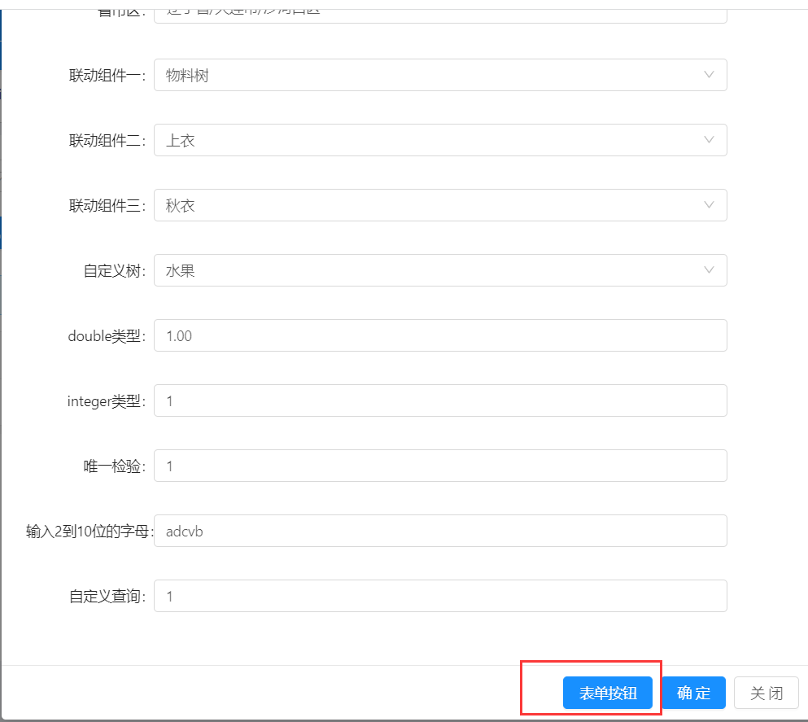

> 列表

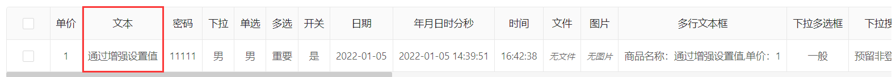

* 点击js增强button，控制台是否有输出
    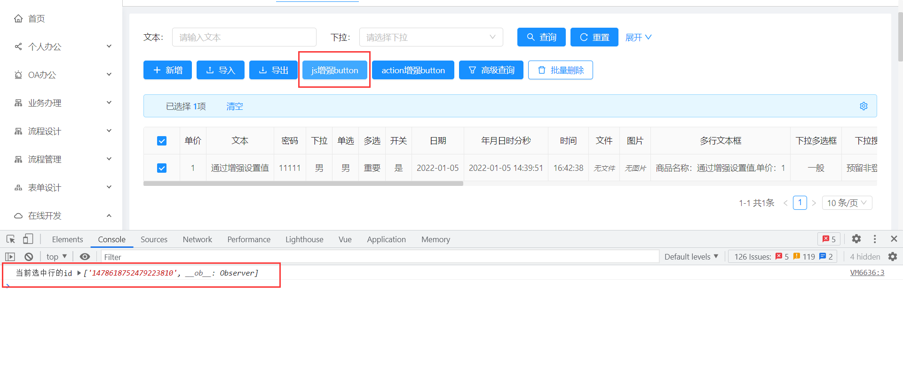
* 点击js增强link，控制台是否有输出
    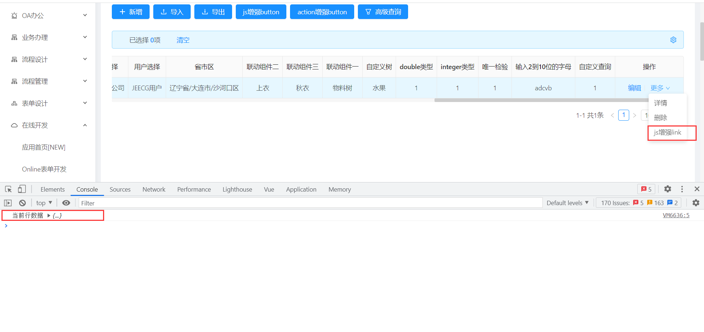
* 点击action增强button，`单价`是否更新为`2`
    

### 2、多表

> 生成`表单控件@主表`，点击保存并同步数据库

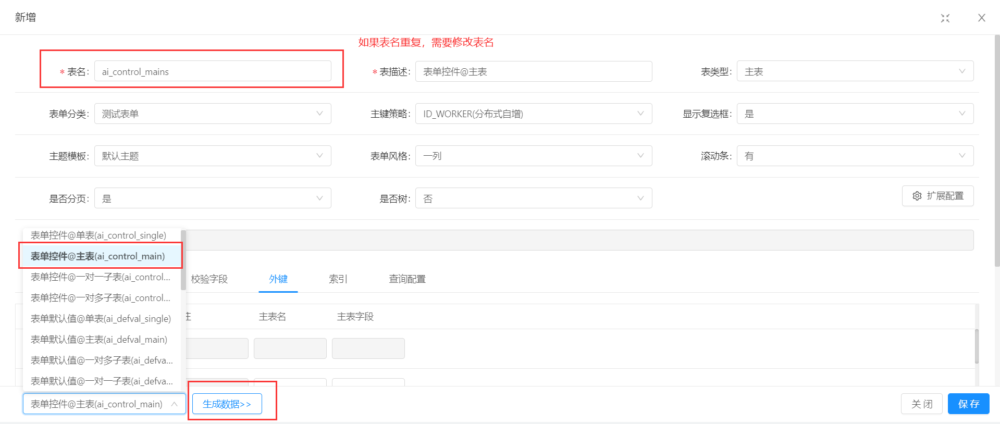

> 生成`表单控件@一对多子表`，点击保存并同步数据库

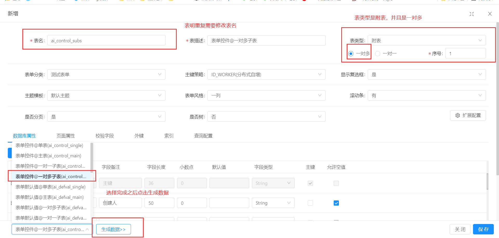
如果主表表名修改，那么对应子表的外键也需要修改
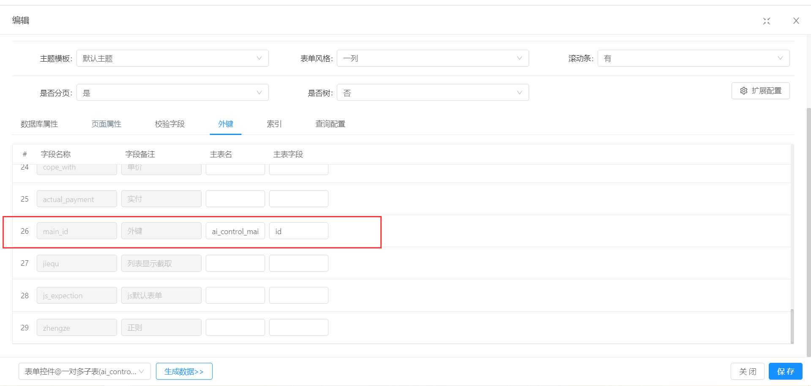

> 生成`表单控件@一对一子表`，点击保存并同步数据库

> 为主表生成对应的自定义按钮，js增强，sql增强

> 主要测试内容

* 重点-> 控件是否全部生成，并且可以点击、新增和保存，字典、字典表和字典表带条件的下拉、单选、多选、下拉多选、下拉搜索是否可以生成
    主表
    
    子表`一对一`、`一对多`
    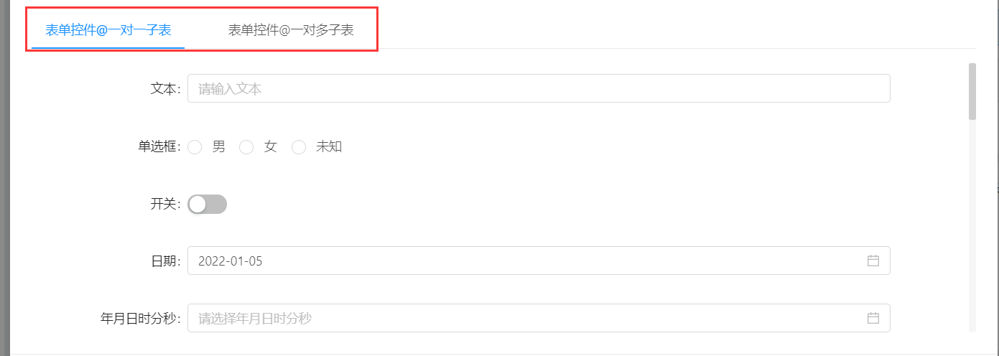
* js增强主表，在`自定义正则`输入后，`多行文本`是否有值
    
    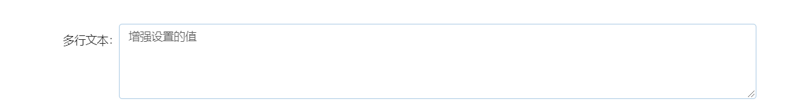
* js增强子表一对一,在`正则`输入内容后，`文本`是否有值
    
    
* js增强子表一对多,在`单价`输入后，`实付`是否是`购买数量*单价`
    \*
* 点击js增强button按钮，查看控制台是否有数据输出
    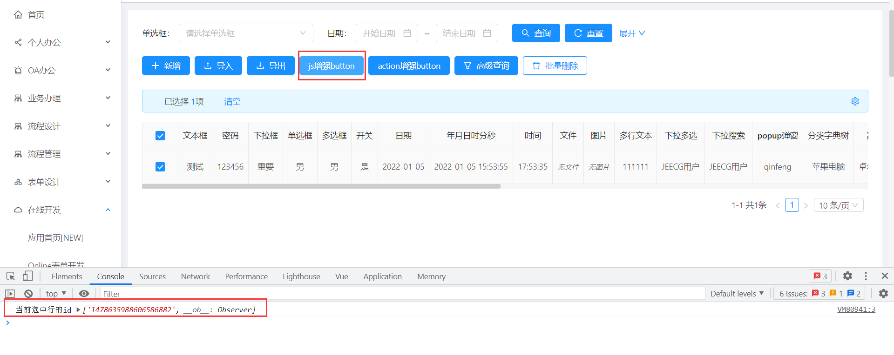
* 点击js增强link按钮，查看控制台是否有数据输出
    
* 点击action增强button，`单价`是否修改成2
    
* 点击表单按钮，列表`文本框`是否修改
    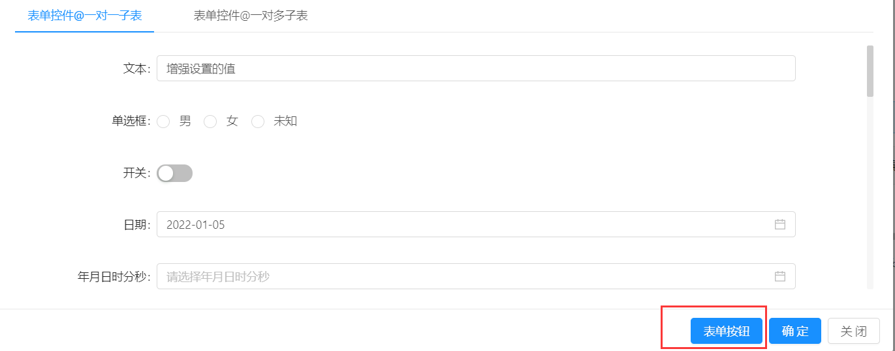
    列表
    

## 表单默认值

表单默认值分为单表`ai_defval_single`，主表`ai_defval_main`，一对多`ai_defval_sub`,一对一`ai_defval_subone`

### 1、单表

> 生成`表单默认值@单表`，点击保存并同步数据库

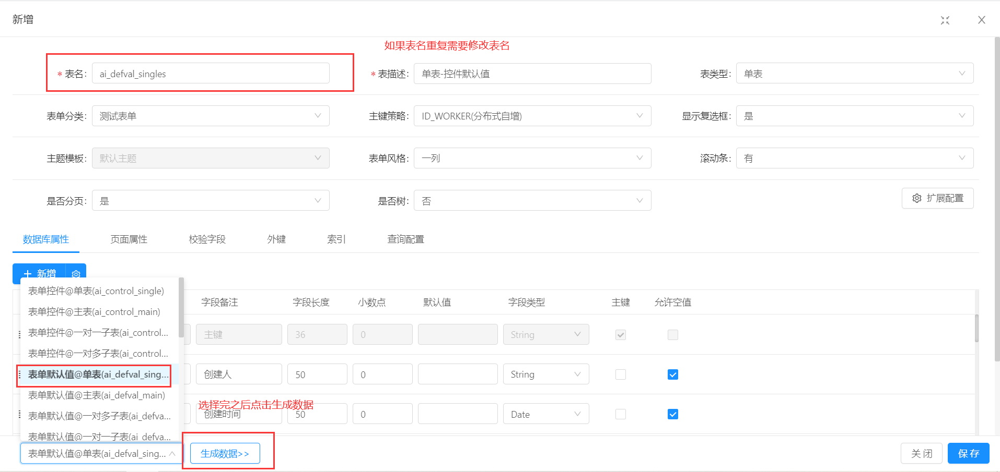

> 主要测试内容：各个组件的默认值、系统变量、编码规则、js表达式是否生成正确

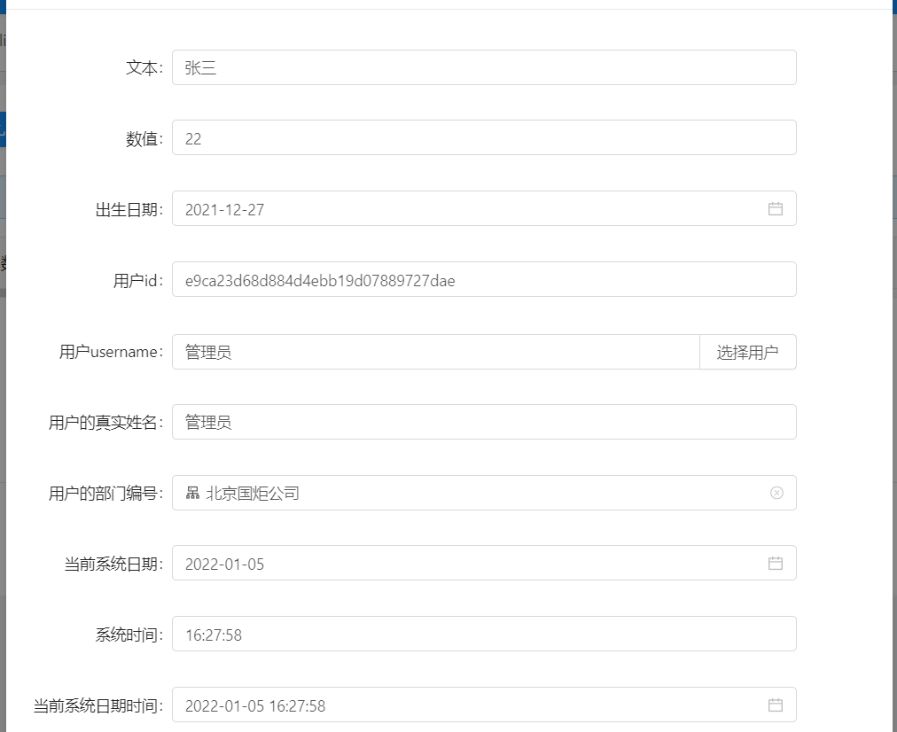

### 2、多表

> 生成`表单默认值@主表`，点击保存并同步数据库

> 生成`表单默认值@一对多子表`，点击保存并同步数据库

如果主表表名修改，需要修改外键

> 生成`表单默认值@一对一子表`，点击保存并同步数据库

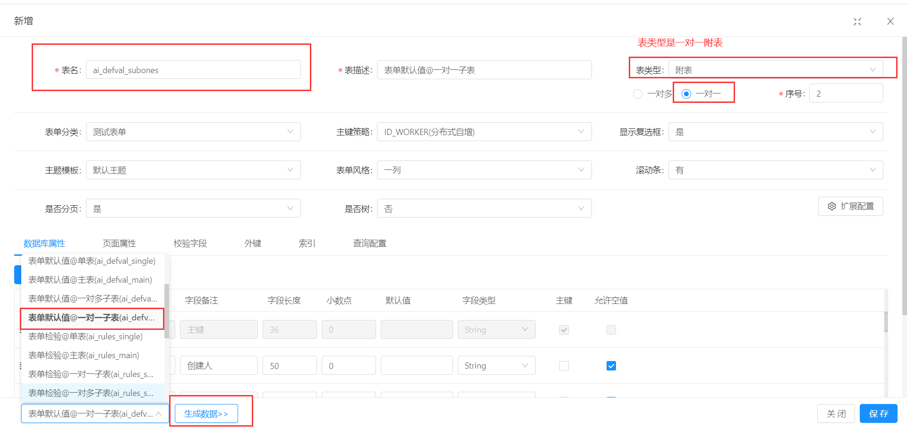

> 主要测试内容：主表、子表各个组件的默认值、系统变量、编码规则、js表达式是否生成正确

> 主表

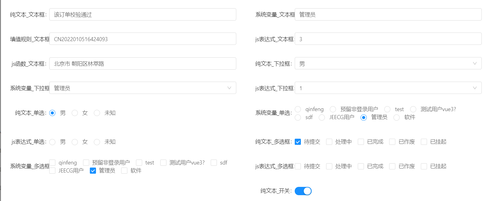

> 一对多子表

> 一对一子表

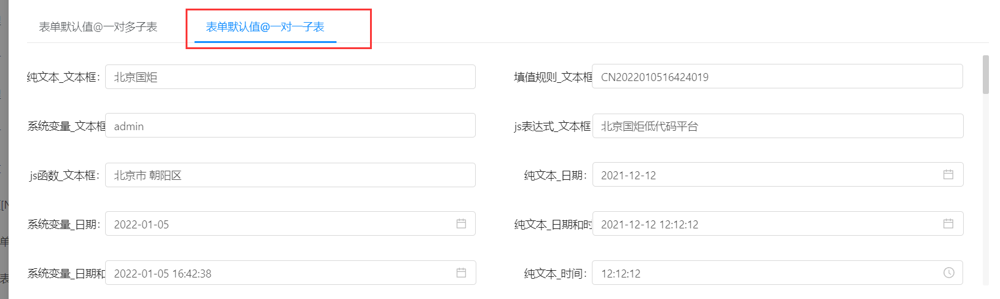

## 表单检验

表单检验分为单表`ai_rules_single`，主表`ai_rules_main`，一对多`ai_rules_sub`,一对一`ai_rules_sub_one`

### 1、单表

> 生成`表单检验@单表`，点击保存并同步数据库

> 主要测试内容：验证规则里面的检验是否正确，自定一验证规则`中文`是否通过，不同组件必填是否有效

### 2、多表

> 生成`表单检验@主表`，点击保存并同步数据库

> 生成`表单检验@一对多子表`，点击保存并同步数据库

如果主表表名修改，需要修改外键
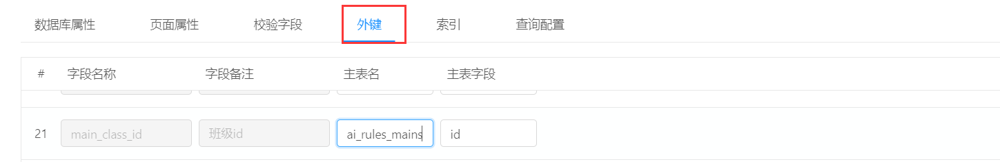

> 生成`表单检验@一对一子表`，点击保存并同步数据库

> 主要测试内容：主表、子表验证规则里面的检验是否正确，自定一验证规则`中文`是否通过，不同组件必填是否有效

> 主表

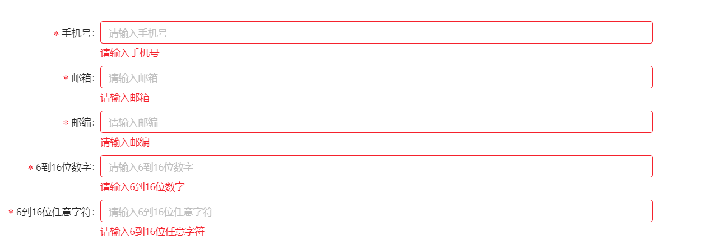

> 一对多子表

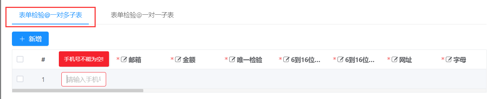

> 一对一子表

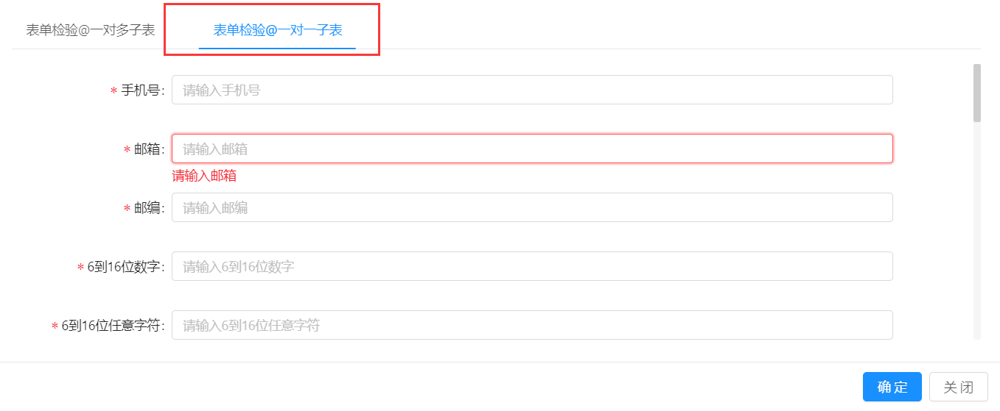

## 自定义查询

自定义查询分为单表`ai_query_custom_single`，主表`ai_query_custom_main`，一对多`ai_query_custom_sub`,一对一`ai_query_custom_sub_one`

### 1、单表

> 生成`自定义查询@单表`，点击保存并同步数据库

> 主要测试内容：列表页面查询是否全部生成（包含数字、时间范围），并且默认值是否存在，高级查询是否生成

### 2、多表

> 生成`自定义查询@主表`，点击保存并同步数据库

> 生成`自定义查询@一对多子表`，点击保存并同步数据库

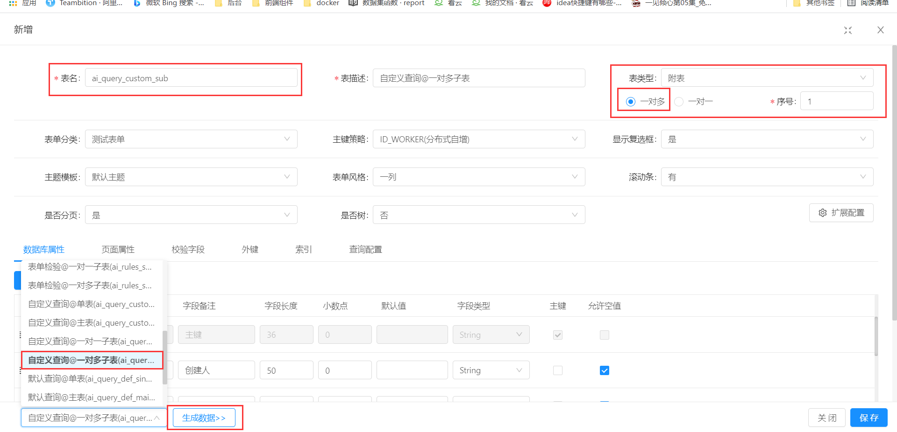
如果主表表名修改，需要修改外键

> 生成`自定义查询@一对一子表`，点击保存并同步数据库

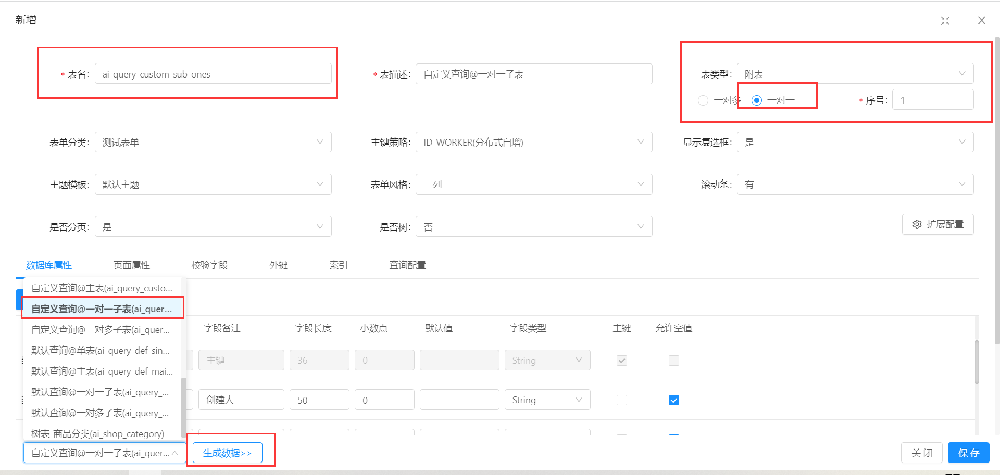

> 主要测试内容：主表、子表列表页面查询是否全部生成（包含数字、时间范围），并且默认值是否存在，高级查询是否生成

>[danger] 注意：当风格是默认和tab时，需要勾选联合查询，erp分格不需要

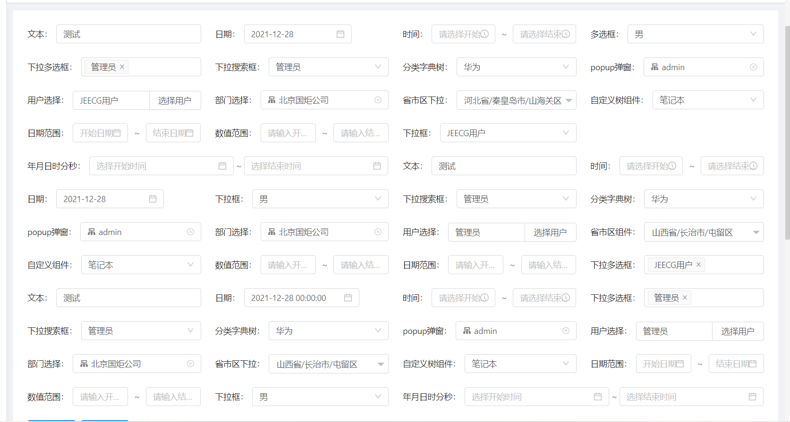

## 默认查询

默认查询分为单表`ai_query_def_single`，主表`ai_query_def_main`，一对多`ai_query_def_sub`,一对一`ai_query_def_sub_one`

### 1、单表

> 生成`默认查询@单表`，点击保存并同步数据库

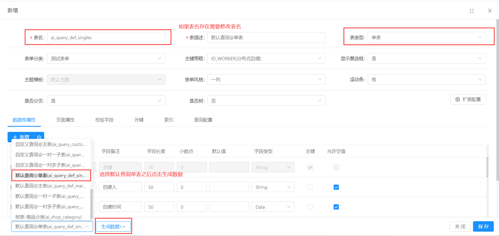

> 主要测试内容：列表页面查询是否全部生成（包含数字、时间范围），高级查询是否生成

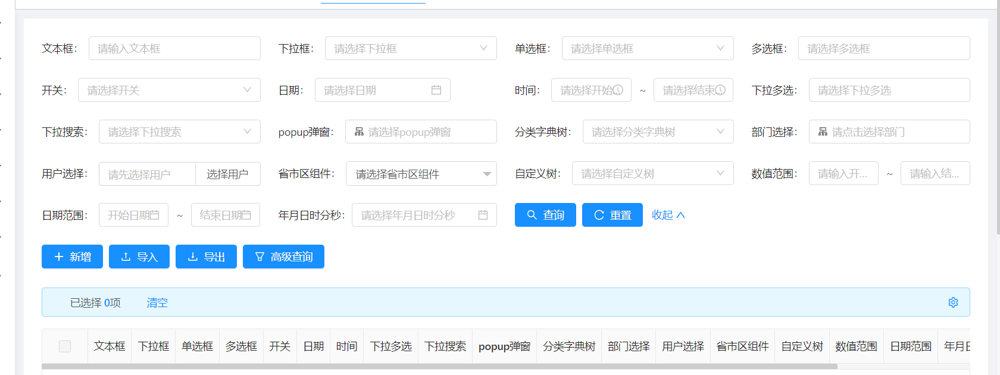

### 2、多表

> 生成`默认查询@主表`，点击保存并同步数据库

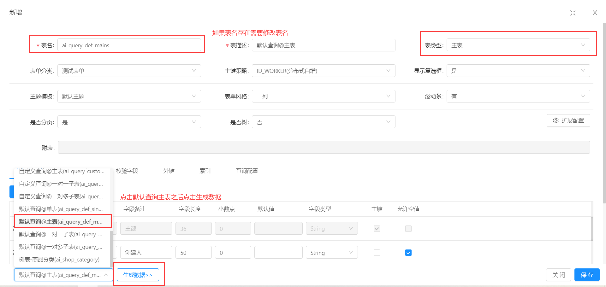

> 生成`默认查询@一对多子表`，点击保存并同步数据库

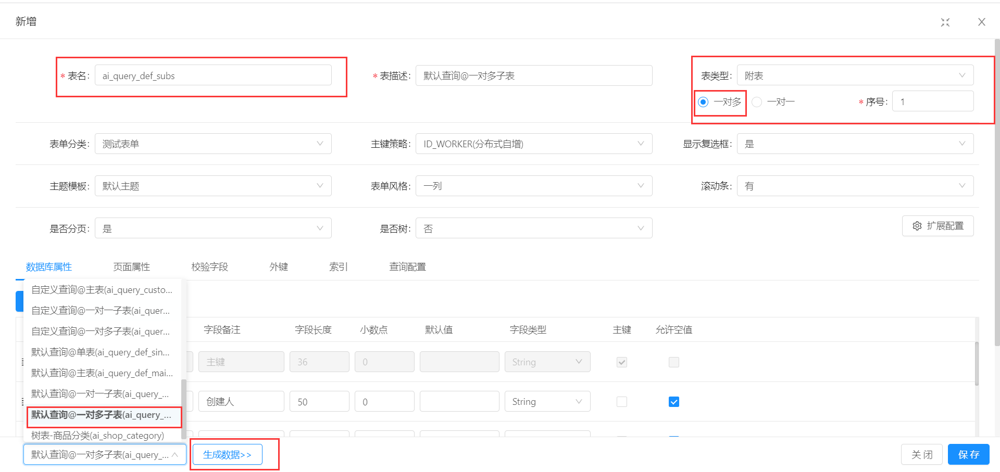
如果主表表名修改，需要修改外键
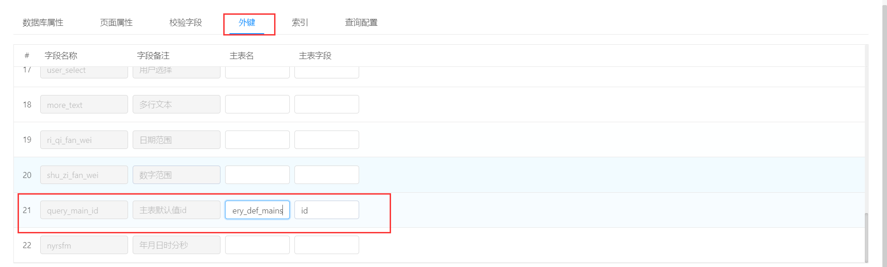

> 生成`默认查询@一对一子表`，点击保存并同步数据库

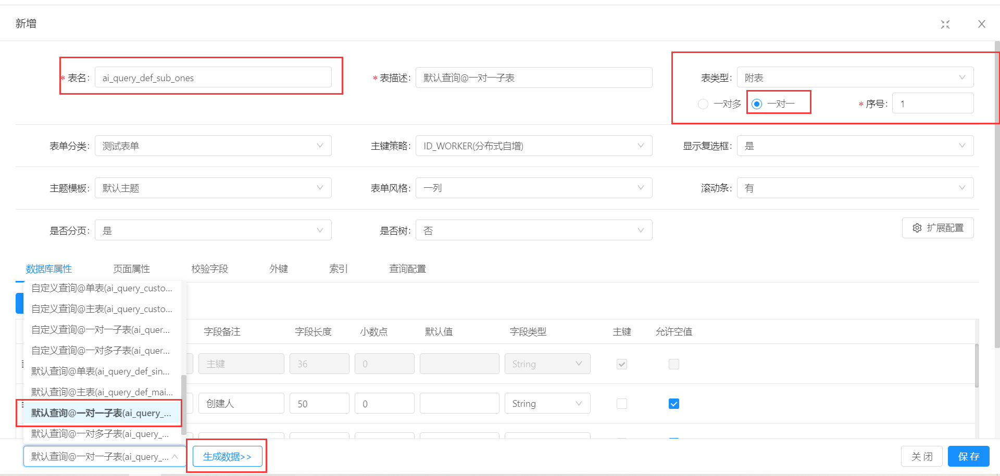

> 主要测试内容：主表、子表列表页面查询是否全部生成（包含数字、时间范围），高级查询是否生成

>[danger] 注意：当风格是默认和tab时，需要勾选联合查询，erp分格不需要

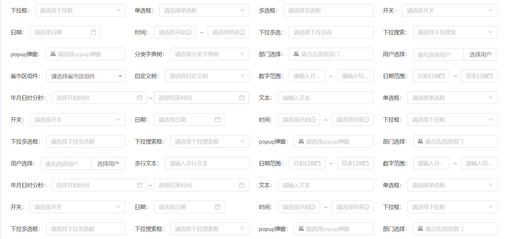