> 本章介绍AI模型如何制作

[TOC]
## 制作步骤
### 1、制作表格数据
#### 1.1 效果展示

#### 1.2 新建一个online表单，名称为`商家信息`
>除了自动生成的字段，其中还包含`bu_name`、`bu_desc`、`bu_address`,点击确定即可

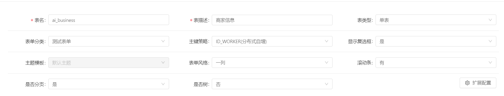
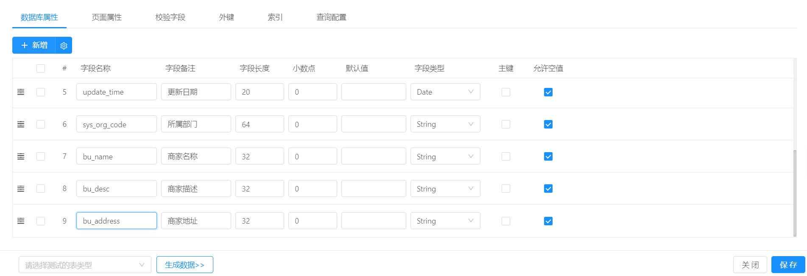
#### 1.3 制作表格数据库
>前台页面新增一个文件夹`demo`，并创建js文件，名称为`one.business.js`，文件存放地址`src/views/modules/aitest/data`

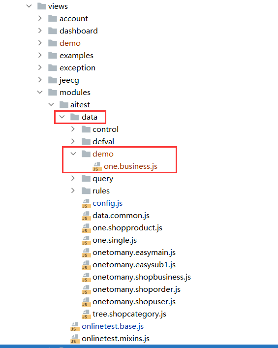

>在`one.business.js`文件中配置表信息`ai_business(商家信息)`
```
/**
 * 配置表信息
 */
const table = {
  //表名
  tableName: 'ai_business',
  //表描述
  tableTxt: '单表-商家信息',
  //表类型 1单表 2主表 3子表
  tableType: 1,
  formTemplate: '1',
  themeTemplate: "normal",
  //是否有横向滚动条 0否 1是 
  scroll: 1,
  //当前表版本号
  tableVersion: 1,
  //显示复选框 Y是 N否
  isCheckbox: 'Y',
  isDbSynch: 'Y',
  //是否分页 Y是 N否
  isPage: 'Y',
  //是否树 Y是 N否
  isTree: 'N',
  idType: 'UUID',
  queryMode: 'single',
  formCategory:'temp',
  //仅在附表中有效,0一对多、1一对一，在单表、主表中删掉
  relationType: 0
}
```

>在Online在线表单页面中键盘按F12打开浏览器控制台页面，点击表描述为`商家信息`的编辑

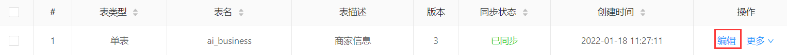

>发现控制台有内容输出,复制json串

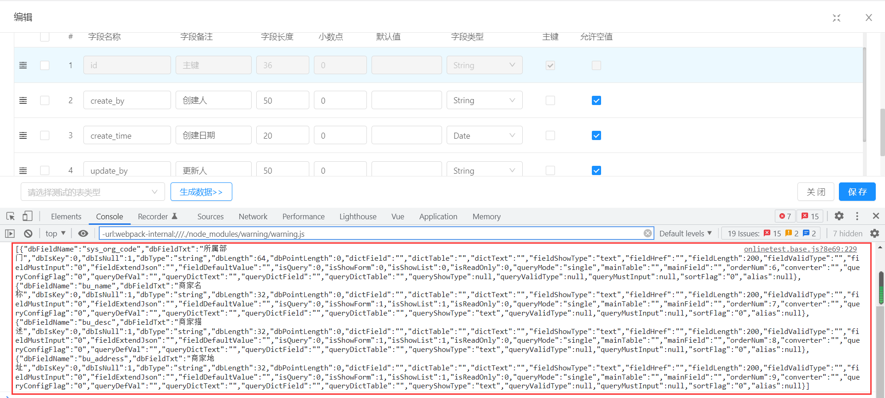

>配置`ai_business(商家信息)`字段->将json串放到`one.business.js`文件中

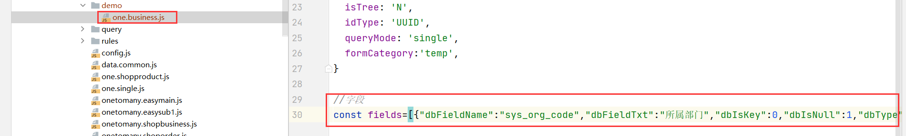

>在`one.business.js`文件末尾，将配置的数据导出
```
/**
 * 数据导出
 * table 表信息
 * fields 表字段
 * 命名规则:表名_config
 */
const ai_business_config = {
  table: table,
  fields: fields
}
export default ai_business_config
```
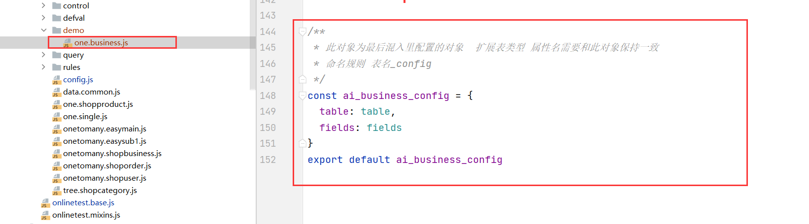
> 在`config.js`文件中新增表名和描述，文件地址：`src/views/modules/aitest/data/config.js`

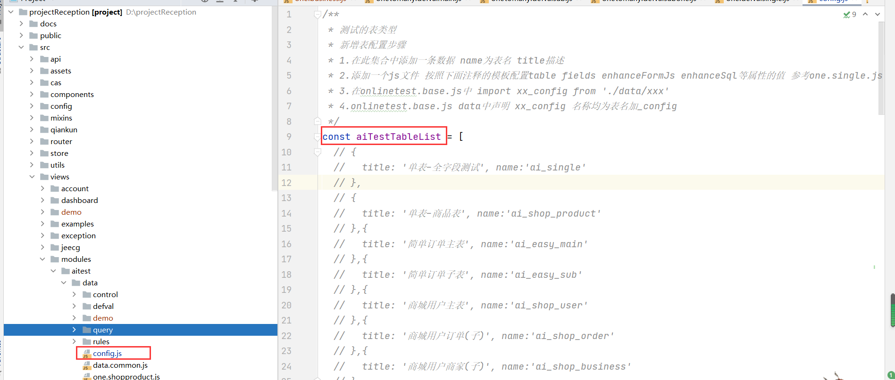
>在方法末尾添加`title`和`name`

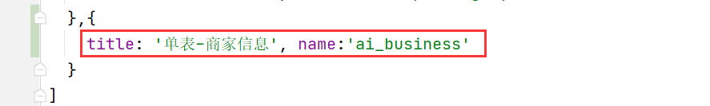
```
{
  title: '单表-商家信息', name:'ai_business'
}
```
>`onlinetest.base.js`引入配置类，文件地址：`src/views/modules/aitest/onlinetest.base.js`

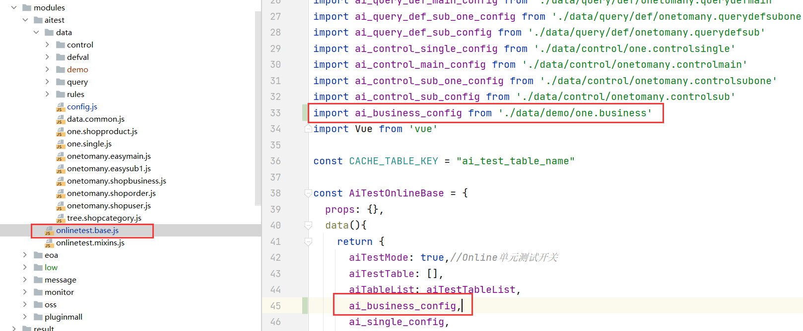


>[danger] 注意：如果json中存在自动生成的字段（id，create_by，create_time，update_by，update_time，sys_org_code）需要去掉包含字段花括号里面的所有内容


### 2、自定义按钮
自定义按钮页面配置详见:[自定义按钮](http://doc.jeecg.com/2516895)
#### 2.1 效果展示
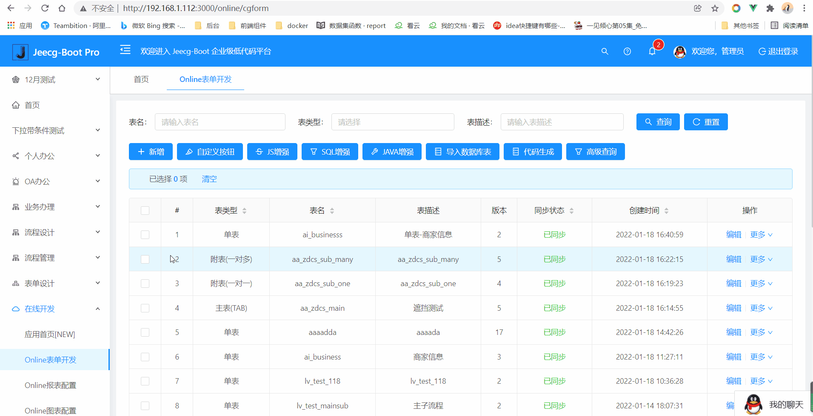
#### 2.2 创建一个名称为`js增强button`的自定义按钮
>在`data.common.js`文件`customButtons`方法中新增自定义按钮，文件地址：`src/views/modules/aitest/data/data.common.js`
```
{
    //按钮编码
    buttonCode: 'one',
    //按钮名称
    buttonName: 'btn增强',
    //按钮样式 link/button/form
    buttonStyle: 'button',
    //按钮位置1侧面 2底部 仅在form模式下有效
    optPosition: '2',
    //按钮类型 action/js
    optType: 'js',
    //排序
    orderNum: 1,
    //按钮状态 0 无效 1 有效
    buttonStatus: '1'
}
```

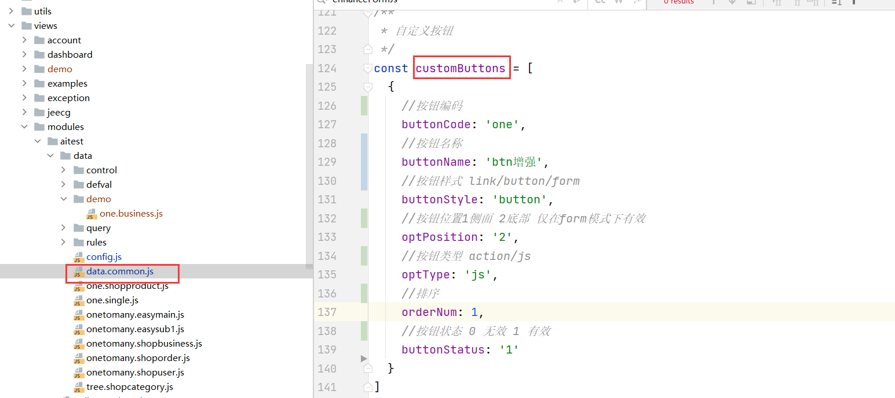
### 3、js增强
js增强页面配置详见:[js增强](http://doc.jeecg.com/2044103)
>js增强分为两种,分别为`list`列表和`form`表单
#### 3.1 效果展示

#### 3.2 js增强`list`列表风格
>在`data.common.js`文件`customListEnhanceJavascript`新增自定义按钮，文件地址：`src/views/modules/aitest/data/data.common.js`

```
one(){
  console.log('当前选中行的id',that.table.selectedRowKeys);
}
```

#### 3.3 js增强`form`表单风格
>在`one.business.js`文件中中新增`from`增强，并将其引入到`ai_business_config`里面，`ai_business_config`固定对象为`enhanceFormJs`
```
//表单js增强
const enhanceFormJs = `
one(){
  console.log("我是表单js增强")
}`
```
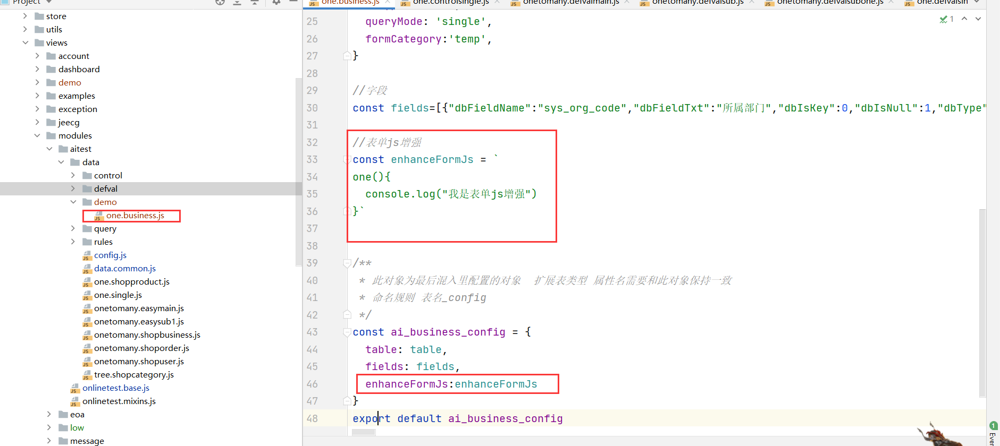

### 4、SQL增强
SQL页面配置详见：[SQL增强](http://doc.jeecg.com/2044111)
#### 4.1 效果展示
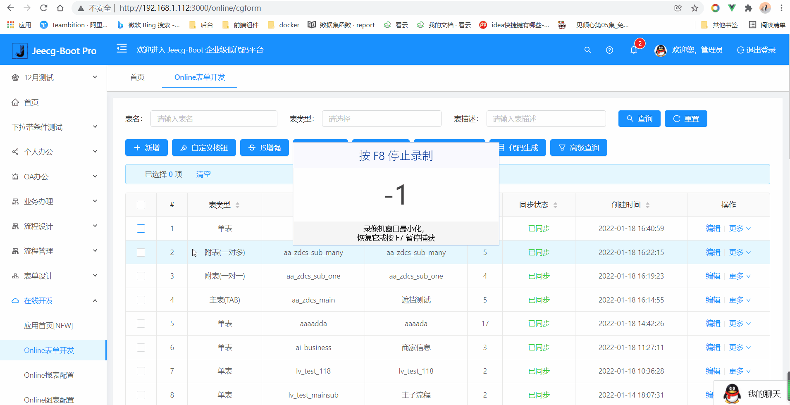
#### 4.2 新增编辑时修改`商品名称`
>在`one.business.js`文件中中新增`from`增强，并将其引入到`ai_business_config`里面，`ai_business_config`固定对象为`enhanceSql`

```
const enhanceSql = "update ai_business set name = '我是sql增强' where id = '#{id}'"
```
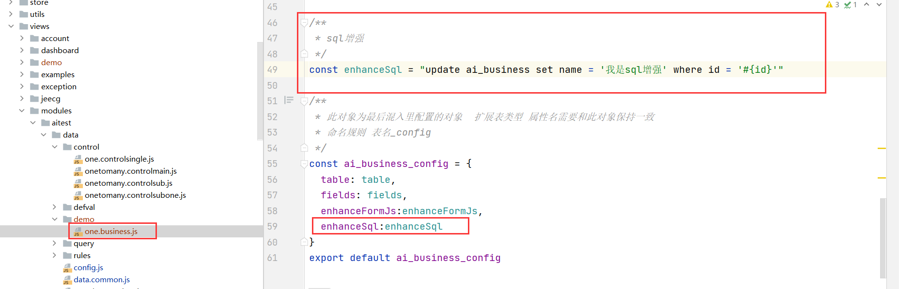
### 5、java增强
#### 5.1 效果展示
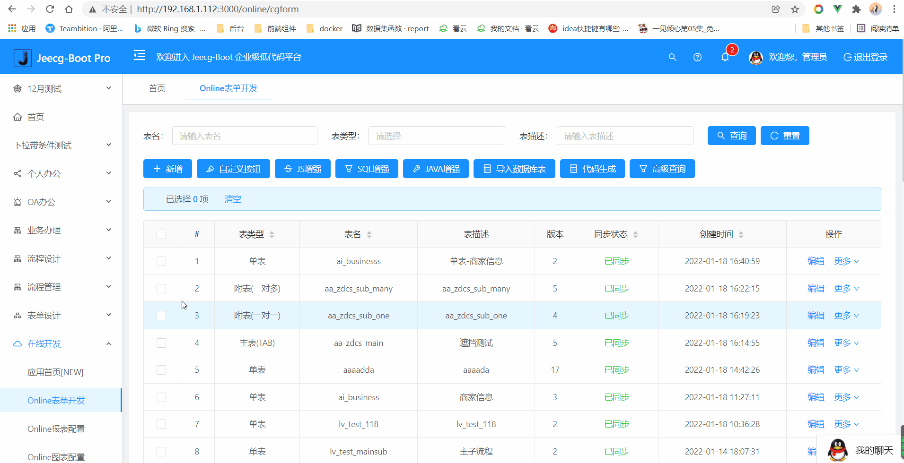
#### 5.2 配置java增强
java增强页面配置详见：[java增强](http://doc.jeecg.com/2516887)
>在`data.common.js`文件`customJavaEnhance`中新增`java增强`，文件地址：`src/views/modules/aitest/data/data.common.js`

```
{
  //按钮编码:新增add、编辑edit、导入import、导出export、查询query、删除delete
  buttonCode: 'add',
  //事件状态 开始start、结束end，仅在新增、编辑、删除时有效
  event: 'start',
  //类型 spring-key/class/http
  cgJavaType: 'spring',
  //内容
  cgJavaValue: 'cgformEnhanceJavaDemo',
  //是否生效 0否、1是
  activeStatus: '1'
}
```
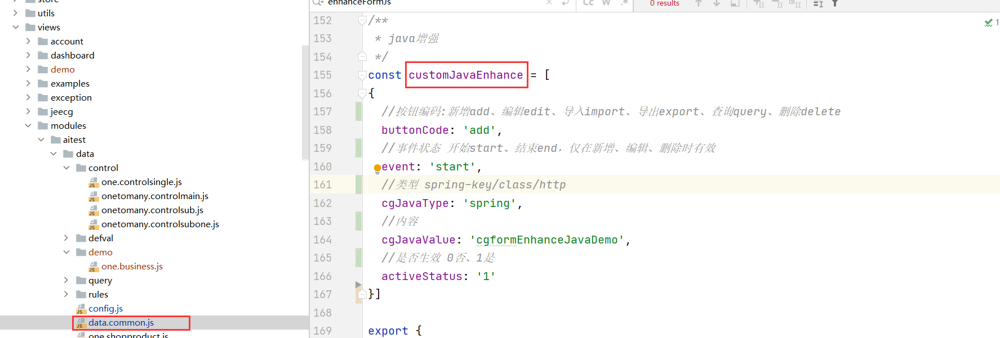

## 其他规则
1、列表的js增强是全局的
2、表单的js增强是根据表名配置的（在各种的js里面定义）
3、注意一对多更改表名，会导致js增强不好使，还会导致编辑页面赋不上值