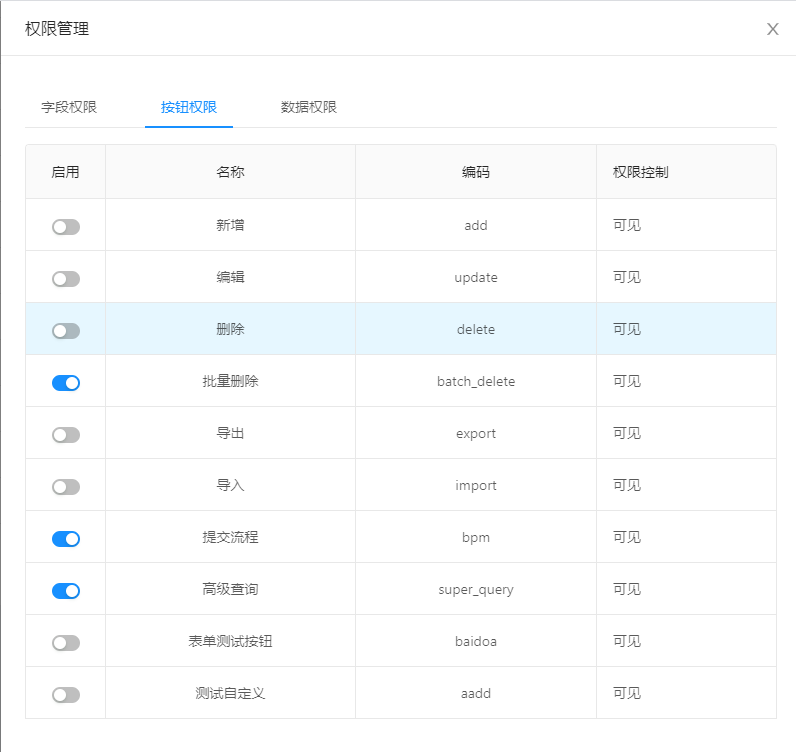
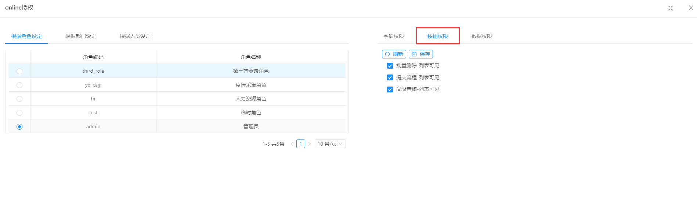

>[info] version`2.3+`  20200914

### 配置:

**1.支持默认按钮(从新增到高级查询均为默认按钮)和自定义按钮
2.启用后才能在授权页面看到
3.启用后，如果没有授权，表示该按钮不可见**

-----

### 授权

**1.授权之前需要在左侧选择角色(每个角色权限不一样，不支持批量选角色)**

**2.切换右侧tab至按钮权限，勾选后，保存即表示左侧选中角色拥有查看此按钮的权限**

**3.提交流程的按钮，需要添加字段bpm_status并且列表可见，才能有效。**
