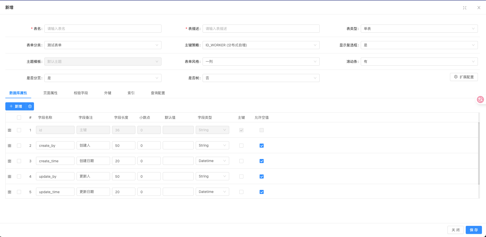
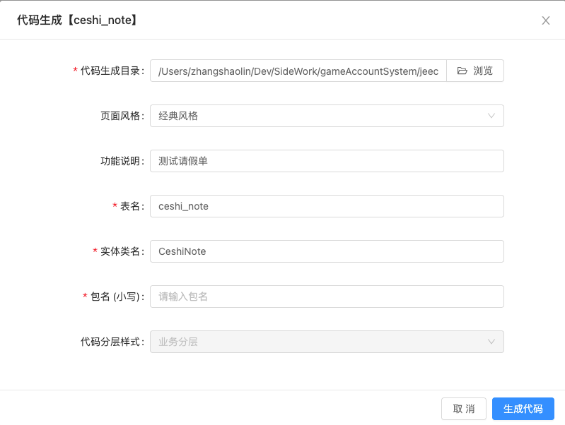
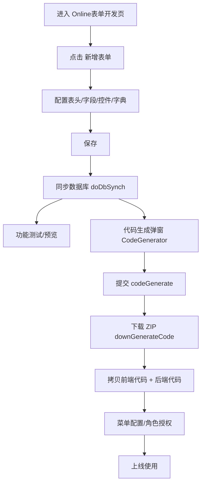
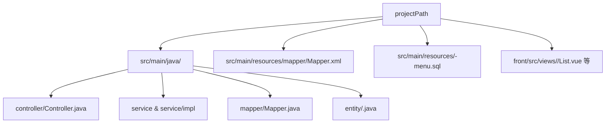

# Online 表单代码生成原理（VUE2 端）——基于反编译源码的全链路说明

> 后端源码未开源，已反编译保存于仓库根 `jeecg-decomp/`：  
> - `jeecg-decomp/hibernate-re-3.6.1-RC`：在线表单接口与服务实现  
> - `jeecg-decomp/codegenerate-1.4.7`：代码生成引擎与模板渲染基类  
> 模板文件本身在仓库：`jeecg-module-system/jeecg-system-biz/src/main/resources/jeecg/code-template-online`

## 1. 页面截图（核对 UI 与文档一致性）
- 在线表单列表页：  
  按钮含：新增、自定义按钮、JS/SQL/JAVA 增强、导入数据库表、代码生成，与文中描述一致。
- 新增表单弹窗：  
  关键字段：表名、表描述、表类型、主键策略、分页、树/一对多配置等，正对应元数据存储章节。
- 代码生成弹窗：  
  字段：代码生成目录、页面风格(jspMode)、表名/实体名/包名/功能说明/代码类型，与前端采集参数章节一致。

## 2. 数据到模板的总流程
前端生成器表单 JSON → `OnlCgformApiController`(`/online/cgform/api/codeGenerate`) → `IOnlCgformHeadService.generateCode` / `generateOneToMany` → 组装 TableVo/ColumnVo/SubTableVo → `codegenerate` 模块 BaseCodeGenerate + FreeMarker 读取 `code-template-online` 模板 → 输出 Java/Vue/Mapper/XML/SQL 到指定 projectPath。

## 3. 元数据存储（在线表单配置）
- 表头：`onl_cgform_head`（表名/类型/模板/树参数/分页/滚动/复制标记/同步标记 is_db_synch 等）
- 字段：`onl_cgform_field`（db 字段类型、长度、小数、是否主键/必填/查询/列表/表单、控件 showType、字典配置、默认值、校验、href、排序、外键 mainTable/mainField、扩展 JSON）
- 辅助：`onl_cgform_button`（自定义按钮）、`onl_cgform_enhance_{js,sql,java}`、`onl_cgform_index`

## 4. 前端生成器采集参数（CodeGenerator 弹窗）
- `projectPath`（本地存储记忆）
- `jspMode`（模板风格：default/jvxe/erp/tab/inner-table/tree 等）
- `jformType`（1 单表 / 3 一对多）
- `entityName`、`entityPackage`、`tableName_tmp`、`ftlDescription`
- `packageStyle`（service vs project 仅影响包路径）
- `codeTypes`（controller/service/dao/mapper/entity/vue）
- 子表列表：表名/实体名/说明（来自 head.sub_table_str）

## 5. 后端生成实现（基于反编译源码）
### 5.1 控制器：`jeecg-decomp/hibernate-re-3.6.1-RC/org/jeecg/modules/online/cgform/c/a.java`
- 路径 `/online/cgform/api/codeGenerate`
- 防护：若开启 firewall.dataSourceSafe，强制使用全局 projectPath；生成后把 `pathKey`→`projectPath` 写 Redis(30 分钟)，用于下载/预览校验。
- 分流：`jformType==1` 调 `generateCode`；否则 `generateOneToMany`。
- 下载接口 `/downGenerateCode` / `/codeView` 校验请求路径必须在 Redis 记录的 projectPath 且包含 `src/main/java`，防目录穿越。

### 5.2 服务：`jeecg-decomp/hibernate-re-3.6.1-RC/org/jeecg/modules/online/cgform/service/a/d.java`
- **generateCode（单表）**
  1) 取 head、字段列表（`db_is_persist=1` 按 order_num）。
  2) 映射 ColumnVo：dbName→camelName、dbType→javaType、长度/小数、isKey/isShow/isShowList/isQuery/queryMode/showType/字典/默认值/校验/href/排序/外键等。
  3) 组装 TableVo：entityName/entityPackage/tableName/描述/fieldRowNum、扩展参数 scroll、树 pid/id/text、vueStyle。
  4) 模板枚举 `CgformEnum.getCgformEnumByConfig(jspMode)` → templatePath/stylePath。
  5) `new CodeGenerateOne(...).generateCodeFile(projectPath, templatePath, stylePath)` 渲染并返回文件列表。
  6) 若生成失败，返回两条排错提示（路径含中文/空格；jar 部署需额外配置）。
- **generateOneToMany（主从）**
  1) 主表同上。子表遍历 front 传入的 `subList`，查 head/field。
  2) 找出子表外键字段（mainTable 非空的字段），设置 `foreignKeys/foreignMainKeys`，relationType==1 视为一对一。
  3) 组装 SubTableVo 列表，调用 `CodeGenerateOneToMany(...).generateCodeFile(...)`。
  4) 若主表但未传子表，直接抛 `JeecgBootException`。
- 字段类型映射：内部 `b(dbType)` 将 string→String，int→Integer/Long，BigDecimal/double/Datetime 等。

### 5.3 模板引擎：`jeecg-decomp/codegenerate-1.4.7/org/jeecgframework/codegenerate/generate/impl/a/a.java` (BaseCodeGenerate)
- 遍历模板根目录，按 `stylePath` 过滤（Vue2/Vue3/JVXE）。
- 相对路径前缀 `java` → 输出到 `src/main/java/{packagePath}/...`；前缀 `webapp` → 输出到 `src/main/resources`/前端路径（常量 h/i）。
- 使用 FreeMarker 渲染，上下文 Map 由 TableVo/SubTableVo/fieldList 等填充。

## 6. 模板目录与选择
- 根：`code-template-online/`
- 子目录：`default`（单表/一对多；含 Vue2/Vue3/uniapp）、`jvxe`、`erp`、`tab`、`inner-table`，公共片段在 `common/`
- `jspMode` 决定子目录；`packageStyle` 仅影响包路径，不影响模板目录。
- 示例模板：`default/onetomany/java/${bussiPackage}/${entityPackage}/controller/${entityName}Controller.javai` 使用 `<#list subTables as sub>`、`tableVo.ftlDescription` 等占位符。

## 7. 字段→模板映射要点
- 主键：`db_is_key=1` → `isKey=Y`
- 显示：`is_show_form/list/query` → 表单/列表/查询区域，`queryMode`（single/group），`queryShowType` 控件
- 字典：`dict_field/table/text` 保留，用于生成字典注解或联表
- 校验：`field_valid_type`、`field_must_input`
- 默认值：`db_default_val`
- 外键：`mainTable/mainField` 写入 SubTableVo.foreignKeys/foreignMainKeys
- 树：head 的 `is_tree`、`tree_parent_id_field/tree_id_field/tree_fieldname` 进入 TableVo.extendParams

## 8. 输出结构（service 分层示例）
```
<projectPath>/
  src/main/java/${packagePath}/controller/${entityName}Controller.java
  src/main/java/${packagePath}/service/I${entityName}Service.java
  src/main/java/${packagePath}/service/impl/${entityName}ServiceImpl.java
  src/main/java/${packagePath}/mapper/${entityName}Mapper.java
  src/main/resources/mapper/${entityName}Mapper.xml
  src/main/java/${packagePath}/entity/${entityName}.java
  src/main/resources/${entityName}-menu.sql (部分模板生成)
front/
  src/views/${modulePath}/${EntityName}List.vue 及 modal 组件
```

## 9. 校验与安全
- 必须先同步数据库：`is_db_synch=Y`，否则前端拦截/后端也拒绝。
- 下载/预览受 Redis pathKey 和路径前缀校验保护，防目录穿越。
- firewall 模式下禁止自定义 projectPath。

## 10. 排错顺序
1) `onl_cgform_field.db_is_persist=1`、`is_db_synch=Y`
2) 生成器入参（jspMode/路径/包名/实体名/子表列表）
3) 服务层映射（ColumnVo 是否含目标字段）
4) 模板占位符（确认所在模板路径是否被 stylePath 过滤）

---

本说明已融合反编译结果与模板源码，可直接对照 `jeecg-decomp/` 与 `code-template-online/` 进行进一步审计。***

---

## 11. 使用流程 & 生成链路（Mermaid）

### 11.1 用户操作流程（前端视角）


### 11.2 后端生成链路（请求到文件）
```mermaid
flowchart LR
  Req[POST /online/cgform/api/codeGenerate] --> Ctl[OnlCgformApiController]
  Ctl -->|防火墙校验·写Redis pathKey| Svc[OnlCgformHeadService]
  Svc -->|读 head/field/button/增强| VO[TableVo·ColumnVo·SubTableVo]
  VO --> Enum[CgformEnum 选模板目录]
  Enum --> Gen[CodeGenerateOne / OneToMany]
  Gen -->|FreeMarker 渲染| Files[写入 projectPath<br/>(src/main/java 与 webapp)]
  Files --> Redis[Redis pathKey->projectPath<br/>TTL 1800s]
  Redis --> DL[POST /downGenerateCode<br/>打包下载]
```

### 11.3 代码生成输出结构（简版）

