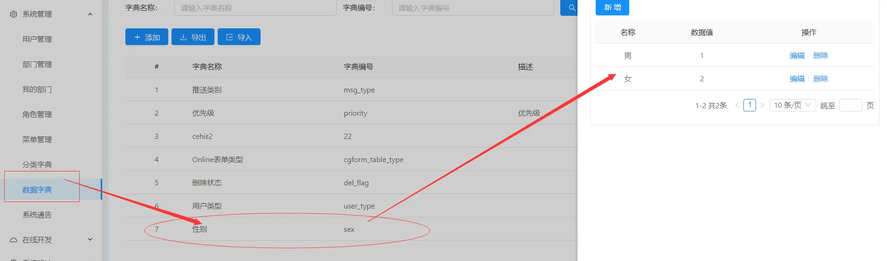
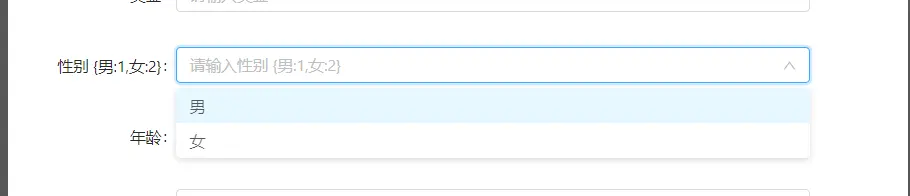
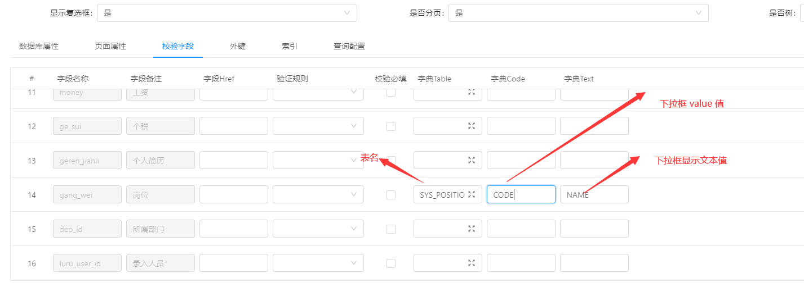
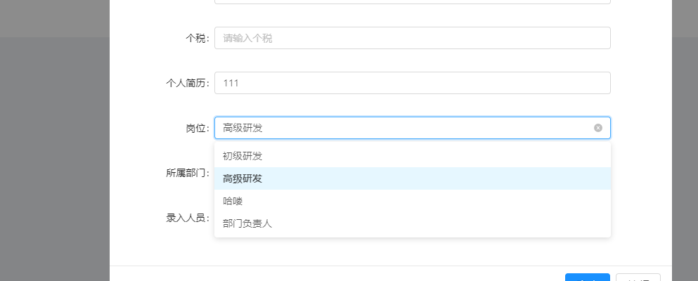

下拉框@多选框@单选框
===

>  字典用法：表单字段，通过配置系统字典或者表字典，实现下拉、Checkbox、Radio等效果。
> 支持模型： 系统字典 和表字典（通过数据库表的配置）——不支持popup

## 1. 数据字典
首选配置表单字段页面控件类型：

配置字典code（对应系统字典表的 字典编码）：

字段code对应： 系统管理 -> 数据字典

演示：

## 2. 表字典

效果：实现通过表里面取数，下拉展示

