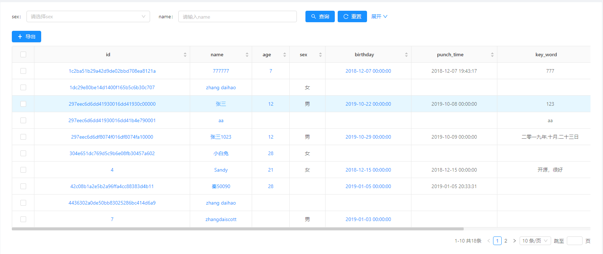
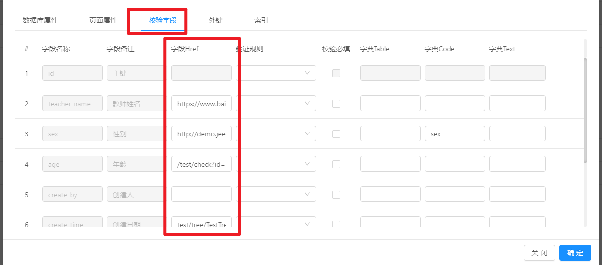
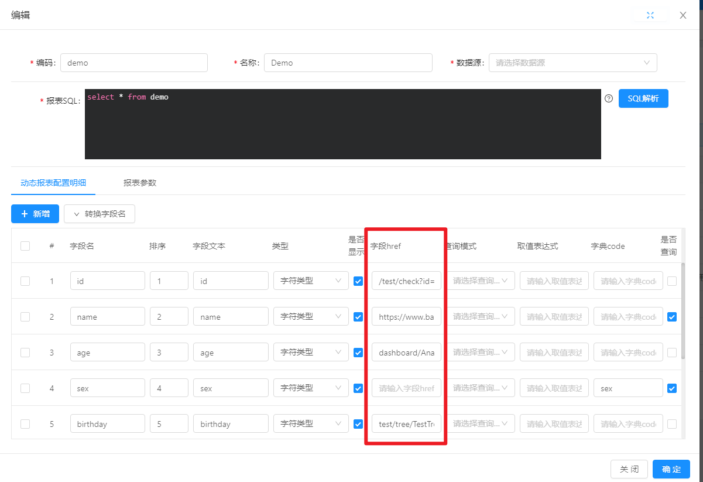
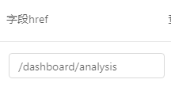
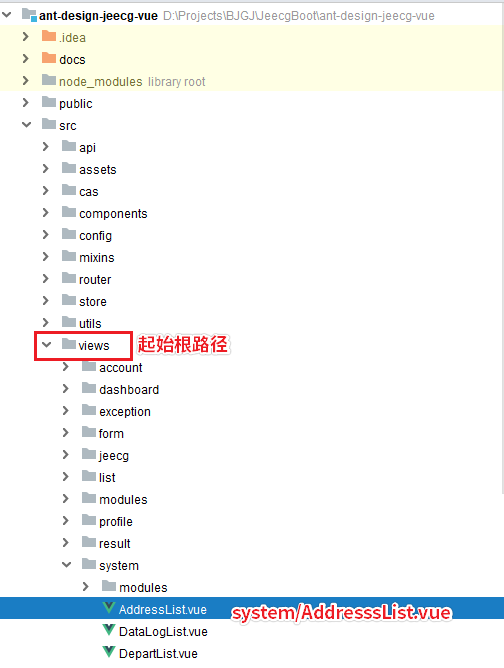
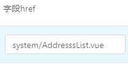
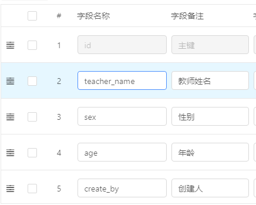
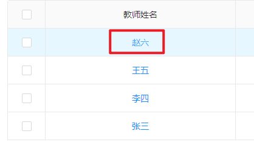
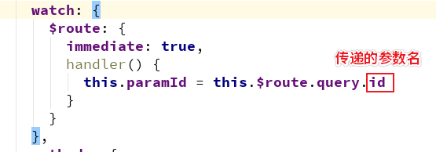

# Online开发如何配置 Href 跳转

[TOC]

## 效果演示

配置了 href 的字段将会显示为超链接，可以点击跳转到你配置的界面，如下图所示



## 配置位置

### Online表单



### Online报表



## 配置方式

直接在输入框里输入你要跳转的地址即可，可以传递参数，目前支持三种跳转方式，分别为

1. http或https链接跳转
2. 路由(router)地址跳转
3. 内部组件跳转

### 配置实例：http或https链接跳转

假如说我想跳转到百度页面，可以在字段href里填写 `https://www.baidu.com`，注意，开头的`http`或`https`一定要填写，如果不填就会被识别成“路由地址跳转”。


### 配置实例：路由(router)地址跳转
假如说我想跳转到菜单里配置的某个页面，就输入该菜单的路径即可
比如首页的路径为`/dashboard/analysis`

那么只需填写到输入框里即可


### 配置实例：内部组件跳转
假如说我写了一个组件，而且没有配置成菜单，但也想在这里打开的时候，就可以使用内部组件跳转。
你只需要提供一个组件的路径，如下图所示：
注意，你只能使用 `/src/views` 下的所有组件，且填写时开头无需填写 `/`，且一定要包含`.vue`，否则将会被识别成“路由地址跳转”。
比如我要弹出通讯录列表这个组件，正确的路径地址为：`system/AddresssList.vue`，如下图所示



## 如何传参

无论是哪一种配置方式，都采用问号(?)的方式传参，多个参数用`&`符号分割
```
?name=zhangsan&age=23&sex=男
```
### 可使用变量
你可以在参数里使用变量，变量的名称取决于你配置了哪些字段

如上图所示，我的配置中有一个`teacher_name`字段，那么我就可以在使用的时候取出来，传给你配置的链接
```
?name=${teacher_name}&ohh=233
```

实际使用中，如果我点击了 赵六

那么实际参数会被转换为
```
?name=赵六&ohh=233
```

## 如何接收参数
### http或https链接跳转
可以在后台用 `request` 获取
### 路由(router)地址方式

参考代码：
```
watch: {
  $route: {
    immediate: true,
    handler() {
      console.log('============= online href  $route props ============= ');
      let sex = this.$route.query.sex
      console.log('$route sex: ', sex);
    }
  }
},
```
### 内部组件方式
内部组件使用 props 来接收参数，传给组件的类型永远都是`String`类型，所以你试图用其他类型（如`Number`）接收的时候会报错。
