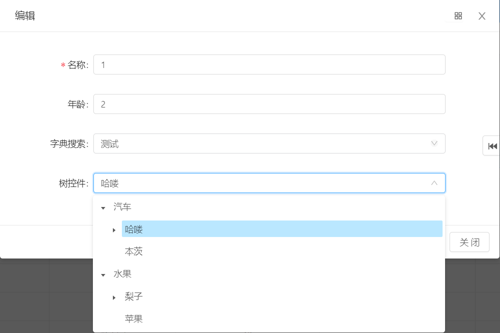

# 树控件

* 1.页面属性配置控件类型
    
* 2.校验字段配置字典
    

备注：
1、字典table 填写树控件对应的表名  { 例如：sys\_category }
2、字典code填写树控件根节点的父ID的值，不填则为空
3、字典text填写4个表字段的名称，以逗号隔开，依次是：**ID列,父ID列,显示列,是否有子节点列**   { 例如：id,pid,name,has\_child}

> 字段顺序解释说明：
> a. ID列和PID列用于记录数据的父子关系，且ID列是该树控件最终保存到数据库的值
> b. 显示列表示树控件展示的数据，
> c. 是否有子节点列是树形表需要的特例列，详细看 online表单树形表单开发 ，该列为字符串类型系统默认1为是 0为否，不支持其他数据格式。

* 3.演示，
    