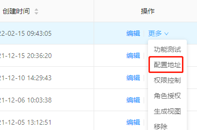
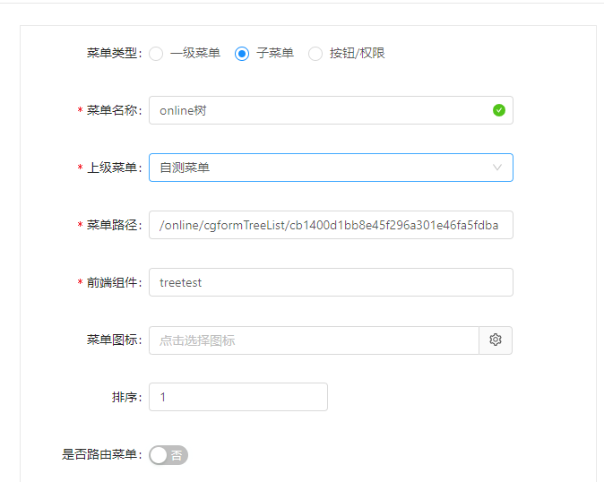

## online菜单配置

###  获取连接创建菜单
1.进入菜单【在线开发】-->【online表单开发】，找到需要配置成菜单的表单记录，[更多]->[配置地址]，复制地址


2.进入菜单【系统管理】-->【菜单管理】 新增菜单


> - 菜单名称，自定义
> - 上级菜单，自定义
> - 菜单路径，填写上述复制地址
> - 前端组件，`随便写不重要`
> - **是否路由菜单** 一定要设置成否

3.进入菜单【系统管理】 -->【角色管理】,确定自己用户对应的角色，在该角色上操作：[更多] -->[授权] 勾选配置的菜单保存，刷新页面重新加载菜单即可访问。


### 注意特殊点
- 默认情况下，没有配置online菜单，有菜单【online表单开发】的权限，功能测试可以正常使用
- 如果没有配置online菜单，而且菜单【online表单开发】的权限也没有，直接访问菜单地址是不行的
- 如果配置了online菜单，但是没有进行角色授权或是授权到了别的角色下，则功能测试是无法正常使用的


### 以下展示多种类型online表单的菜单配置界面

- 1. Online普通表单，访问菜单配置


----

- 2. Online 树形表单，访问菜单配置



---

- 3. erp风格表单(主子表) 访问菜单配置


-----

 **原理说明**
```
Online功能菜单的配置，是通过动态路由实现，
动态路由平台已经提前配置好，采用隐藏路由方式，菜单统一以auto开头，
所以如果某角色需要访问online的菜单，必须把下面截图的隐藏路由菜单给角色授权，才能访问。
```


