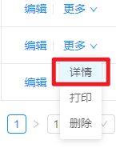
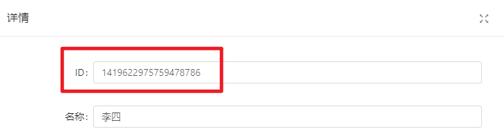
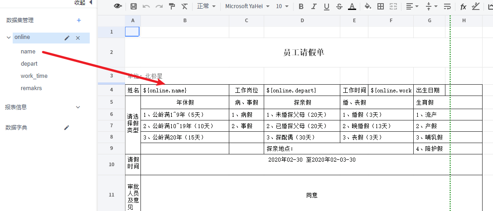
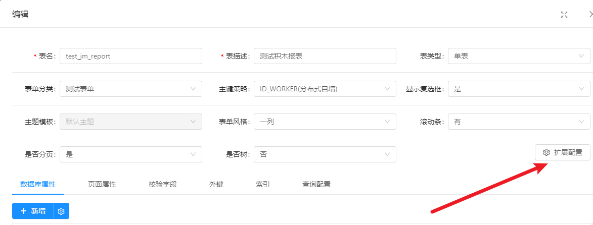
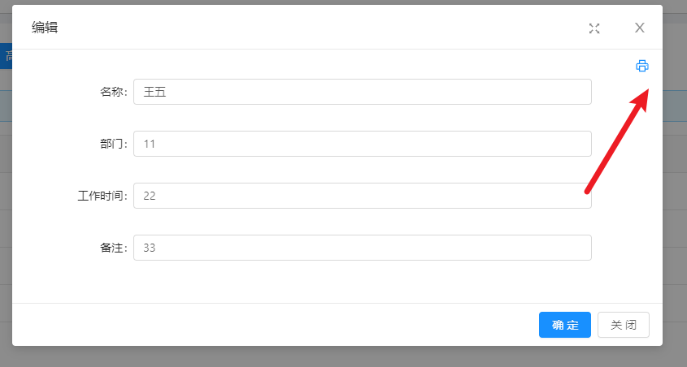

# Online对接积木报表
[TOC]

## 配置积木报表

1、打开积木报表的设计页面，在数据集管理里添加一个API数据集


2、Online表单数据的 API地址固定为以下的格式
```
 {{ domainURL }}/online/cgform/api/data/{tableName}/queryById?id=${id}&token=${token}&mock=true
```

参数替换说明：

- [1]. 其中 {tableName} 需要替换成Online的表名，
- [2]. 域名前缀变量`{{ domainURL }}`，固定不要改。如果需要对接外网可以替换真实地址，比如 [http://localhost:8080/jeecg-boot](http://localhost:8080/jeecg-boot)
- [3]. `?id=${id}&token=${token}&mock=true`这一段固定参数，不要改。


3、点击API解按钮，生成Online表单里的字段

>[info]  提醒：这里需要先填写参数ID和Token的默认值，再点击API解析，才能成功生成字段


如何获取id和token的值？
* id是某条数据的id。获取方式见下图（可以直接查询表数据）



* token是项目的token，实际使用时会替换成有效的token，这里API解析成功后就没多大用了。


4、点击确定按钮保存，可以直接将字段拖拽到要显示的位置上


## 配置Online表单
1、点击积木报表上的预览按钮，把打开的链接复制一下（不需要复制 ? 后面的参数）


2、在Online报表配置页面，点击扩展配置，点击启用打印，并且把刚刚复制的链接粘贴上保存即可。  
如果是当前项目前缀可以改成变量`{{ window._CONFIG['domianURL'] }}`




3、在功能测试页面可以点击打印

也可以在编辑或者详情页面点击图标打印

