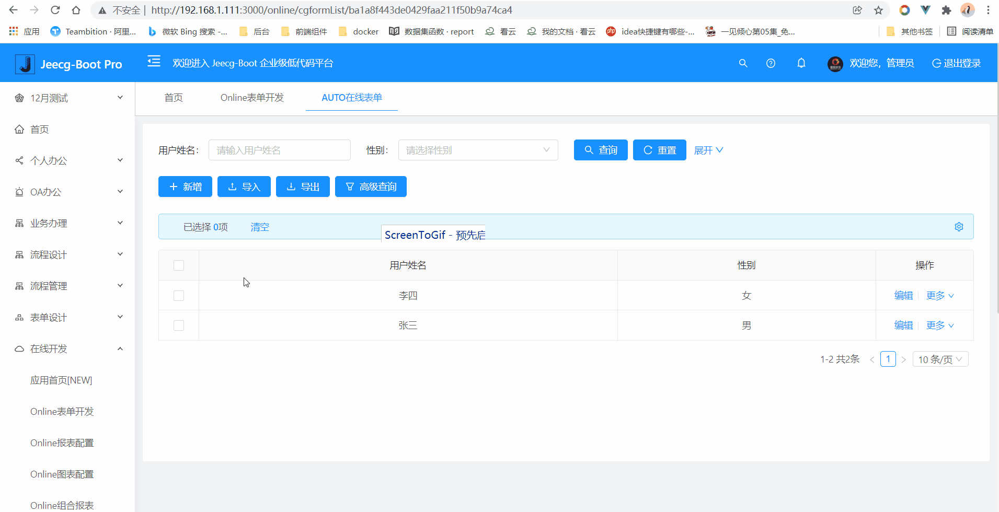
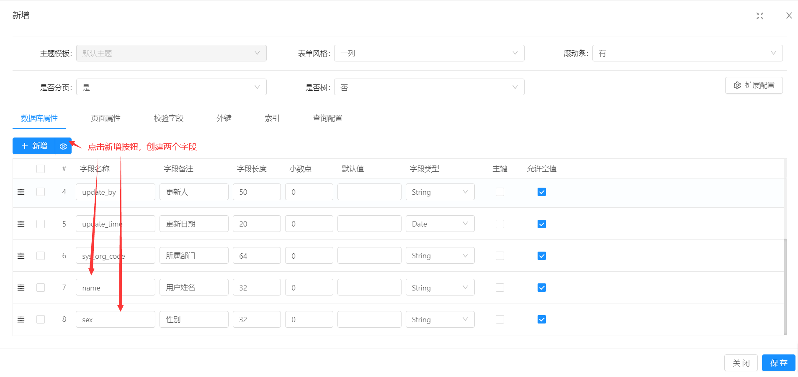
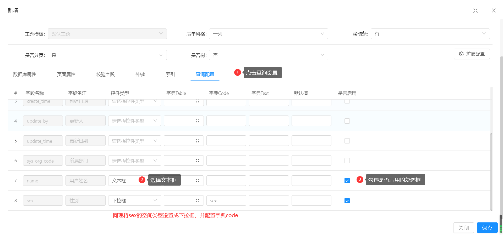
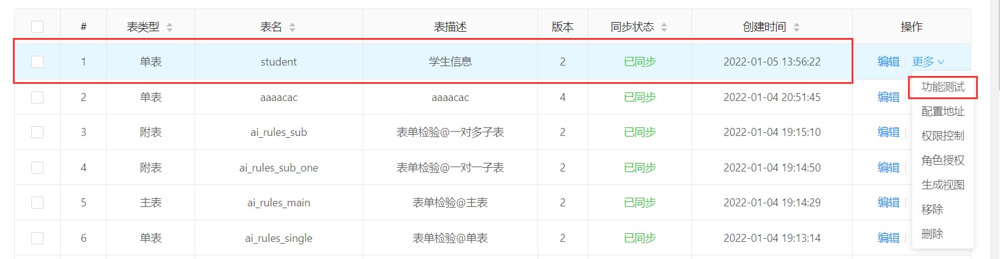

>自定义查询配置：对字段进行自定义查询，包含文本、日期等

[TOC]
## 效果图展示
>用户姓名为输入框，性别为下拉框

## 新建一个online表单学生信息表`student`
> 新建学生表,表名为`student`

> 添加两个字段，分别为用户姓名`name`和性别`sex`

## 重点来了->创建自定义查询
>为  `name`创建文本框查询,sex创建下拉框查询

>点击确定，鼠标移动到`student`对应的更多，点击同步数据库

>点击功能测试

>效果预览图

## 支持的自定义查询组件清单
* 文本框
* 年月日
* 年月日时分秒
* 时分秒
* 下拉框
* 下拉多选框
* 下拉搜索框
* 分类字典树
* popup弹窗
* 部门选择
* 用户选择
* 省市区组件
* 自定树组件