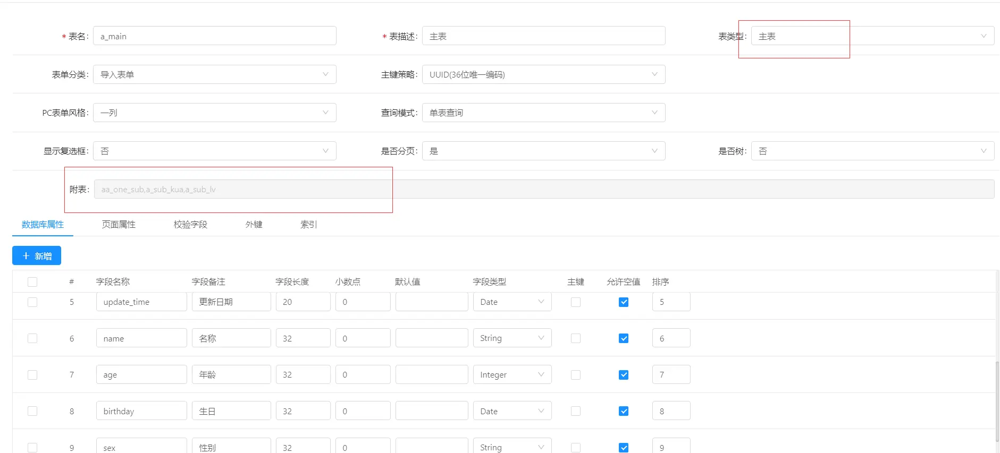
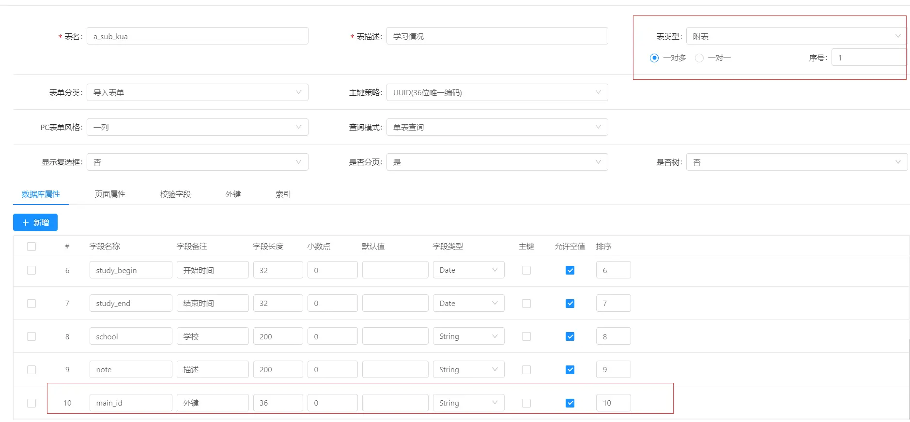
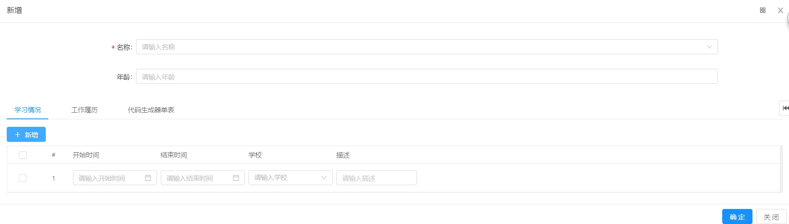

# Online表单一对多表单开发

一对多类型表单
Online 支持一对多，一对一模型表单配置。
###1.创建主表/附表
主表创建，设置表单类型为主表；

附表创建，设置表单类型为附表，配置外键字段

附表外键设置，设置该字段对应的主表名、主表字段

主子表关系会自动展示在主表的附表字段（多个附表会以逗号分割）
主表和附表创建完后，分别点击同步数据库，创建表。

说明： 附表不能单独维护数据；
一对一和一对多配置，通过表类型设置，子表tab展示顺序通过序号控制。

### 2.测试功能

主表作为统一表单功能测试入口，附表不提供功能测试入口；
点击主表，功能测试链接进入表单列表, 打开表单界面
