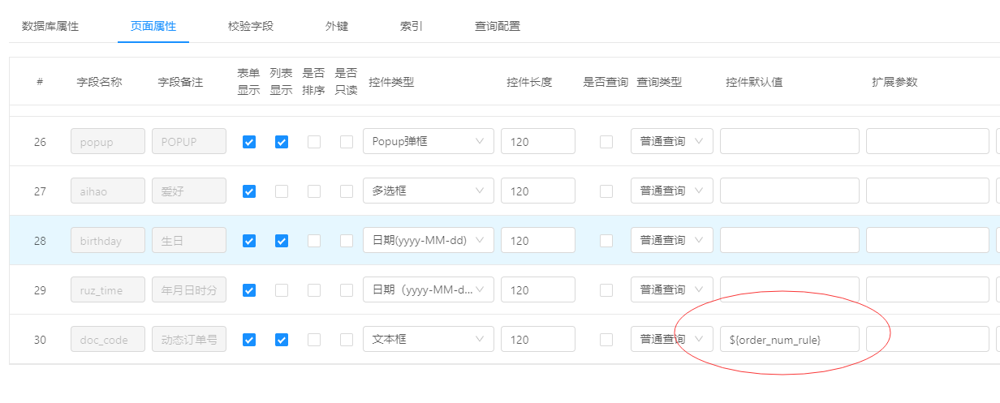
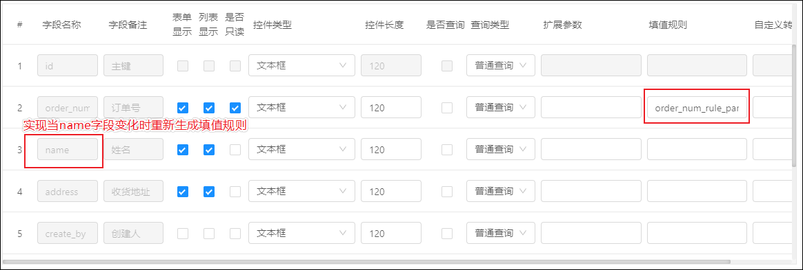

# Online表单填值规则配置

## 如何使用
> Online填值规则配置，需要通过${}包含着填值规则编码，例如：${order_num_rule}
> 下面有的截图是老图，请以${}用法为准。

在 `页面属性` 中，倒数第二列就是`填值规则`的输入框。

输入框里填写的是填值规则的`规则Code`
如果你不希望生成的数据被修改，可以勾选`是否只读`


## 如何定义填值规则

在 系统管理-->填值规则 菜单中进行添加，详细添加方法请参考 [填值规则（编码生成）](http://doc.jeecg.com/2044051) 文档

## 如何在某个值变化的时候更新填值规则

要做到这一点，就需要通过 JS增强 来实现了，可参考[ online基础篇-JS增强(表单渲染) ](http://doc.jeecg.com/2044102)



如上图，我的`order_rule`字段设置了填值规则，我想实现当`name`字段变化时重新生成填值规则，JS增强该如何编写呢？

### 第一步
在Online表单开发页面，选中你要修改JS增强的那一条数据，并点击上方的JS增强按钮


### 第二步
#### 主表JS增强写法


``` js
 onlChange(){
   return {
    name() {
      that.executeMainFillRule()
    }
  }
 }
```
#### 子表JS增强写法

> **注意：子表的JS增强也写在主表里！**


```
test_fill_rule_sub_onlChange(){
  return {
    name(that, event) {
      // 重新触发子表的填值规则（仅当前更改的行）
      that.executeSubFillRule('test_fill_rule_sub', event)
    }
  }
}
```