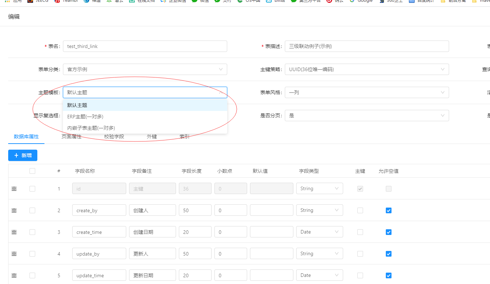
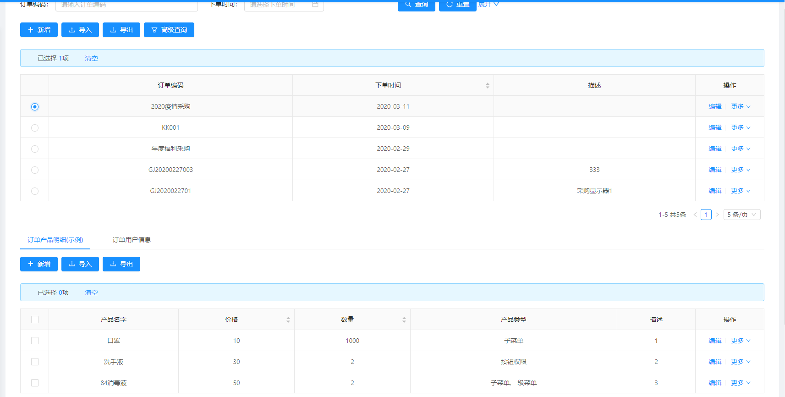

# Online表单风格

[TOC]

## 实现表单多列效果
Online表单默认单列，如何实现多列，可以通过设置表单风格实现。
>  适用范围： 单表、一对多（附表需要单独设置）、一对一（附表需要单独设置）、树表单 

## 实现表单不同风格（ERP风格、内嵌子表风格）
 通过选择不同主题实现，只适用于一对多模型。
>  适用范围：一对多模型

### 默认一对多表单风格

### ERP表单风格

### 内嵌子表风格
