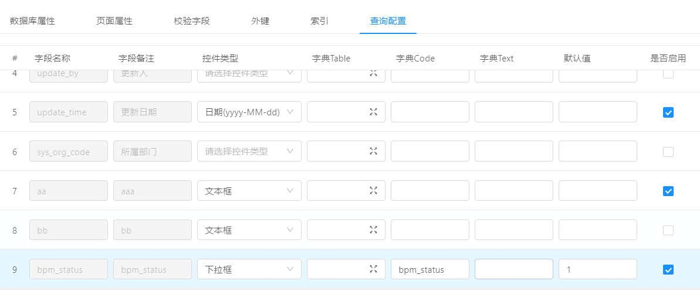
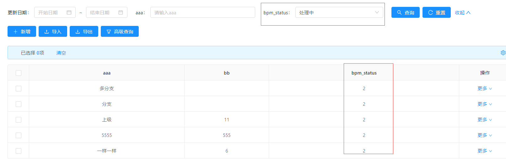

查询配置参数说明
===
### 1.使用场景
当online表单中需要配置查询条件时，可配置查询。
### 2.具体实现
在online表单开发的查询配置中，可选择查询条件的控件类型，
配置字典及默认值，选中是否启用后即生效
注：默认值目前只支持固定参数，例如bpm_status设置默认值为2，则在查询时默认选中处理中，查询数据默认查询bpm_status=2的数据
配置如图：

页面显示：

