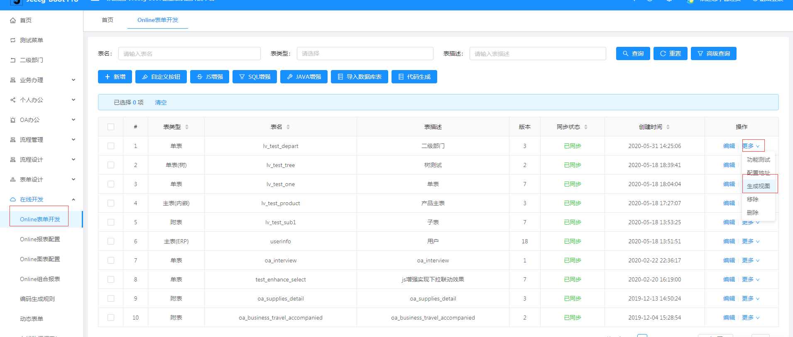
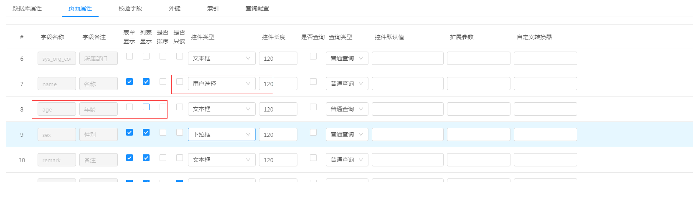
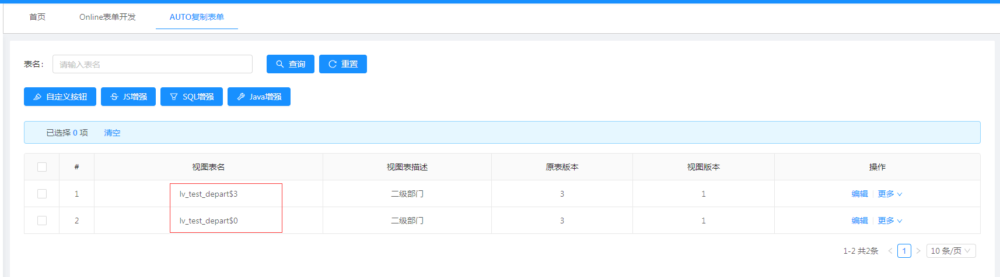
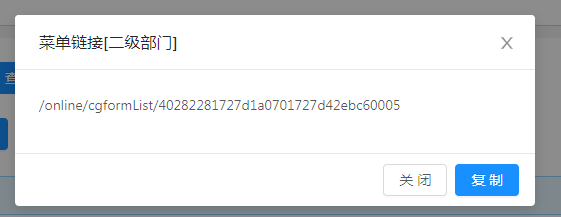

# online表单视图功能说明
Online表单提供了生成视图的功能，用于对online表单需要做单独处理时。
[TOC]
## 一.  使用场景
### 1. 针对一对多表，需要单独修改时，可单独生成子表视图进行配置子表视图内容
### 2. 针对流程中各个节点需要显示不同页面时，比如节点1显示前两个字段，节点2显示后两个字段；可根据节点来配置不同视图

## 二. 操作说明
1.在online表单开发列表--更多中点击生成视图，可生成多个版本的视图
如图：

2.可单独修改每个视图字段是否显示，设置控件
例如：将视图lv_test_depart$3 的名称又原来的文本框修改为用户选择，将年龄在表单和列表中不显示，
则原表和视图lv_test_depart$0不受影响

3.视图生成成功后会显示视图管理按钮，在视图管理中可编辑视图样式

4.复制配置地址可以单独配置菜单

5.可删除视图

