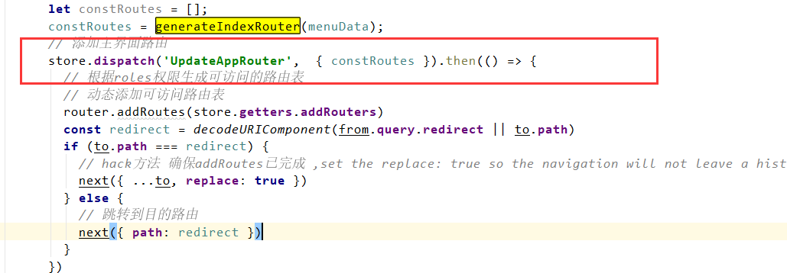

路由代码解析：
1.登录完成后,login.vue跳转页面 `this.$router.push({ name: "dashboard" })`
2.此时走了`router.beforeEach`
如果没有token则调用user.js中的`GetPermissionList`
2.1`queryPermissionsByUser`从数据库中查询权限
2.2将查询结果 为menu的数据保存到`permissionList`
2.3左侧菜单在globallayout中取该`permissionList`的数据

3.左侧菜单加载方式：
若hidden 则不显示
若路由菜单 则跳转name，否则跳转path
若聚合路由则子菜单不加载

注意：代码中有一块修改了permission.js 的addRouters，似乎没啥用，

这两块很干扰人。vuex,state定义后并没有什么地方使用。

