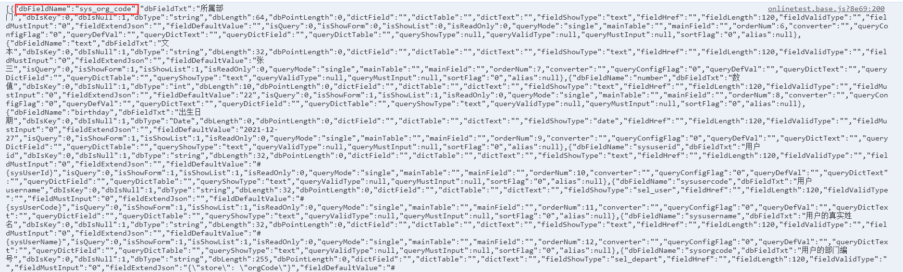

# Online AI自动化测试数据制作

## 制作步骤

### 1.进入online表单配置的编辑界面，打开控制台，获取json数据

>[danger] 注意：如果json中存在自动生成的字段（id，create_by，create_time，update_by，update_time，sys_org_code）需要去掉包含字段花括号里面的所有内容

### 2.添加配置
找到文件 `src\views\modules\aitest\data\config.js`
.在`aiTestTableList`集合中添加一条数据 name为`表名`, title为 `描述`的记录

### 3.添加一个js文件
参考one.single.js命名规则，fields取值步骤1的 json
按照文件`config.js`中的注释，配置table 、fields、 enhanceFormJs 、enhanceSql、indexList
等属性。

### 4. onlinetest.base.js 增加配置
修改 onlinetest.base.js
`xxx`表示表名
- 引入新增JS文件，` import xxx_config from './data/xxx'`
- data中声明` xxx_config` ，名称为 `{表名}_config`

## 其他规则
1、列表的js增强是全局的
2、表单的js增强是根据表名配置的（在各种的js里面定义）
3、注意一对多更改表名，会导致js增强不好使，还会导致编辑页面赋不上值