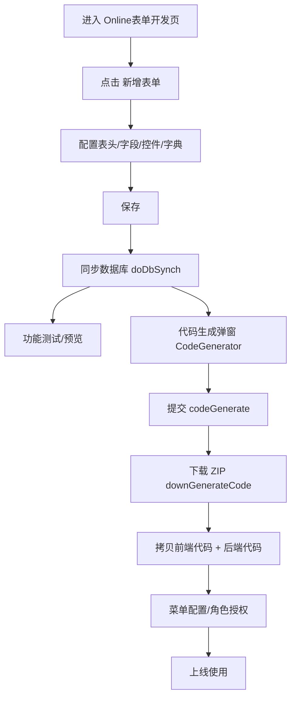
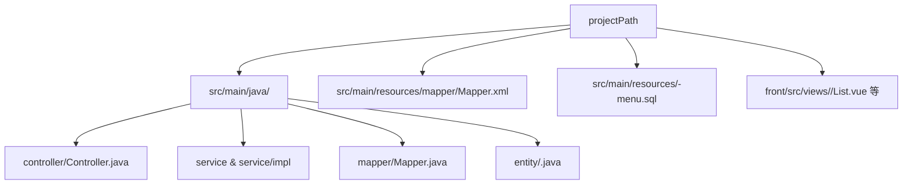

```mermaid
flowchart LR
  Req[POST /online/cgform/api/codeGenerate] --> Ctl[OnlCgformApiController]
  Ctl -->|防火墙校验·写Redis pathKey| Svc[OnlCgformHeadService]
  Svc -->|读 head/field/button/增强| VO[TableVo·ColumnVo·SubTableVo]
  VO --> Enum[CgformEnum 选模板目录]
  Enum --> Gen[CodeGenerateOne / OneToMany]
  Gen -->|FreeMarker 渲染| Files["写入 projectPath\n(src/main/java 和 webapp)"]
  Files --> Redis[Redis pathKey->projectPath<br/>TTL 1800s]
  Redis --> DL[POST /downGenerateCode<br/>打包下载]
```

# Online 表单代码生成原理（VUE2 端）——基于反编译源码的全链路说明

> 前端在线表单核心组件未开源，打包于 `ant-design-vue-jeecg/node_modules/@jeecg/antd-online-mini/dist/OnlineForm.umd.min.js`；  
> 后端源码未开源，已反编译保存于仓库根 `jeecg-decomp/`：  
> - `jeecg-decomp/hibernate-re-3.6.1-RC`：在线表单接口与服务实现  
> - `jeecg-decomp/codegenerate-1.4.7`：代码生成引擎与模板渲染基类  
> 模板文件本身在仓库：`jeecg-module-system/jeecg-system-biz/src/main/resources/jeecg/code-template-online`

## 1. 前端视角：页面与使用流程

### 1.1 页面截图（核对 UI 与文档一致性）
- 在线表单列表页：  
  按钮含：新增、自定义按钮、JS/SQL/JAVA 增强、导入数据库表、代码生成，与文中描述一致。
- 新增表单弹窗：  
  关键字段：表名、表描述、表类型、主键策略、分页、树/一对多配置等，正对应元数据存储章节。
- 代码生成弹窗：  
  字段：代码生成目录、页面风格(jspMode)、表名/实体名/包名/功能说明/代码类型，与前端采集参数章节一致。

### 1.2 用户操作流程（前端视角）


## 2. 前端生成器采集参数（CodeGenerator 弹窗）
- `projectPath`（本地存储记忆）
- `jspMode`（模板风格：default/jvxe/erp/tab/inner-table/tree 等）
- `jformType`（1 单表 / 3 一对多）
- `entityName`、`entityPackage`、`tableName_tmp`、`ftlDescription`
- `packageStyle`（service vs project 仅影响包路径）
- `codeTypes`（controller/service/dao/mapper/entity/vue）
- 子表列表：表名/实体名/说明（来自 head.sub_table_str）

## 3. 后端链路总览（请求 → 模板 → 文件）
前端生成器表单 JSON → `OnlCgformApiController`(`/online/cgform/api/codeGenerate`) → `IOnlCgformHeadService.generateCode` / `generateOneToMany` → 组装 TableVo/ColumnVo/SubTableVo → `codegenerate` 模块 BaseCodeGenerate + FreeMarker 读取 `code-template-online` 模板 → 输出 Java/Vue/Mapper/XML/SQL 到指定 projectPath。

### 3.1 后端生成链路（请求到文件）


## 4. 后端实现细节

### 4.1 控制器：`jeecg-decomp/hibernate-re-3.6.1-RC/org/jeecg/modules/online/cgform/c/a.java`
- 路径 `/online/cgform/api/codeGenerate`
- 防护：若开启 firewall.dataSourceSafe，强制使用全局 projectPath；生成后把 `pathKey`→`projectPath` 写 Redis(30 分钟)，用于下载/预览校验。
- 分流：`jformType==1` 调 `generateCode`；否则 `generateOneToMany`。
- 下载接口 `/downGenerateCode` / `/codeView` 校验请求路径必须在 Redis 记录的 projectPath 且包含 `src/main/java`，防目录穿越。

### 4.2 服务：`jeecg-decomp/hibernate-re-3.6.1-RC/org/jeecg/modules/online/cgform/service/a/d.java`
- **generateCode（单表）**
  1) 取 head、字段列表（`db_is_persist=1` 按 order_num）。
  2) 映射 ColumnVo：dbName→camelName、dbType→javaType、长度/小数、isKey/isShow/isShowList/isQuery/queryMode/showType/字典/默认值/校验/href/排序/外键等。
  3) 组装 TableVo：entityName/entityPackage/tableName/描述/fieldRowNum、扩展参数 scroll、树 pid/id/text、vueStyle。
  4) 模板枚举 `CgformEnum.getCgformEnumByConfig(jspMode)` → templatePath/stylePath。
  5) `new CodeGenerateOne(...).generateCodeFile(projectPath, templatePath, stylePath)` 渲染并返回文件列表。
  6) 若生成失败，返回两条排错提示（路径含中文/空格；jar 部署需额外配置）。
- **generateOneToMany（主从）**
  1) 主表同上。子表遍历 front 传入的 `subList`，查 head/field。
  2) 找出子表外键字段（mainTable 非空的字段），设置 `foreignKeys/foreignMainKeys`，relationType==1 视为一对一。
  3) 组装 SubTableVo 列表，调用 `CodeGenerateOneToMany(...).generateCodeFile(...)`。
  4) 若主表但未传子表，直接抛 `JeecgBootException`。
- 字段类型映射：内部 `b(dbType)` 将 string→String，int→Integer/Long，BigDecimal/double/Datetime 等。

### 4.3 模板引擎：`jeecg-decomp/codegenerate-1.4.7/org/jeecgframework/codegenerate/generate/impl/a/a.java` (BaseCodeGenerate)
- 遍历模板根目录，按 `stylePath` 过滤（不同风格目录）。
- 相对路径前缀 `java` → 输出到 `src/main/java/{packagePath}/...`；前缀 `webapp` → 输出到 `src/main/resources`/前端路径（常量 h/i）。
- 使用 FreeMarker 渲染，上下文 Map 由 TableVo/SubTableVo/fieldList 等填充。

## 5. 模板选择与输出结构（以 VUE2 为主）

### 5.1 枚举 → 模板路径 → 结构类型（来自 `CgformEnum`）
- 模板根：`jeecg-module-system/jeecg-system-biz/src/main/resources/jeecg/code-template-online/`
- `jspMode` → `stylePath` → 模板子目录；`packageStyle` 只影响 Java 包路径，不影响模板目录。

| type | jspMode(code) | 结构 | stylePath | 说明 | vueStyle |
| --- | --- | --- | --- | --- | --- |
| 1 | `one` | 单表 | `default.one` | 经典风格 | `vue` |
| 2 | `many` | 一对多 | `default.onetomany` | 经典风格 | `vue` |
| 2 | `jvxe` | 一对多 | `jvxe.onetomany` | JVXE 风格 | `vue` |
| 2 | `erp` | 一对多 | `erp.onetomany` | ERP 风格 | `vue` |
| 2 | `innerTable` | 一对多 | `inner-table.onetomany` | 内嵌子表风格 | `vue` |
| 2 | `tab` | 一对多 | `tab.onetomany` | Tab 风格 | `vue` |
| 3 | `tree` | 树表 | `default.tree` | 树形列表 | `vue` |

> 注意：`default/onetomany` 目录仅有 Vue2 模板文件，与本文范围一致；  
> 其它一对多风格按各自模板目录（`jvxe/erp/inner-table/tab`）区分。

### 5.2 目录分层与结构含义
- `default/one`：单表（经典）
- `default/tree`：树表（经典）
- `default/onetomany`：一对多（经典，Vue2）
- `jvxe/onetomany`：一对多（JVXE 子表）
- `erp/onetomany`：一对多（ERP 结构）
- `inner-table/onetomany`：一对多（子表内嵌）
- `tab/onetomany`：一对多（子表 Tab）
- `common/`：公共 FreeMarker 片段（表单、校验、初始化、SQL 片段）

### 5.3 模板选择速查表（jspMode/jformType/输出结构）
> 目的：不看源码就能快速选模板，避免“选错风格导致生成结构不匹配”。

| jformType | jspMode | 结构类型 | 后端输出（典型） | 前端输出（典型） |
| --- | --- | --- | --- | --- |
| 1 | `one` | 单表 | Controller / Service / Mapper / Entity / XML | `List.vue` + `Form.vue/Modal.vue` |
| 3 | `tree` | 树表 | 同单表 + 树查询逻辑 | `List.vue` + 树形增改（Modal/Form） |
| 3 | `many` | 一对多（经典） | 主表 + 子表 entity/mapper/service + `*Page` | Vue2：主列表 + 子表 Form |
| 3 | `jvxe` | 一对多（JVXE） | 同一对多 | JVXE 子表编辑 |
| 3 | `erp` | 一对多（ERP） | 同一对多 | 主列表 + 子表列表/弹窗（ERP 结构） |
| 3 | `innerTable` | 一对多（内嵌） | 同一对多 | 子表以内嵌 `SubTable.vue` 呈现 |
| 3 | `tab` | 一对多（Tab） | 同一对多 | 子表以 Tab 形式呈现 |

> 备注：实际生成受 `vueStyle` 约束（见 5.1 表），例如 `default/onetomany` 仅支持 Vue2（`vue`）。

### 5.4 Vue2 输出目录结构示意（典型）

```
<projectPath>/
  src/main/java/<packagePath>/
    controller/<Entity>Controller.java
    service/I<Entity>Service.java
    service/impl/<Entity>ServiceImpl.java
    mapper/<Entity>Mapper.java
    entity/<Entity>.java
  src/main/resources/
    mapper/<Entity>Mapper.xml
    <Entity>-menu.sql
  front/                          (若配置前端输出路径)
    src/views/<module>/<Entity>List.vue
    src/views/<module>/modules/<Entity>Form.vue
    src/views/<module>/modules/<Entity>Modal.vue
    # 一对多时额外：
    src/views/<module>/modules/<SubEntity>Form.vue
```

### 5.5 代码生成输出结构（简版）


### 5.6 一对多前端差异对照（ERP / Tab / InnerTable / JVXE / 经典）
> 只对比 Vue2 模板层面的差异，便于选型。

| 模板 | 子表呈现 | 关键前端模板文件 | 说明 |
| --- | --- | --- | --- |
| 经典（default.onetomany） | 主表表单 + 子表表单 | `vue/${entityName}List.vuei`、`vue/modules/${entityName}Form.vuei`、`vue/modules/[1-n]Form.vuei` | Vue2 经典一对多 |
| JVXE（jvxe.onetomany） | JVXE 可编辑表格 | `vue/${entityName}List.vuei`、`vue/modules/${entityName}Form.vuei`、`vue/modules/[1-n]Form.vuei` | 与经典同路径，但组件实现不同 |
| ERP（erp.onetomany） | 子表列表 + 弹窗 | `vue/${entityName}List.vuei`、`vue/[1-n]List.vuei`、`vue/modules/${entityName}Modal.vuei`、`vue/modules/[1-n]Modal.vuei` | 子表使用列表与弹窗 |
| InnerTable（inner-table.onetomany） | 子表内嵌 | `vue/subTables/[1-n]SubTable.vuei`、`vue/modules/${entityName}Form.vuei`、`vue/modules/[1-n]Form.vuei` | 子表以内嵌组件渲染 |
| Tab（tab.onetomany） | 子表 Tab | `vue/modules/${entityName}Form.vuei`、`vue/modules/[1-n]Form.vuei` | 子表以 Tab 切换 |

> 备注：本文仅关注 Vue2 模板路径。

## 6. 数据库元数据与字段映射

### 6.1 元数据存储（在线表单配置）
- 表头：`onl_cgform_head`（表名/类型/模板/树参数/分页/滚动/复制标记/同步标记 is_db_synch 等）
- 字段：`onl_cgform_field`（db 字段类型、长度、小数、是否主键/必填/查询/列表/表单、控件 showType、字典配置、默认值、校验、href、排序、外键 mainTable/mainField、扩展 JSON）
- 辅助：`onl_cgform_button`（自定义按钮）、`onl_cgform_enhance_{js,sql,java}`、`onl_cgform_index`

### 6.2 字段 → 模板映射要点
- 主键：`db_is_key=1` → `isKey=Y`
- 显示：`is_show_form/list/query` → 表单/列表/查询区域，`queryMode`（single/group），`queryShowType` 控件
- 字典：`dict_field/table/text` 保留，用于生成字典注解或联表
- 校验：`field_valid_type`、`field_must_input`
- 默认值：`db_default_val`
- 外键：`mainTable/mainField` 写入 SubTableVo.foreignKeys/foreignMainKeys
- 树：head 的 `is_tree`、`tree_parent_id_field/tree_id_field/tree_fieldname` 进入 TableVo.extendParams

### 6.3 新增表单字段配置（页面 → 数据库映射）
> 以下是与截图中“新增表单”页面最直接对应的字段；完整字段以实体为准。

**表头配置（onl_cgform_head）**
| 页面字段 | 存储字段 | 说明 |
| --- | --- | --- |
| 表名 | `table_name` | 物理表名 |
| 表描述 | `table_txt` | 表中文描述 |
| 表类型 | `table_type` | 单表 / 一对多 / 树表等 |
| 表单分类 | `form_category` | 表单分类 |
| 主键策略 | `id_type` | 主键策略 |
| 显示复选框 | `is_checkbox` | 列表是否显示复选框 |
| 主题模板 | `theme_template` | 主题样式 |
| 表单风格 | `form_template` | 表单布局风格 |
| 滚动条 | `scroll` | 列表滚动条开关 |
| 是否分页 | `is_page` | 列表分页开关 |
| 是否树 | `is_tree` | 树表开关 |
| 扩展配置 | `ext_config_json` | 扩展 JSON |

**字段配置（onl_cgform_field）**
| 页面字段 | 存储字段 | 说明 |
| --- | --- | --- |
| 字段名称 | `db_field_name` | 物理字段名 |
| 字段备注 | `db_field_txt` | 中文名 |
| 表单显示 | `is_show_form` | 是否在表单显示 |
| 列表显示 | `is_show_list` | 是否在列表显示 |
| 是否排序 | `sort_flag` | 是否支持排序 |
| 是否只读 | `is_read_only` | 只读控制 |
| 控件类型 | `field_show_type` | 控件类型（核心） |
| 控件长度 | `field_length` | 表单展示长度 |
| 是否查询 | `is_query` | 是否出现在查询区 |
| 查询类型 | `query_mode` | 单条件/范围 |
| 控件默认值 | `field_default_value` | 表单默认值 |
| 扩展参数 | `field_extend_json` | 控件扩展 JSON |
| 自定义转换器 | `converter` | 导入导出/转换器 |
| 校验规则 | `field_valid_type` / `field_must_input` | 校验 |

> 数据库默认值在 `db_default_val`（数据库属性页配置）；  
> 表单默认值在 `field_default_value`（页面属性页配置）。

## 7. 控件、校验、字典对代码生成的影响

### 7.1 控件类型的生成链路（从页面到模板）
**核心链路：**
1) 新增表单页面选择控件类型 → 写入 `onl_cgform_field.field_show_type`  
2) 服务层组装 `ColumnVo`：`classType = field_show_type`  
3) 模板生成时用 `po.classType` 分支输出不同组件

**关键代码位置：**
- 赋值位置：`jeecg-decomp/hibernate-re-3.6.1-RC/org/jeecg/modules/online/cgform/service/a/d.java`  
  `columnVo.setClassType(onlCgformField.getFieldShowType())`
- 表单模板：  
  `jeecg-boot/jeecg-module-system/jeecg-system-biz/src/main/resources/jeecg/code-template-online/default/one/java/${bussiPackage}/${entityPackage}/vue/modules/${entityName}Form.vuei`
- 查询模板：  
  `jeecg-boot/jeecg-module-system/jeecg-system-biz/src/main/resources/jeecg/code-template-online/default/one/java/${bussiPackage}/${entityPackage}/vue/${entityName}List.vuei`
- 高级查询配置：  
  `jeecg-boot/jeecg-module-system/jeecg-system-biz/src/main/resources/jeecg/code-template-online/common/utils.ftl`

### 7.2 控件类型清单（Vue2 模板生成 → 组件 → 源码/文档）
> 以下控件类型来自模板分支（`po.classType`），等价于 `field_show_type`。

| 控件名称 | 控件类型值 | Vue2 模板输出 | 组件源码（对照） | 文档位置 |
| --- | --- | --- | --- | --- |
| 日期 | `date` | `<j-date />` | `ant-design-vue-jeecg/src/components/jeecg/JDate.vue` | `docs/jeecg-boot文档中心/VUE2 前端开发/自定义组件/JDate 日期组件.md` |
| 日期时间 | `datetime` | `<j-date :show-time="true" />` | 同上 | 同上 |
| 时间 | `time` | `<j-time />` | `ant-design-vue-jeecg/src/components/jeecg/JTime.vue` | `docs/jeecg-boot文档中心/Online 表单 VUE2 版/Online表单控件/时间控件.md` |
| 弹窗选择 | `popup` | `<j-popup />` | `ant-design-vue-jeecg/src/components/jeecg/JPopup.vue` | `docs/jeecg-boot文档中心/VUE2 前端开发/自定义组件/JPopup弹窗选择组件.md` |
| 部门选择 | `sel_depart` | `<j-select-depart />` | `ant-design-vue-jeecg/src/components/jeecgbiz/JSelectDepart.vue` | `docs/jeecg-boot文档中心/VUE2 前端开发/自定义组件/JSelectDepart部门选择组件.md` |
| 用户选择 | `sel_user` | `<j-select-user-by-dep />` | `ant-design-vue-jeecg/src/components/jeecgbiz/JSelectUserByDep.vue` | `docs/jeecg-boot文档中心/VUE2 前端开发/自定义组件/JSelectUserByDep根据部门选择用户.md` |
| 开关 | `switch` | `<j-switch />` | `ant-design-vue-jeecg/src/components/jeecg/JSwitch.vue` | `docs/jeecg-boot文档中心/Online 表单 VUE2 版/Online表单控件/开关控件.md` |
| 省市区 | `pca` | `<j-area-linkage type="cascader" />` | `ant-design-vue-jeecg/src/components/jeecg/JAreaLinkage.vue` | `docs/jeecg-boot文档中心/VUE2 前端开发/自定义组件/JAreaLinkage省市县三级联动.md` |
| Markdown编辑器 | `markdown` | `<j-markdown-editor />` | `ant-design-vue-jeecg/src/components/jeecg/JMarkdownEditor` | `docs/jeecg-boot文档中心/Online 表单 VUE2 版/Online表单控件/markdown编辑器.md` |
| 密码 | `password` | `<a-input-password />` | Ant Design Vue | - |
| 多行文本 | `textarea` | `<a-textarea />` | Ant Design Vue | - |
| 下拉框 | `list` | `<j-dict-select-tag type="list" />` | `ant-design-vue-jeecg/src/components/dict/JDictSelectTag.vue` | `docs/jeecg-boot文档中心/VUE2 前端开发/自定义组件/JDictSelectTag字典标签.md` |
| 单选框 | `radio` | `<j-dict-select-tag type="radio" />` | 同上 | 同上 |
| 多选下拉 | `list_multi` | `<j-multi-select-tag type="list_multi" />` | `ant-design-vue-jeecg/src/components/dict/JMultiSelectTag.vue` | `docs/jeecg-boot文档中心/VUE2 前端开发/自定义组件/JMultiSelectTag多选组件.md` |
| 复选框 | `checkbox` | `<j-multi-select-tag type="checkbox" />` | 同上 | 同上 |
| 搜索下拉 | `sel_search` | `<j-search-select-tag />` | `ant-design-vue-jeecg/src/components/dict/JSearchSelectTag.vue` | `docs/jeecg-boot文档中心/VUE2 前端开发/自定义组件/JSearchSelectTag字典表的搜索组件.md` |
| 分类字典 | `cat_tree` | `<j-category-select />` | `ant-design-vue-jeecg/src/components/jeecg/JCategorySelect.vue` | `docs/jeecg-boot文档中心/VUE2 前端开发/自定义组件/JCategorySelect 帮助文档.md` |
| 树形下拉 | `sel_tree` | `<j-tree-select />` | `ant-design-vue-jeecg/src/components/jeecg/JTreeSelect.vue` | `docs/jeecg-boot文档中心/VUE2 前端开发/自定义组件/JTreeSelect树形下拉组件.md` |
| 文件上传 | `file` | `<j-upload />` | `ant-design-vue-jeecg/src/components/jeecg/JUpload.vue` | `docs/jeecg-boot文档中心/VUE2 前端开发/自定义组件/JUpload上传组件.md` |
| 图片上传 | `image` | `<j-image-upload />` | `ant-design-vue-jeecg/src/components/jeecg/JImageUpload.vue` | `docs/jeecg-boot文档中心/VUE2 前端开发/自定义组件/JImageUpload图片上传组件.md` |
| 富文本 | `umeditor` | `<j-editor />` | `ant-design-vue-jeecg/src/components/jeecg/JEditor.vue` | `docs/jeecg-boot文档中心/Online 表单 VUE2 版/Online表单控件/富文本控件.md` |
| 文本框 | `default` | `<a-input />` | Ant Design Vue | - |
| 数字框 | `number` | `<a-input-number />` | Ant Design Vue | - |

> 说明：`number` 实际由 `field_db_type` 决定（`int/double/BigDecimal` → 数字控件），不依赖 `field_show_type`。  
> 模板中未显式处理的 `field_show_type` 会走默认 `<a-input />`。

### 7.3 控件扩展参数（field_extend_json）如何影响生成
**模板直接读取的扩展字段：**
- `popupMulti`：popup 是否多选  
  - 模板读取：`po.extendParams.popupMulti`  
  - 若未配置，后端兜底为 `false`
- `multi / store / text`：部门/用户选择组件的参数  
  - 模板读取：`po.extendParams.multi` / `store` / `text`
- `uploadnum`：文件/图片上传数量  
  - 模板读取：`po.uploadnum` → `<j-upload :number=...>` / `<j-image-upload :number=...>`

**模板使用的字典字段：**
- 字典类组件（list/radio/checkbox/list_multi/sel_search）  
  - 依赖 `dictField/dictTable/dictText` 生成 `dictCode` 或 `dict` 参数
- 树类组件  
  - `cat_tree`：使用 `dictField` 作为 pcode  
  - `sel_tree`：使用 `dictTable` + `dictText` 解析 id/pid/label/hasChild

### 7.4 目前模板未显式支持的控件类型
`common/utils.ftl` 中有 `link_down` 的排除判断，但 Vue2 表单模板没有专门分支。  
**结论：**若 `field_show_type = link_down`，代码生成可能退化为默认 `<a-input />`。  
如果需要该控件的代码生成，必须补齐模板分支。

### 7.5 在线表单 UI 端控件枚举（来自 `antd-online-mini`）
来源：`ant-design-vue-jeecg/node_modules/@jeecg/antd-online-mini/dist/OnlineForm.umd.min.js`  
该文件在 UI 端注册了所有可选控件类型（`register(p["c"]+"xxx")`）：

```
text
number
integer
password
date
datetime
time
textarea
list
radio
checkbox
list_multi
sel_search
sel_depart
sel_user
sel_tree
cat_tree
popup
switch
file
image
umeditor
markdown
pca
link_down
hidden
rate
```

### 7.6 UI 枚举 vs 模板支持对照（代码生成口径）
| 控件类型 | UI 可选 | Vue2 模板显式分支 | 结果 |
| --- | --- | --- | --- |
| `text` | ✅ | ❌ | 走默认 `<a-input />` |
| `number` / `integer` | ✅ | ❌ | **不会**走 `<a-input-number />`（模板按 DB 类型判断），会退化 |
| `rate` | ✅ | ❌ | 退化为 `<a-input />` |
| `hidden` | ✅ | ❌ | 无隐藏逻辑，需自行补模板 |
| `link_down` | ✅ | ❌（仅在 `utils.ftl` 排除） | 退化 |
| 其余（list/radio/checkbox/.../popup/markdown/umeditor 等） | ✅ | ✅ | 正常生成 |

> 结论：**UI 可选 ≠ 代码生成支持**。  
> 如果期望“选了控件类型，就能生成对应 Vue2 代码”，必须补齐模板分支（尤其是 `link_down/hidden/rate/number/integer`）。

### 7.7 校验规则与字典配置（校验字段页）

#### 7.7.1 校验字段页 → 数据库存储映射
| 页面字段 | 存储字段 | 说明 |
| --- | --- | --- |
| 字段名称 | `db_field_name` | 物理字段名 |
| 字段备注 | `db_field_txt` | 字段中文名 |
| 字段 Href | `field_href` | 字段超链接配置（在线表单/报表使用，代码生成模板不消费） |
| 验证规则 | `field_valid_type` | 校验规则编码 |
| 校验必填 | `field_must_input` | 是否必填（1=必填） |
| 字典 Table | `dict_table` | 表字典表名 |
| 字典 Code | `dict_field` | 字典值字段（普通字典为 dict_code；表字典为值字段） |
| 字典 Text | `dict_text` | 表字典显示字段 |

> 说明：数据库属性页中的 `db_is_null`（是否允许为空）也参与必填判断。

#### 7.7.2 校验规则的生成逻辑（Vue2 表单）
来源：`code-template-online/common/validatorRulesTemplate/core.ftl`  
核心逻辑：
- **必填条件**：`db_is_null=0` 或 `field_valid_type='*'` 或 `field_must_input='1'`
- **唯一校验**：`field_valid_type='only'` → 生成 `validateDuplicateValue(...)` 远程校验
- **内置正则**：`n6-16` / `*6-16` / `s6-18` / `url` / `e` / `m` / `p` / `s` / `n` / `z` / `money`
- **自定义正则**：`field_valid_type` 非空且非 `*` 时直接作为正则

**模板落点：**
- Vue2 表单模板：  
  `jeecg-boot/jeecg-module-system/jeecg-system-biz/src/main/resources/jeecg/code-template-online/default/one/java/${bussiPackage}/${entityPackage}/vue/modules/${entityName}Form.vuei`
- 校验规则定义：  
  `jeecg-boot/jeecg-module-system/jeecg-system-biz/src/main/resources/jeecg/code-template-online/common/validatorRulesTemplate/core.ftl`

#### 7.7.3 字典配置如何影响代码生成（表单 + 列表 + 实体）
**1) 表单控件生成（Vue2）**  
当 `field_show_type` 为 `list/radio/checkbox/list_multi/sel_search` 时：
- 使用 `dict_table/dict_text/dict_field` 生成 `dictCode`/`dict` 参数  
- 模板：`default/one/.../vue/modules/${entityName}Form.vuei`  
  - `<j-dict-select-tag />`、`<j-multi-select-tag />`、`<j-search-select-tag />`

**2) 列表显示（字典翻译）**  
`default/one/.../vue/${entityName}List.vuei` 中：
- 字典类字段的列 `dataIndex` 使用 `${fieldName}_dictText`
- 依赖后端 `@Dict` 注解翻译生成 `_dictText` 字段

**3) 实体注解生成（@Dict + @Excel）**  
实体模板在以下场景自动生成 `@Dict` 和 Excel 字典参数：
- `list/list_multi/sel_search/radio/checkbox`  
  - 普通字典：`@Dict(dicCode = dict_field)`  
  - 表字典：`@Dict(dicCode=dict_field, dicText=dict_text, dictTable=dict_table)`
- `sel_user`：`@Dict(dictTable="sys_user", dicText=extendParams.text默认realname, dicCode=extendParams.store默认username)`
- `sel_depart`：`@Dict(dictTable="sys_depart", dicText=extendParams.text默认depart_name, dicCode=extendParams.store默认id)`
- `sel_tree`：从 `dict_text` 里解析 `id,pid,name,has_child`，生成 `dictTable/dicText/dicCode`

实体模板位置：  
`jeecg-boot/jeecg-module-system/jeecg-system-biz/src/main/resources/jeecg/code-template-online/default/one/java/${bussiPackage}/${entityPackage}/entity/${entityName}.javai`

#### 7.7.4 字典翻译注解原理（与文档对照）
参考文档：  
- `docs/architecture/06-数据库开发/字典注解规范.md`  
- `docs/jeecg-boot文档中心/后端开发技巧/自定义注解用法/字典翻译注解@Dict.md`

核心结论：
- `@Dict` 会在返回 JSON 中追加 `${fieldName}_dictText`（前端列表直接使用）  
- 普通字典：`dicCode` 对应 `sys_dict.dict_code`  
- 表字典：`dictTable + dicText + dicCode` 指向表名/显示字段/值字段

#### 7.7.5 关键缺口与注意事项
- `field_href` 在在线表单运行时用于生成超链接 slot，但**代码生成模板未使用**。
- `number/integer/rate/hidden/link_down` 等控件类型 UI 可选，但 **Vue2 模板未实现**（会退化为 `<a-input />`）。
- `cat_tree` 属于分类字典树，默认不生成 `@Dict`（列表展示依赖 `dictOptions` 或记录字段映射）。

#### 7.7.6 校验规则编码对照表（配置速查）
> 来源：`code-template-online/common/validatorRulesTemplate/core.ftl`

| field_valid_type | 含义 | 正则/逻辑 | 备注 |
| --- | --- | --- | --- |
| `*` | 必填 | `required: true` | 与 `db_is_null=0` / `field_must_input=1` 等价 |
| `only` | 唯一 | `validateDuplicateValue(...)` | 远程校验 |
| `n6-16` | 6-16 位数字 | `/^\\d{6,16}$/` | - |
| `*6-16` | 6-16 位任意字符 | `/^.{6,16}$/` | - |
| `s6-18` | 6-18 位任意字符 | `/^.{6,18}$/` | - |
| `url` | 网址 | `/^((ht|f)tps?):\\/\\/[\\w\\-]+(\\.[\\w\\-]+)+([\\w\\-.,@?^=%&:\\/~+#]*[\\w\\-@?^=%&\\/~+#])?$/` | - |
| `e` | 电子邮件 | `/^([\\w]+\\.*)([\\w]+)@[\\w]+\\.\\w{3}(\\.\\w{2}|)$/` | - |
| `m` | 手机号码 | `/^1[3456789]\\d{9}$/` | - |
| `p` | 邮政编码 | `/^[0-9]\\d{5}$/` | - |
| `s` | 字母 | `/^[A-Z|a-z]+$/` | - |
| `n` | 数字 | `/^-?\\d+\\.?\\d*$/` | 含小数 |
| `z` | 整数 | `/^-?\\d+$/` | - |
| `money` | 金额 | `/^(([1-9][0-9]*)|([0]\\.\\d{0,2}|[1-9][0-9]*\\.\\d{0,2}))$/` | 最多 2 位小数 |
| 其他非空值 | 自定义正则 | `pattern = field_valid_type` | 直接写正则 |

## 8. 校验与安全、排错顺序

### 8.1 校验与安全
- 必须先同步数据库：`is_db_synch=Y`，否则前端拦截/后端也拒绝。
- 下载/预览受 Redis pathKey 和路径前缀校验保护，防目录穿越。
- firewall 模式下禁止自定义 projectPath。

### 8.2 排错顺序
1) `onl_cgform_field.db_is_persist=1`、`is_db_synch=Y`
2) 生成器入参（jspMode/路径/包名/实体名/子表列表）
3) 服务层映射（ColumnVo 是否含目标字段）
4) 模板占位符（确认所在模板路径是否被 stylePath 过滤）

---

本说明已融合反编译结果与模板源码，可直接对照 `jeecg-decomp/` 与 `code-template-online/` 进行进一步审计。

## 9. 附录：模板文件清单（完整）
> `*.javai`/`*.vuei` 是 FreeMarker 模板文件后缀；`[1-n]` 代表子表实体占位符。

### 9.1 `default.one`（单表 / 经典）
- Java：  
  `default/one/java/${bussiPackage}/${entityPackage}/controller/${entityName}Controller.javai`  
  `default/one/java/${bussiPackage}/${entityPackage}/service/I${entityName}Service.javai`  
  `default/one/java/${bussiPackage}/${entityPackage}/service/impl/${entityName}ServiceImpl.javai`  
  `default/one/java/${bussiPackage}/${entityPackage}/mapper/${entityName}Mapper.javai`  
  `default/one/java/${bussiPackage}/${entityPackage}/mapper/xml/${entityName}Mapper.xml`  
  `default/one/java/${bussiPackage}/${entityPackage}/entity/${entityName}.javai`
- Vue2：  
  `default/one/java/${bussiPackage}/${entityPackage}/vue/${entityName}List.vuei`  
  `default/one/java/${bussiPackage}/${entityPackage}/vue/modules/${entityName}Form.vuei`  
  `default/one/java/${bussiPackage}/${entityPackage}/vue/modules/${entityName}Modal.vuei`  
  `default/one/java/${bussiPackage}/${entityPackage}/vue/modules/${entityName}Modal__Style#Drawer.vuei`  
  `default/one/java/${bussiPackage}/${entityPackage}/vue/V${currentDate}_1__menu_insert_${entityName}.sql`

### 9.2 `default.tree`（树表 / 经典）
- Java：  
  `default/tree/java/${bussiPackage}/${entityPackage}/controller/${entityName}Controller.javai`  
  `default/tree/java/${bussiPackage}/${entityPackage}/service/I${entityName}Service.javai`  
  `default/tree/java/${bussiPackage}/${entityPackage}/service/impl/${entityName}ServiceImpl.javai`  
  `default/tree/java/${bussiPackage}/${entityPackage}/mapper/${entityName}Mapper.javai`  
  `default/tree/java/${bussiPackage}/${entityPackage}/mapper/xml/${entityName}Mapper.xml`  
  `default/tree/java/${bussiPackage}/${entityPackage}/entity/${entityName}.javai`
- Vue2：  
  `default/tree/java/${bussiPackage}/${entityPackage}/vue/${entityName}List.vuei`  
  `default/tree/java/${bussiPackage}/${entityPackage}/vue/modules/${entityName}Modal.vuei`  
  `default/tree/java/${bussiPackage}/${entityPackage}/vue/V${currentDate}_1__menu_insert_${entityName}.sql`

### 9.3 `default.onetomany`（一对多 / 经典）
- Java：  
  `default/onetomany/java/${bussiPackage}/${entityPackage}/controller/${entityName}Controller.javai`  
  `default/onetomany/java/${bussiPackage}/${entityPackage}/service/I${entityName}Service.javai`  
  `default/onetomany/java/${bussiPackage}/${entityPackage}/service/impl/${entityName}ServiceImpl.javai`  
  `default/onetomany/java/${bussiPackage}/${entityPackage}/service/[1-n]Service.javai`  
  `default/onetomany/java/${bussiPackage}/${entityPackage}/service/impl/[1-n]ServiceImpl.javai`  
  `default/onetomany/java/${bussiPackage}/${entityPackage}/mapper/${entityName}Mapper.javai`  
  `default/onetomany/java/${bussiPackage}/${entityPackage}/mapper/xml/${entityName}Mapper.xml`  
  `default/onetomany/java/${bussiPackage}/${entityPackage}/mapper/[1-n]Mapper.javai`  
  `default/onetomany/java/${bussiPackage}/${entityPackage}/mapper/xml/[1-n]Mapper.xml`  
  `default/onetomany/java/${bussiPackage}/${entityPackage}/entity/${entityName}.javai`  
  `default/onetomany/java/${bussiPackage}/${entityPackage}/entity/[1-n]Entity.javai`  
  `default/onetomany/java/${bussiPackage}/${entityPackage}/vo/${entityName}Page.javai`
- Vue2：  
  `default/onetomany/java/${bussiPackage}/${entityPackage}/vue/${entityName}List.vuei`  
  `default/onetomany/java/${bussiPackage}/${entityPackage}/vue/modules/${entityName}Form.vuei`  
  `default/onetomany/java/${bussiPackage}/${entityPackage}/vue/modules/${entityName}Modal.vuei`  
  `default/onetomany/java/${bussiPackage}/${entityPackage}/vue/modules/[1-n]Form.vuei`  
  `default/onetomany/java/${bussiPackage}/${entityPackage}/vue/V${currentDate}_1__menu_insert_${entityName}.sql`

### 9.4 `jvxe.onetomany`（一对多 / JVXE）
- Java：  
  `jvxe/onetomany/java/${bussiPackage}/${entityPackage}/controller/${entityName}Controller.javai`  
  `jvxe/onetomany/java/${bussiPackage}/${entityPackage}/service/I${entityName}Service.javai`  
  `jvxe/onetomany/java/${bussiPackage}/${entityPackage}/service/impl/${entityName}ServiceImpl.javai`  
  `jvxe/onetomany/java/${bussiPackage}/${entityPackage}/service/[1-n]Service.javai`  
  `jvxe/onetomany/java/${bussiPackage}/${entityPackage}/service/impl/[1-n]ServiceImpl.javai`  
  `jvxe/onetomany/java/${bussiPackage}/${entityPackage}/mapper/${entityName}Mapper.javai`  
  `jvxe/onetomany/java/${bussiPackage}/${entityPackage}/mapper/xml/${entityName}Mapper.xml`  
  `jvxe/onetomany/java/${bussiPackage}/${entityPackage}/mapper/[1-n]Mapper.javai`  
  `jvxe/onetomany/java/${bussiPackage}/${entityPackage}/mapper/xml/[1-n]Mapper.xml`  
  `jvxe/onetomany/java/${bussiPackage}/${entityPackage}/entity/${entityName}.javai`  
  `jvxe/onetomany/java/${bussiPackage}/${entityPackage}/entity/[1-n]Entity.javai`  
  `jvxe/onetomany/java/${bussiPackage}/${entityPackage}/vo/${entityName}Page.javai`
- Vue2：  
  `jvxe/onetomany/java/${bussiPackage}/${entityPackage}/vue/${entityName}List.vuei`  
  `jvxe/onetomany/java/${bussiPackage}/${entityPackage}/vue/modules/${entityName}Form.vuei`  
  `jvxe/onetomany/java/${bussiPackage}/${entityPackage}/vue/modules/${entityName}Modal.vuei`  
  `jvxe/onetomany/java/${bussiPackage}/${entityPackage}/vue/modules/[1-n]Form.vuei`  
  `jvxe/onetomany/java/${bussiPackage}/${entityPackage}/vue/V${currentDate}_1__menu_insert_${entityName}.sql`

### 9.5 `erp.onetomany`（一对多 / ERP）
- Java：  
  `erp/onetomany/java/${bussiPackage}/${entityPackage}/controller/${entityName}Controller.javai`  
  `erp/onetomany/java/${bussiPackage}/${entityPackage}/service/I${entityName}Service.javai`  
  `erp/onetomany/java/${bussiPackage}/${entityPackage}/service/impl/${entityName}ServiceImpl.javai`  
  `erp/onetomany/java/${bussiPackage}/${entityPackage}/service/[1-n]Service.javai`  
  `erp/onetomany/java/${bussiPackage}/${entityPackage}/service/impl/[1-n]ServiceImpl.javai`  
  `erp/onetomany/java/${bussiPackage}/${entityPackage}/mapper/${entityName}Mapper.javai`  
  `erp/onetomany/java/${bussiPackage}/${entityPackage}/mapper/xml/${entityName}Mapper.xml`  
  `erp/onetomany/java/${bussiPackage}/${entityPackage}/mapper/[1-n]Mapper.javai`  
  `erp/onetomany/java/${bussiPackage}/${entityPackage}/mapper/xml/[1-n]Mapper.xml`  
  `erp/onetomany/java/${bussiPackage}/${entityPackage}/entity/${entityName}.javai`  
  `erp/onetomany/java/${bussiPackage}/${entityPackage}/entity/[1-n]Entity.javai`
- Vue2：  
  `erp/onetomany/java/${bussiPackage}/${entityPackage}/vue/${entityName}List.vuei`  
  `erp/onetomany/java/${bussiPackage}/${entityPackage}/vue/[1-n]List.vuei`  
  `erp/onetomany/java/${bussiPackage}/${entityPackage}/vue/modules/${entityName}Modal.vuei`  
  `erp/onetomany/java/${bussiPackage}/${entityPackage}/vue/modules/[1-n]Modal.vuei`  
  `erp/onetomany/java/${bussiPackage}/${entityPackage}/vue/V${currentDate}_1__menu_insert_${entityName}.sql`

### 9.6 `inner-table.onetomany`（一对多 / 内嵌子表）
- Java：  
  `inner-table/onetomany/java/${bussiPackage}/${entityPackage}/controller/${entityName}Controller.javai`  
  `inner-table/onetomany/java/${bussiPackage}/${entityPackage}/service/I${entityName}Service.javai`  
  `inner-table/onetomany/java/${bussiPackage}/${entityPackage}/service/impl/${entityName}ServiceImpl.javai`  
  `inner-table/onetomany/java/${bussiPackage}/${entityPackage}/service/[1-n]Service.javai`  
  `inner-table/onetomany/java/${bussiPackage}/${entityPackage}/service/impl/[1-n]ServiceImpl.javai`  
  `inner-table/onetomany/java/${bussiPackage}/${entityPackage}/mapper/${entityName}Mapper.javai`  
  `inner-table/onetomany/java/${bussiPackage}/${entityPackage}/mapper/xml/${entityName}Mapper.xml`  
  `inner-table/onetomany/java/${bussiPackage}/${entityPackage}/mapper/[1-n]Mapper.javai`  
  `inner-table/onetomany/java/${bussiPackage}/${entityPackage}/mapper/xml/[1-n]Mapper.xml`  
  `inner-table/onetomany/java/${bussiPackage}/${entityPackage}/entity/${entityName}.javai`  
  `inner-table/onetomany/java/${bussiPackage}/${entityPackage}/entity/[1-n]Entity.javai`  
  `inner-table/onetomany/java/${bussiPackage}/${entityPackage}/vo/${entityName}Page.javai`
- Vue2：  
  `inner-table/onetomany/java/${bussiPackage}/${entityPackage}/vue/${entityName}List.vuei`  
  `inner-table/onetomany/java/${bussiPackage}/${entityPackage}/vue/modules/${entityName}Form.vuei`  
  `inner-table/onetomany/java/${bussiPackage}/${entityPackage}/vue/modules/${entityName}Modal.vuei`  
  `inner-table/onetomany/java/${bussiPackage}/${entityPackage}/vue/modules/[1-n]Form.vuei`  
  `inner-table/onetomany/java/${bussiPackage}/${entityPackage}/vue/subTables/[1-n]SubTable.vuei`  
  `inner-table/onetomany/java/${bussiPackage}/${entityPackage}/vue/V${currentDate}_1__menu_insert_${entityName}.sql`

### 9.7 `tab.onetomany`（一对多 / Tab）
- Java：  
  `tab/onetomany/java/${bussiPackage}/${entityPackage}/controller/${entityName}Controller.javai`  
  `tab/onetomany/java/${bussiPackage}/${entityPackage}/service/I${entityName}Service.javai`  
  `tab/onetomany/java/${bussiPackage}/${entityPackage}/service/impl/${entityName}ServiceImpl.javai`  
  `tab/onetomany/java/${bussiPackage}/${entityPackage}/service/[1-n]Service.javai`  
  `tab/onetomany/java/${bussiPackage}/${entityPackage}/service/impl/[1-n]ServiceImpl.javai`  
  `tab/onetomany/java/${bussiPackage}/${entityPackage}/mapper/${entityName}Mapper.javai`  
  `tab/onetomany/java/${bussiPackage}/${entityPackage}/mapper/xml/${entityName}Mapper.xml`  
  `tab/onetomany/java/${bussiPackage}/${entityPackage}/mapper/[1-n]Mapper.javai`  
  `tab/onetomany/java/${bussiPackage}/${entityPackage}/mapper/xml/[1-n]Mapper.xml`  
  `tab/onetomany/java/${bussiPackage}/${entityPackage}/entity/${entityName}.javai`  
  `tab/onetomany/java/${bussiPackage}/${entityPackage}/entity/[1-n]Entity.javai`  
  `tab/onetomany/java/${bussiPackage}/${entityPackage}/vo/${entityName}Page.javai`
- Vue2：  
  `tab/onetomany/java/${bussiPackage}/${entityPackage}/vue/${entityName}List.vuei`  
  `tab/onetomany/java/${bussiPackage}/${entityPackage}/vue/modules/${entityName}Form.vuei`  
  `tab/onetomany/java/${bussiPackage}/${entityPackage}/vue/modules/${entityName}Modal.vuei`  
  `tab/onetomany/java/${bussiPackage}/${entityPackage}/vue/modules/[1-n]Form.vuei`  
  `tab/onetomany/java/${bussiPackage}/${entityPackage}/vue/V${currentDate}_1__menu_insert_${entityName}.sql`

### 9.8 `common`（公共片段）
- 初始化：  
  `common/init/initValue.ftl`  
  `common/init/initValueSub.ftl`  
- 校验规则：  
  `common/validatorRulesTemplate/core.ftl`  
  `common/validatorRulesTemplate/main.ftl`  
  `common/validatorRulesTemplate/sub.ftl`  
- 其它：  
  `common/utils.ftl`  
  `common/blob.ftl`  
  `common/sql/menu_insert.ftl`
