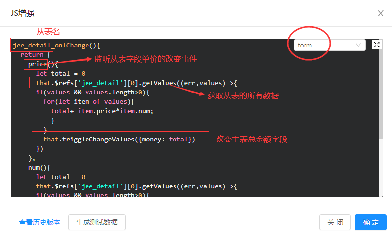
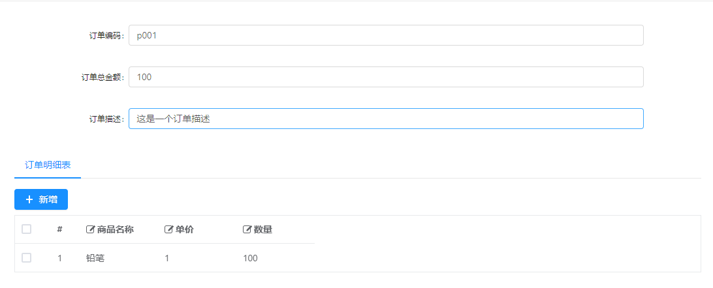

# 修改控件值【从改主】

>[info] 功能：一对多的从表字段改变后，关联修改主表的字段。

场景：订单明细表(子表)商品数量/单价发生改变时，订单表(主表)的总金额跟着变。
[TOC]

## 创建表单
1.建立订单表(主表)`jee_order`
|    字段 |  描述   |
| --- | --- |
|   order_no  | 订单编码    |
|   money| 订单总金额    |
|   note|订单描述    |
2.建立明细表(子表)`jee_detail`
|    字段 |  描述   |
| --- | --- |
|   name| 商品名称    |
|   price| 单价    |
|   num|数量    |
## 配置js增强
选中主表`jee_order`，点击`“js增强”`添加js增强代码：

代码示例：
```
jee_detail_onlChange(){
  return {
    price(){
      let total = 0
      that.$refs['jee_detail'][0].getValues((err,values)=>{
      if(values && values.length>0){
        for(let item of values){
          total+=item.price*item.num;
          }
        }
        that.triggleChangeValues({money: total})
      })
    },
    num(){
      let total = 0
      that.$refs['jee_detail'][0].getValues((err,values)=>{
      if(values && values.length>0){
        for(let item of values){
          total+=item.price*item.num;
          }
        }
        that.triggleChangeValues({money: total})
      })
    }
  }
}
```

测试表单：



