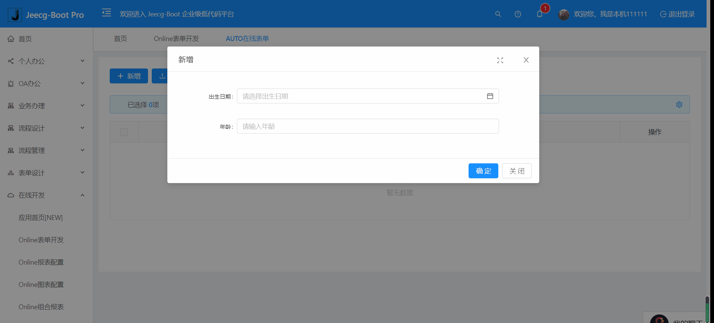

Online之JS增强-关联修改控件值【单表/主表】
===

>[info] 功能说明：在online表单中，当改变表单某一控件值的时候，关联改变其他控件的值

>[danger] **关联修改控件值【仅限单表/主表】**

[TOC]

## 示例效果


## 示例说明
`当出生日期(birthday) 被改变的时候，对应改变年龄(age)的值.`

## 配置步骤

1.配置form的增强JS:[（JS增强定义见online基础篇）](http://jeecg-boot.mydoc.io/?t=345055)  

示例代码如下：
```
 onlChange(){
   return {
    birthday(){
      let value = event.value
      let currBirthday = new Date(value.replace(/-/g, "\/")); 
      let d = new Date(); 
      let age = d.getFullYear()-currBirthday.getFullYear()    
      let values = {'age':age}
      that.triggleChangeValues(values)
    }
  }
 }
```

## 注意事项
配置form表单JS增强 -单表实现关联change有如下几点需要注意（如1图例子）
1.方法名规则是：表名+'_onlChange'或是直接写onlChange也行(单/主表才支持这种命名规则)
2.上述方法会返回一个对象，对象中的属性名和数据库的字段名保持一致，上述1定义表示：当birthday字段内容改变的时候会触发birthday方法改变age字段的值
3.每个字段方法内有两个内置参数that和event，that指向当前页面的vue实例对象,event对象包含属性如下表
4.使用getAction发起请求
5.使用that.triggleChangeValues(values)改变其他控件的值，values是一个对象可以配置多个控件的值
> event对象描述如下

属性名 | 描述 
-|-
row  | 当前表单的数据,编辑页面通过row.id可以获取当前表单的id值 
column | 当前列的配置信息,通过column.key 获取当前字段名称 
value | 当前控件的值 

