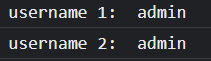

# Online表单JS增强—获取vuex缓存

直接操作`$store`即可

## 示例：


> `$store.getters.username` 是 `$store.getters.userInfo.username` 的语法糖

```
beforeAdd(){
  console.log('username 1: ', that.$store.getters.userInfo.username)
  console.log('username 2: ', that.$store.getters.username)
}
```

输出结果：



