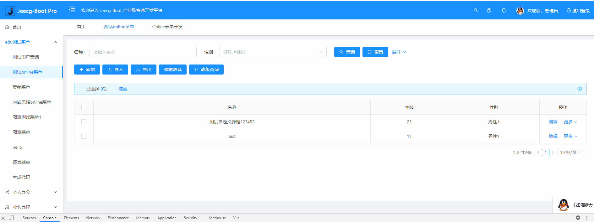
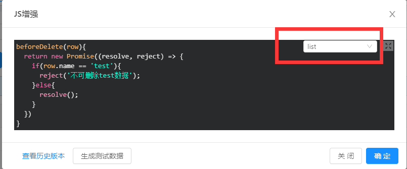
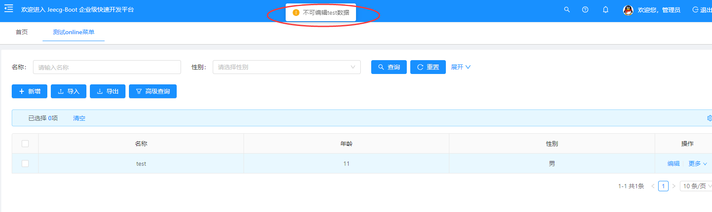

# 表单操作前置事件(提交/编辑/删除)

[TOC]
## 提交前置事件（beforeSubmit）

>[info] 功能新增日期：2020-12-03  日期之前的版本不支持

online表单提交数据之前，支持通过函数 `beforeSubmit` 加入自己的业务逻辑。

* 示例如下
选中单表或主表，点击`“js增强”`，选择`“form”`编写js增强

* 示例代码：
```
beforeSubmit(row){
	return new Promise((resolve, reject)=>{
    //此处模拟等待时间，可能需要发起请求
    setTimeout(()=>{
      if(row.name == 'test'){
        // 当某个字段不满足要求的时候可以reject 
        reject('不能提交测试数据');
      }else{
        resolve();
      }
    },3000)
  })
}
```

备注：
- 1.方法名为 `beforeSubmit`，**form页面** 类型定义
- 2.方法接受一个参数`row`，表示当前表单数据
- 3.方法返回一个`Promise`对象,校验无误resolve，失败reject，并给出失败提示
- 4.方法中发起 http请求 的语法和原项目保持一致
- 5.方法中依然可以使用` that `关键字 指向当前vue实例
- 6.支持`beforeEdit`编辑前调用，**list页面** 类型，定义同上，示例如下
- 7.支持`beforeDelete` 删除单条数据前调用，**list页面**类型，定义同上，示例如下

----
## 删除前置事件（beforeDelete）
>[info] 下述功能新增日期：2021-06-01 日期之前的版本不支持

 online列表页面删除单条数据之前，支持通过方法 `beforeDelete` 处理自己的业务 ，并且可以根据状态判断是否删除。
* 示例效果：

* js增强配置：
选中单表或主表，点击`“js增强”`，选择`“list”`编写js增强


* 示例代码：
```
beforeDelete(row){
	return new Promise((resolve, reject) => {
  	if(row.name == 'test'){
    	reject('不可删除test数据');
    }else{
    	resolve();
    }
  })     
}
```

------
## 编辑前置事件（beforeEdit）
online列表页面编辑数据之前，支持通过方法 `beforeEdit`, 处理自己的业务 ，并且可以根据状态判断是否弹出编辑框。
* 示例效果：

* js增强配置：
选中单表或主表，点击`“js增强”`，选择`“form”`编写js增强


* 示例代码：
```
beforeEdit(row){
	return new Promise((resolve, reject) => {
  	if(row.name == 'test'){
    	reject('不可编辑test数据');
    }else{
    	resolve();
    }
  })     
}
```


