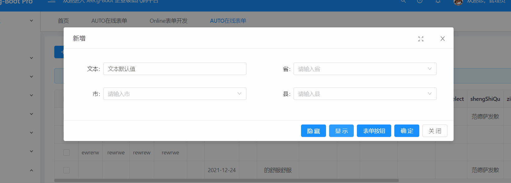

OnlineJS增强之—自定义按钮，控制字段的隐藏和显示
===

>[info] 以下内容基于online自定义按钮和online js增强， JS 方法名字为按钮的编码名。

>[danger] **提醒：** 如遇到规则定义不明确或是代码不理解的情况请先阅读基础篇的相关文档 

### 此示例通过自定按钮+js增强实现点击按钮控制表单控件的显示/隐藏
（以online demo表为例演示控制姓名控件的显示/隐藏）  

- 1. 示例效果如下：  

- 2.添加自定义按钮
进入online表单开发页面,选择demo表记录，点击自定义按钮，新增两个按钮编码为`“showname”`和`“hidename”`的`form`按钮，如下图  

- 3. 配置js增强
进入online表单开发页面,选择demo表记录，点击JS增强，选择`“form”`编写js，按钮编码对应方法名，如下  

-------

