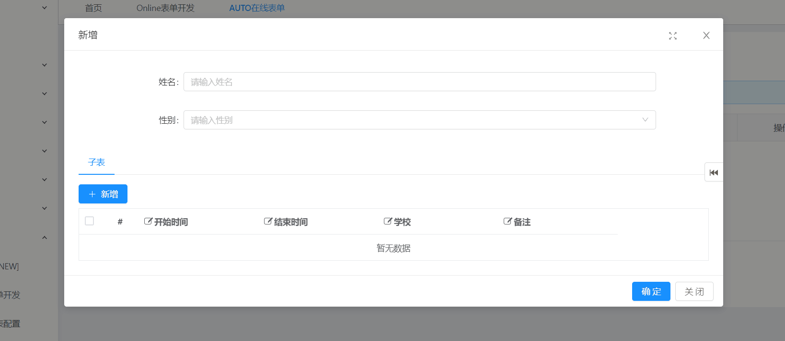
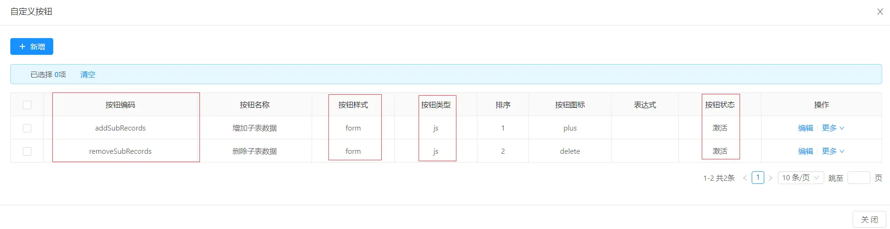
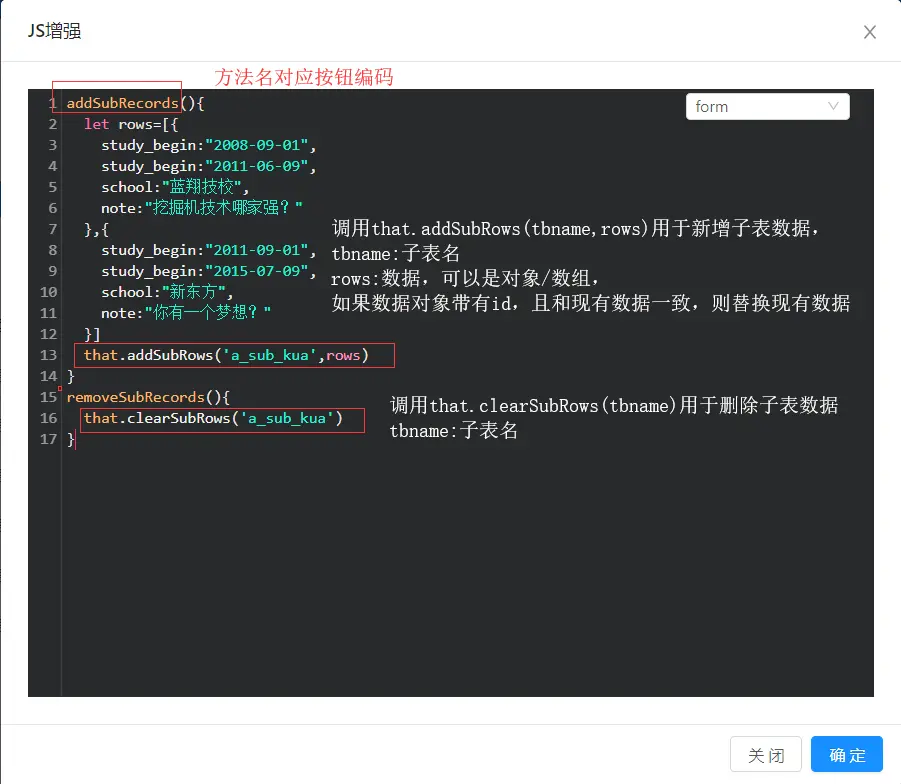
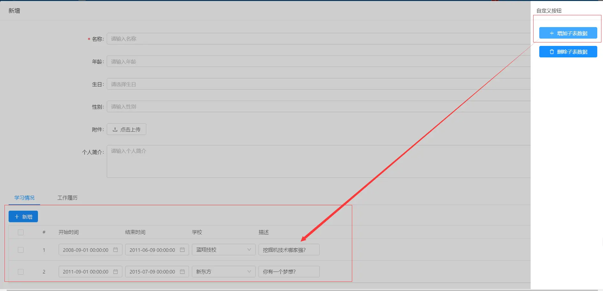
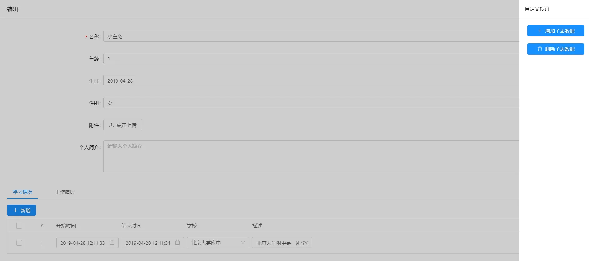
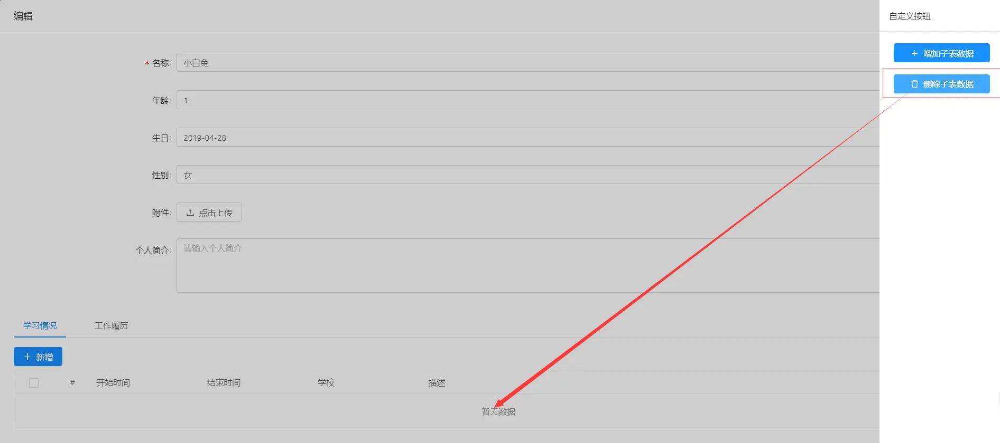

# OnlineJS增强之—自定义按钮，修改子表的数据

>[info] 【主子表】通过自定按钮+js增强实现一键增加子表的多条数据/清除子表的多条数据
[TOC]

## 示例效果


## 示例说明
点击自定义表单按钮，子表自动添加多条数据；点击删除按钮时，删除子表数据。
* 子表表名：`a_sub_kua`
* 子表数据字段如下(省略部分字段)

字段名 | 描述 | 
---|---|
study_begin | 开始时间 | 
study_end | 结束时间 | 
school | 学校 | 
note | 备注 | 

## 配置步骤
- 1. 进入online表单开发页面,选择一张主表记录，点击自定义按钮，新增两个`“form”`按钮—` “增加子表数据(addSubRecords)”` 、`“删除子表数据(removeSubRecords)”`,如下图：

- 2. 进入online表单开发页面,选择上述主表记录，点击JS增强，选择`“form”`，编写js，按钮编码对应方法名，如下  

* 代码示例：
```
addSubRecords(){
  let rows=[{
    study_begin:"2008-09-01",
    study_end:"2011-06-09",
    school:"蓝翔技校",
    note:"挖掘机技术哪家强?"
  },{
    study_begin:"2011-09-01",
    study_end:"2015-07-09",
    school:"新东方",
    note:"你有一个梦想?"
  }]
  that.addSubRows('a_sub_kua',rows)
}
removeSubRecords(){
  that.clearSubRows('a_sub_kua')
}
```

- 3. 新增测试结果：  

- 4. 删除测试结果  



## 注意事项
> 1.新增数据,此处是自定义一个测试的数据对象，实际开发中可以向后台发起请求获取数据,然后添加到子表
> 2.此处有几个内置方法可以调用

方法名 | 参数 | 描述 | 
---|---|---|
clearSubRows | tbname | 传入参数子表名，用于清除子表数据。(示例如上图) | 
addSubRows | tbname,rows | 传入参数子表名和数据对象，用于新增子表的数据，
rows可以是一个对象，也可以是一个数组(一次性新增多条记录)(示例如上图) | 
clearThenAddRows | tbname,rows | 传入参数子表名和数据对象，用于新增子表的数据，在新增前先清除子表现有数据，参数用法同addSubRows | 