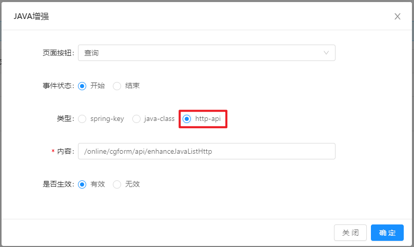

### 功能描述：

> http-api列表类java增强，适用于导出、查询。

### 定义请求处理方法：
```
/**
 * online api增强 列表
 * @param params
 * @return
 */
@PostMapping("/enhanceJavaListHttp")
public Result enhanceJavaListHttp(@RequestBody JSONObject params) {
    log.info(" =========================================================== ");
    log.info("params: " + params.toJSONString());
    log.info("params.tableName: " + params.getString("tableName"));
    log.info("params.dataList: " + params.getJSONArray("dataList").toJSONString());
    log.info(" =========================================================== ");
    return Result.OK(params.dataList);
}
```

>[info]注意
请求方式：post
请求参数：params，表单数据信息具体属性见下方描述
请求返回值：类路径`org.jeecg.common.api.vo.Result`该类是jeecgboot通用返回结果类。可以不使用该对象，但是返回对象的属性需和下面描述保持一致。

#### 返回值对象Result属性说明：
|属性|类型|说明|
|-|-|-|
|success|boolean|状态值，true表示当前数据需要转换，必须传入对应的数据列表到result中|
|result|JSONArray/List|当前查询或导出的数据集合，当success为true，请传该参数|

#### 请求方法参数params说明：
|属性|类型|说明|
|-|-|-|
|tableName|string|表名|
|dataList|JSONArray|当前查询或导出的数据集合|


### 增强配置

