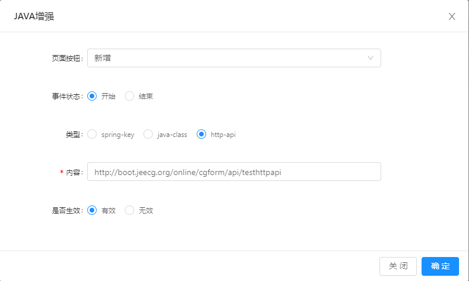

### 功能描述：

> http-api表单类java增强，适用于导出、查询。

### 定义请求处理方法：
~~~
/**
 * online api增强 表单
 * @param params
 * @return
 */
@PostMapping("/testhttpapi")
public Result enhanceJavaFormHttp(@RequestBody JSONObject params) {
    log.info(" =========================================================== ");
    log.info("params: " + params.toJSONString());
    log.info("params.tableName: " + params.getString("tableName"));
    log.info("params.record: " + params.getJSONObject("record").toJSONString());
    log.info(" =========================================================== ");
    return Result.OK(params);
}
~~~

>[info]注意
请求方式：post
请求参数：params，表单数据信息具体属性见下方描述
请求返回值：类路径`org.jeecg.common.api.vo.Result`该类是jeecgboot通用返回结果类。可以不使用该对象，但是返回对象的属性需和下面描述保持一致。

#### 返回值对象Result属性说明：
|属性|类型|说明|
|-|-|-|
|success|boolean|`version3.1`之后系统会判断该状态值是否为true，为true则表示请求处理正常，为false则认为当前请求处理失败，整个操作(新增、编辑、删除)会回滚|
|message|string|当success为false的时候，需要设置一个错误信息|
|result|object|表单数据对象，当success为true，请传该参数|

#### 请求方法参数params说明：
|属性|类型|说明|
|-|-|-|
|tableName|string|表名|
|record|JSONObject |当前操作(新增、编辑、删除)的表单数据|

### 增强配置

