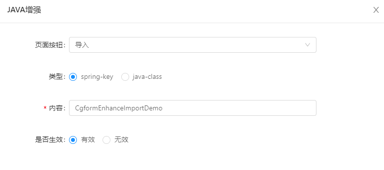

### 功能描述：

> online导入数据 可以通过配置 java增强判断 每一条数据是新增还是修改还是丢弃·

`version 3.1`(老版本请参考[ `online java增强 导入2.4`](http://doc.jeecg.com/2653465))
·

### 定义java类：

~~~
import com.alibaba.fastjson.JSONObject;
import lombok.extern.slf4j.Slf4j;
import org.jeecg.modules.online.cgform.enhance.CgformEnhanceJavaImportInter;
import org.jeecg.modules.online.cgform.util.CgformUtil;
import org.jeecg.modules.online.config.exception.BusinessException;
import org.springframework.beans.factory.annotation.Autowired;
import org.springframework.stereotype.Component;
import org.jeecg.modules.online.cgform.enums.EnhanceDataEnum;

/**
 * Excel导入增强，针对导入数据进行check或者数据转换
 */
@Slf4j
@Component("cgformEnhanceImportDemo")
public class CgformEnhanceImportDemo implements CgformEnhanceJavaImportInter{

   /**
    * 这个testService是自定义的 用于查询数据
    */
   @Autowired
   private TestService testService;

   @Override
   public EnhanceDataEnum execute(String tableName, JSONObject json) throws BusinessException {
      // 从json中获取excel里面的数据
      String name = json.getString("name");
      if(name==null || "".equals(name)){
         // 常量值为：0 表示丢弃数据
         return EnhanceDataEnum.ABANDON;
      }

      // 拿到excel中的name 去数据库查询
      Demo demo = testService.getDataByName(name);
      if(demo!=null){
         // 假定这个name是demo表的唯一标识，那么如果excel中的name 在数据库中已经存在，则根据excel中的数据走修改逻辑
         // 修改逻辑需要设置原数据的ID
         json.put("id", demo.getId());
         // 常量值为：2 表示需要走修改逻辑
         return EnhanceDataEnum.UPDATE;
      }

      // 常量值为：1 表示走新增逻辑
      return EnhanceDataEnum.INSERT;
   }

}

~~~


### 增强配置：

>[info]注：version3.0之后，java增强-导入不需要配置事件状态(开始/结束)，且不支持http-api


----

### 导入增强总结：
- 1.java类实现接口`CgformEnhanceJavaImportInter`
- 2.重写方法`execute`
- 3.方法返回一个枚举，返回值说明如下：
```
// return EnhanceDataEnum.ABANDON = 丢弃
// return EnhanceDataEnum.INSERT = 新增
// return EnhanceDataEnum.UPDATE = 修改
```


