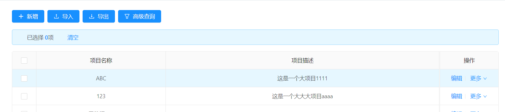

### 功能描述：

> online导出数据 可以通过配置 java增强**修改导出的数据**，e.g.数据库存的是编码，导出excel需要展示具体的名称，这个时候就可以使用导出增强。
### 定义java类：
~~~
import lombok.extern.slf4j.Slf4j;
import org.jeecg.modules.online.cgform.enhance.CgformEnhanceJavaListInter;
import org.jeecg.modules.online.config.exception.BusinessException;
import org.springframework.stereotype.Component;
import java.util.List;
import java.util.Map;

/**
 * Excel导出增强简单示例-数据转换
 */
@Slf4j
@Component("cgformEnhanceExportDemo")
public class CgformEnhanceExportDemo implements CgformEnhanceJavaListInter {

    @Override
    public void execute(String tableName, List<Map<String, Object>> data) throws BusinessException {
        for (Map<String, Object> map : data) {
            // 获取项目名称字段的值
            Object projectName = map.get("project_name");
            if(projectName!=null){
                // 满足一定的条件 将值替换成自定义的格式
                if(projectName.toString().equalsIgnoreCase("abc")){
                    map.put("project_name", "这是字母abc");
                }else if(projectName.toString().equalsIgnoreCase("123")){
                    map.put("project_name", "这是数字123");
                }
            }
        }
    }
}

~~~
>[info]注：java增强-导出，需要实现的接口是：CgformEnhanceJavaListInter与常规的JAVA增强不同。

### 增强配置

### 效果展示：
- 访问online表数据

- 导出excel数据显示如下：

----

### 导出增强总结：
- 1.java类实现接口`CgformEnhanceJavaListInter `
- 2.重写方法`execute`

