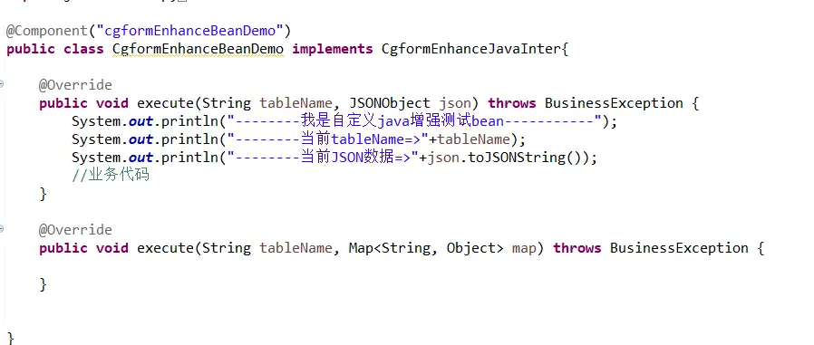
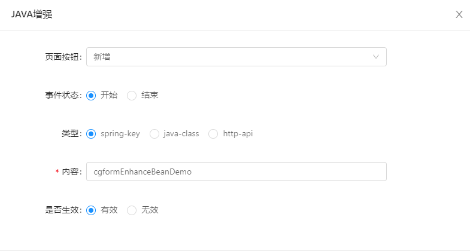

online 基础篇-java增强
===

1.功能简述：
> 通过Java增强可在表单的增加、修改、和删除数据时实现额外的功能，类似spring中的AOP切面编程。
> 可实现的功能： 
> 1、添加数据库之前，对数据进行校验，不通过的话，通过抛出异常即可。
> 2、添加数据库之前，对数据进行处理、转换值等。
> 3、进行其他业务逻辑代码。

>[info] JAVA增强是在线开发概念，不支持代码生成器生成。

2.操作截图：
先定义一个类再绑定该类到java增强按钮上

> 注意：
1.自定义的java增强类需要实现接口implements CgformEnhanceJavaInter，并且重写方法execute的
2.如果选择spring-key 则需要在类上加上对应的注解并填入注解value,如果选择java-class则需要填写该类的路径
3.java增强是一个类似aop的功能,也就是说如果一个按钮配置了sql增强，还是可以再在这个按钮上配置java增强的,这样其实两者都会执行（上述截图就是在sql增强的按钮上配置了java增强）
4.除java增强-导入外，java增强返回值，暂无实际意义。

执行效果如下：

----------

### 以下说明增强配置：

#### 页面按钮：
分为新增、编辑、删除、导入、导出、查询、自定义按钮
#### 事件状态：
指的是java增强的执行时机，e.g.页面按钮为新增，事件状态为开始，则表示当前java增强是在新增数据（数据的insert操作）之前执行，编辑、删除同理。导入、导出、查询只有开始状态有效（`version3.0`之后系统默认设置状态为开始，不需要用户手动配置）。
#### 类型+内容：
- 类型为spring-key，则java类需要添加springbean的注解`@Component`，内容填写注解的value
- 类型为java-class，内容填写java类的类路径
- 类型为http-api，内容填写一个请求地址，详细用法参考[Online java增强 http-api](http://doc.jeecg.com/2398738)
