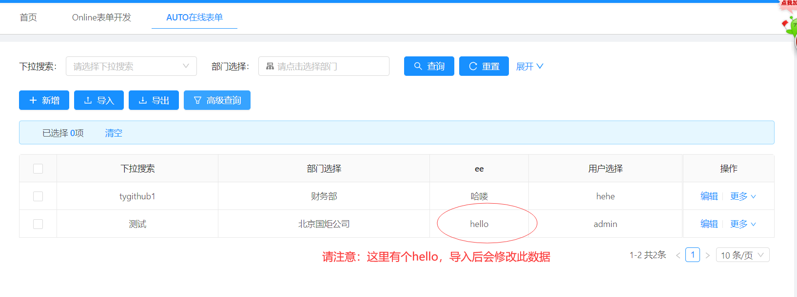
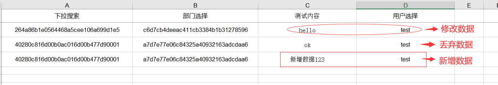
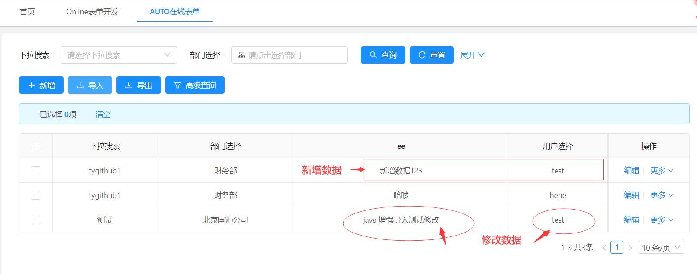

# Online java增强 导入
>[warning]  3.0之前版本参考此文档


功能描述：


> online导入数据 可以通过配置 java增强判断 此数据是新增还是修改还是丢弃
> 只有 `开始`事件有效
示例：
1.增强配置

2.编写java增强类
~~~
返回值说明
// return 0 = 丢弃
// return 1 = 新增
// return 2 = 修改
~~~

```
import com.alibaba.fastjson.JSONObject;
import org.jeecg.modules.online.cgform.enhance.CgformEnhanceJavaInter;
import org.jeecg.modules.online.config.exception.BusinessException;
import org.springframework.stereotype.Component;

import java.util.Map;

@Component("cgformEnhanceImportDemo")
public class CgformEnhanceImportDemo implements CgformEnhanceJavaInter{

   @Override
   public int execute(String tableName, JSONObject json) throws BusinessException {
      // 从json中获取excel里面的数据，
      if(json.getString("testname").equals("hello")){
         // 因为是测试，此处id值是直接拿的数据库的写死了，
         //如果修改数据 需要设置id值以便知道修改的是哪条数据
         json.put("id","testid123");
         json.put("testname","java 增强导入测试修改");
         return 2;
      }

    if(json.getString("testname").equals("ok")){
      // 如果丢弃数据，直接返回0
         return 0;
      }
      //默认返回1 走新增逻辑
      return 1;
   }

   @Override
   public int execute(String tableName, Map<String, Object> map) throws BusinessException {
      return 1;
   }

}
```
3.访问online表数据

4.新增excel数据

5.导入后数据显示：


