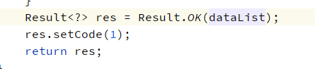

# Online Java增强 http-api

[TOC]

>[info] version`2.4.7+`  20210820

## 配置
配置方式与原版增强保持一致，只不过在选择类型时需要选择`http-api`，
内容输入框里填写请求地址，可以填写`http(s)`开头的绝对地址，也可以填写项目相对地址。
> 注意：请求方式为`post`


## 使用
以项目相对地址为例，在项目里定义一个`PostMapping`，接收一个 `RequestBody` 参数，类型为`JSONObject`


列表 http-api示例
```
/**
 * online api增强 列表
 * @param params
 * @return
 */
@PostMapping("/enhanceJavaListHttp")
public Result enhanceJavaListHttp(@RequestBody JSONObject params) {
    log.info(" =========================================================== ");
    log.info("params: " + params.toJSONString());
    log.info("params.tableName: " + params.getString("tableName"));
    log.info("params.dataList: " + params.getJSONArray("dataList").toJSONString());
    log.info(" =========================================================== ");
    return Result.OK();
}
```
表单 http-api示例
~~~
/**
 * online api增强 表单
 * @param params
 * @return
 */
@PostMapping("/enhanceJavaFormHttp")
public Result enhanceJavaFormHttp(@RequestBody JSONObject params) {
    log.info(" =========================================================== ");
    log.info("params: " + params.toJSONString());
    log.info("params.tableName: " + params.getString("tableName"));
    log.info("params.record: " + params.getJSONObject("record").toJSONString());
    log.info(" =========================================================== ");
    return Result.OK("1");
}
~~~

### 参数详情
* `params.tableName` 当前执行增强的 online表单表名
* `params.record` 当前单条数据
    * 仅 **新增**、**编辑**、**删除**、**导入** 时传递该参数
* `params.dataList` 所有数据列表
    * 仅 **导出**、**查询** 时传递该参数。

### 返回值

* `查询` 如果修改了列表数据，那么就需要将修改的数据整体返回，反之不需要返回值。

* `新增` 默认无返回值，如果需要对数据做校验，可以校验失败后直接返回错误。如果修改了数据，需要将修改的数据原样返回。
  
* `编辑` （同新增）
* `导入`  返回一个0-2的数字
    * `0` 丢弃该条数据
    * `1` 新增该条数据
    * `2` 修改该条数据
* `导出` （同查询）


### 参考示例代码

`jeecg-boot-module-demo/org.jeecg.modules.demo.online.OnlCgformDemoController`

