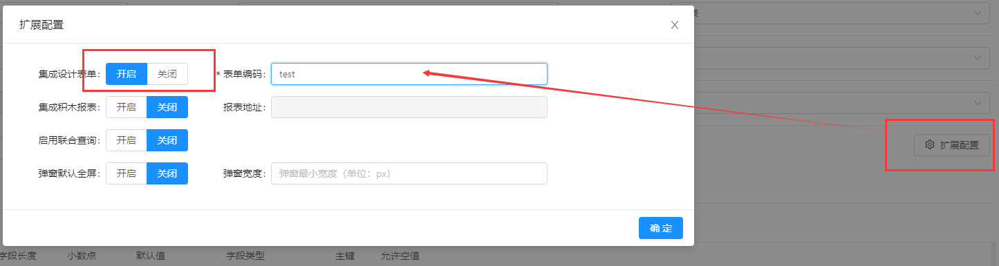
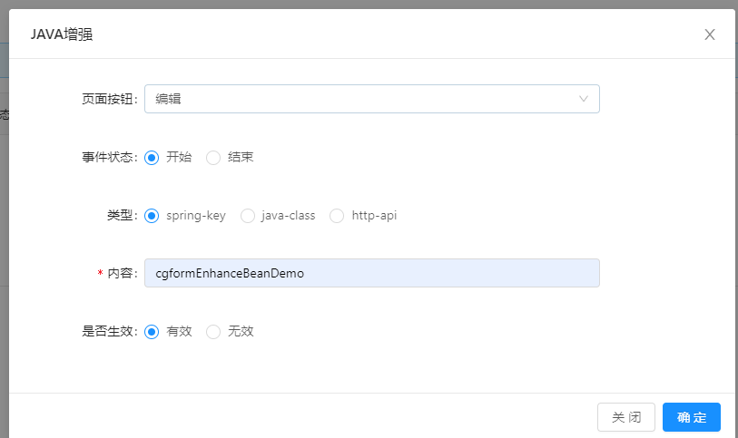

### **主从表**对于表单数据操作的增强（新增、编辑）需要注意一个特殊的场景

>[info]  online表单支持配置表单设计器的编码，实现在online的新增编辑页面展示设计器的表单。

>[info]对应的，配置了新增/编辑的java增强

* 增强类中的execute方法传递一个参数json，用于接收表单的数据
~~~
@Override
public int execute(String tableName, JSONObject json) throws BusinessException {
    // TODO
}
~~~

* 当表单为主子表的时候，子表的数据类似下图：

---- 

* 需要用户自己拿到被编码的字符串后通过URLDecoder转成实际的json字符串，才能获取到真实的数据

~~~
String jsonString = URLDecoder.decode("拿到的字符串", "UTF-8")
~~~