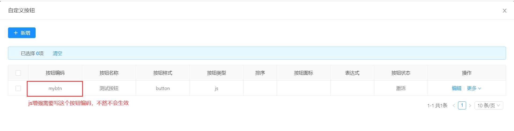
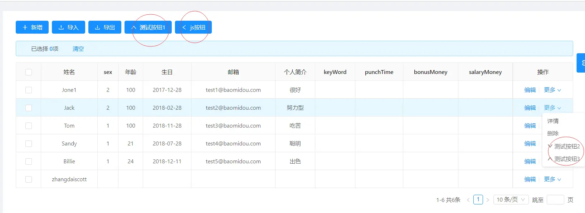

online 基础篇-自定义按钮
===

1.功能简述：  
通过自定义按钮功能，可以为智能表单列表添加按钮，实现扩展功能。
>[info] 自定义按钮是在线开发概念，不支持代码生成器生成。

2.操作截图  


3.按钮配置说明（很重要）

> 按钮编码：该编码在一个智能表单配置中唯一，同时js增强中定义的函数名和该编码的值需要保持一致(详见js增强描述)  
> 按钮名称：按钮上面显示的文本.

> 按钮样式：可选button/link。  
button:即生成的按钮显示在导航工具栏上；
link:显示在每一条数据的操作列。

> 动作类型：可选action/js。  
action:该按钮会触发通用入口，挂接到SQL增强上（前提是SQL增强配置中配置了按钮编码对应的sql语句）。

SQL新增按钮

确定保存

sql增强

>Js:该按钮会触发JS增强中类型为“list”的配置中编写了函数名为按钮编码的函数。

JS新增按钮

确定保存

JS增强

>按钮图标：和antd-vue的icon保持一致 参考：https://vue.ant.design/components/icon-cn/
> 显示表达式：按钮样式为link时起作用

```
注：status为表单字段
[1]、判断值相等，支持exp有多个值判断，比如 status  in('N','Y')
语法：status#eq#N,Y  多个以逗号隔开
[2]、判断值不相等
语法：status#ne#N
[3]、判断空值判断
语法：status#empty#true  非空false
```

4.操作截图  


