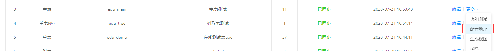
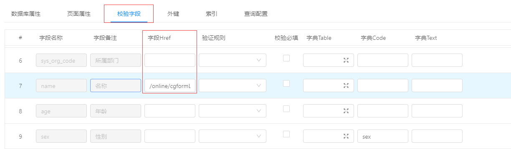
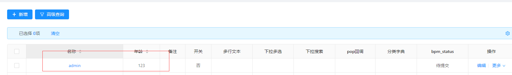
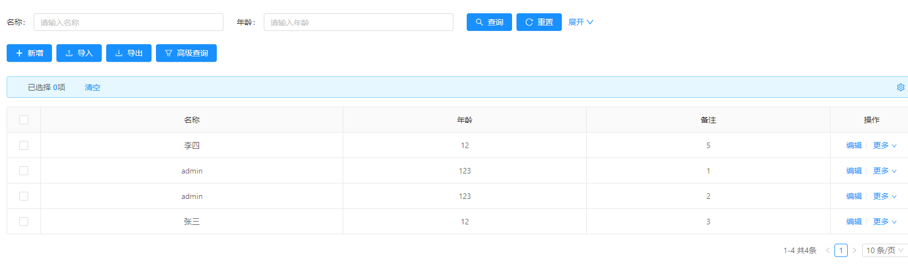
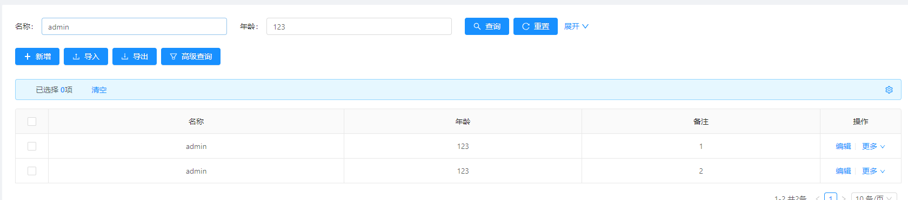

场景需求：
需要3张表关联。A表作为单表  B表作为主表 C表作为子表 实现1：n：n

实现方案：
在A表上配置字段href，跳转B表，BC作为主子表展示

示例步骤：
1.配置一张单表A 一张主表B 以及一张子表C

2.拿到B表的配置地址，此处为：`/online/cgformList/ff80a8751de2435f8724117c8f4c9e55`

3.添加A表的字段href配置,配置值为 `/online/cgformList/ff80a8751de2435f8724117c8f4c9e55?name=${name}&age=${age}`

- 备注：上述href配置的值为步骤2的配置地址加上具体的参数，这些参数名为B表的字段名，参数值取自A表，通过`${field_name}`的表达式获取A表的字段值
 
测试：
4.查看A表有一条记录如下：

5.查看B表所有数据如下：

6.点击A表的名称，跳转至B表，展示如下：

- 备注：只要是跳转进入的页面，若有查询条件，则查询条件会显示默认跳转时带的参数值，并且即使在该页面重置查询条件，最终的查询条件还是基于第一次进入的参数赋值

